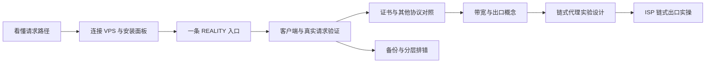

# 学习路线

## 从哪里开始

零基础先读 [[第一次读先看这里]]。复现单服务器主线只需要一台自己的电脑、一台可管理的 VPS 和可用网络；本项目恰好已有两台，meu 是参考环境，tyccc 是操作对象。链式实验才另外需要一个落地服务。

## 第一段：看懂并完成一条可用节点

先学 [[VPS与云服务商]] → [[终端与命令行]] → [[协议传输与安全层]]。在下表第 4 课先做 [[VLESS-REALITY配置]]，接第 5、6 课完成客户端与验证。这个第一次学习顺序可以先跳过 IP 证书课；扩展 TLS 入口时再回来补。已经交付的 tyccc 用户直接按第 8 课访问，不重新执行安装命令。

## 第二段：按原实操记录扩展与维护

| 课 | 你会完成什么 | 遇到生词先读 |
| --- | --- | --- |
| [[01-准备与核对服务器]] | 确认远程电脑身份与现状 | [[VPS与云服务商]]、[[SSH与主机指纹]] |
| [[02-安装面板与SSH隧道]] | 装好并私密访问管理页面 | [[3x-ui与Xray]]、[[SSH隧道]] |
| [[03-签发IP证书与自动续期]] | 准备 TLS 身份证明 | [[TLS证书与HTTPS]]、[[ACME与证书续期]] |
| [[04-浏览器配置六种入口]] | 按截图配置六种协议组合 | [[协议传输与安全层]]、[[主流协议选择地图]] |
| [[05-添加客户端与导出连接]] | 创建使用身份，导出链接 | [[UUID密码与订阅链接]] |
| [[10-MEU五个入站逐表单配置]] | 将已有五条节点逐页拆开理解 | [[协议传输与安全层]] |
| [[06-连接验证与结果]] | 用真实请求验证结果 | [[客户端软件与内核]]、[[SOCKS5与系统代理]] |
| [[07-用Obsidian阅读与Git保存]] | 阅读链接并保存修改历史 | [[Obsidian与双向链接]]、[[Git与版本控制]] |
| [[08-开放公网HTTPS面板]] | 直接通过公网加密登录面板 | [[防火墙与监听地址]]、[[TLS证书与HTTPS]] |

## 第三段：理解路径与出口，再设计进阶实验

| 学习内容 | 要能回答的问题 | 状态 |
| --- | --- | --- |
| [[KVM与VPS选型]]、[[带宽流量延迟与丢包]] | 为什么机器配置、线路和下载速度不是一回事？ | 原理与选择方法 |
| [[BBR与拥塞控制]] | 算法调整能改变什么，不能改变什么？ | 原理；本次未改内核设置 |
| [[住宅IP与机房IP]]、[[链式代理与中转落地]] | 代理端口和 VPS 差在哪，谁决定最后出口？ | 已验证 ISP HTTP 代理链；未对住宅属性作独立判定 |
| [[09-链式代理实验设计]] | 如何关联出站、验证链路并撤回？ | 通用设计课 |
| [[11-将ISP代理接入tyccc链式出口]] | 怎样把 ISP HTTP 代理持久化接到五个 TCP 入站？ | 已实测；Hysteria2 与 SS UDP 仍直连 |
| [[XHTTP与传输选择]]、[[CDN与DNS代理状态]] | 改传输与改变网络路径分别需要核对什么？ | 拓展阅读，未部署 |

准备视频时使用 [[视频分集与画面安排]] 和 [[入门与链式代理讲稿]]。更多概念在 [[名词索引]]；新增内容的来源核对在 [[NotebookLM笔记核对与改编依据]]。

## 实验进度

- [x] 确认目标、保存位置与 Git 仓库。
- [x] 克隆空仓库到 Obsidian 根目录。
- [x] 在浏览器读取 meu 的入站列表。
- [x] 核对两台 VPS 的系统与现有服务。
- [x] 为 tyccc 确定安全的面板访问方式并部署。
- [x] 在浏览器配置并记录协议。
- [x] 完成客户端内核实际通信验证。
- [x] 完成知识点、排错、来源与脱敏检查。
- [x] 教程纳入指定 Git 仓库版本管理。
- [x] tyccc 的 ISP HTTP 出站与 TCP 链式路由已通过实际出口及重启持久性验证。

具体操作证据见 [[05-探索记录/2026-09-07-实操日志]]。
