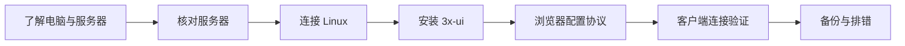

# 学习路线

## 从哪里开始

你需要一台自己的电脑、两台已有 VPS 的访问权限，以及可用的网络。已有 meu 是参考环境；tyccc 是本次操作对象。

## 实验进度

- [x] 确认目标、保存位置与 Git 仓库。
- [x] 克隆空仓库到 Obsidian 根目录。
- [x] 在浏览器读取 meu 的入站列表。
- [ ] 核对两台 VPS 的系统与现有服务。
- [ ] 为 tyccc 确定安全的面板访问方式并部署。
- [ ] 在浏览器配置并记录协议。
- [ ] 完成客户端实际通信验证。
- [ ] 完成知识点、排错、来源与脱敏检查。
- [ ] 提交并推送完整教程。

具体操作证据见 [[05-探索记录/2026-09-07-实操日志]]。
