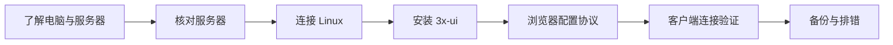

# 学习路线

## 从哪里开始

你需要一台自己的电脑、两台已有 VPS 的访问权限，以及可用的网络。已有 meu 是参考环境；tyccc 是本次操作对象。

## 按课学习

| 课 | 你会完成什么 | 遇到生词先读 |
| --- | --- | --- |
| [[01-准备与核对服务器]] | 确认远程电脑身份与现状 | [[VPS与云服务商]]、[[SSH与主机指纹]] |
| [[02-安装面板与SSH隧道]] | 装好并私密访问管理页面 | [[3x-ui与Xray]]、[[SSH隧道]] |
| [[03-签发IP证书与自动续期]] | 准备 TLS 身份证明 | [[TLS证书与HTTPS]]、[[ACME与证书续期]] |
| [[04-浏览器配置六种入口]] | 按截图配置六种协议组合 | [[协议传输与安全层]]、[[主流协议选择地图]] |
| [[05-添加客户端与导出连接]] | 创建使用身份，导出链接 | [[UUID密码与订阅链接]] |
| [[06-连接验证与结果]] | 用真实请求验证结果 | [[客户端软件与内核]]、[[SOCKS5与系统代理]] |
| [[07-用Obsidian阅读与Git保存]] | 阅读链接并保存修改历史 | [[Obsidian与双向链接]]、[[Git与版本控制]] |

先完成一条主线，再阅读其他协议对照。更多概念都在 [[名词索引]]。

## 实验进度

- [x] 确认目标、保存位置与 Git 仓库。
- [x] 克隆空仓库到 Obsidian 根目录。
- [x] 在浏览器读取 meu 的入站列表。
- [x] 核对两台 VPS 的系统与现有服务。
- [x] 为 tyccc 确定安全的面板访问方式并部署。
- [x] 在浏览器配置并记录协议。
- [x] 完成客户端内核实际通信验证。
- [x] 完成知识点、排错、来源与脱敏检查。
- [x] 教程纳入指定 Git 仓库版本管理。

具体操作证据见 [[05-探索记录/2026-09-07-实操日志]]。
