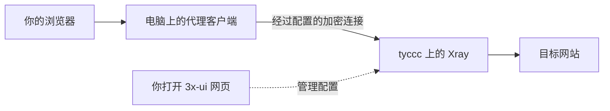

# 第一次读，先看这里

你要完成的事可以先说成一句话：让自己的电脑把一部分网络请求交给另一台电脑，由它去访问目标网站，再把结果送回来。这台租来的电脑叫 [[VPS与云服务商|VPS]]。

## 先看数据经过谁

实线表示本课关心的请求方向；网站的回复沿已建立的连接返回。虚线表示管理操作。3x-ui 像一张控制表，Xray 是按表工作、实际收发流量的软件。关掉管理网页，服务仍可以继续运行。

“帮忙转交请求”是生活类比。实际网络里存在很多连接与协议；是否加密、验证谁的身份，要看每一段连接的配置。网站自己的 HTTPS 与客户端到 VPS 的加密也不是同一层。

## 不同工具使用不同凭据

| 你正在用什么 | 用来做什么 | 填哪一类信息 |
| --- | --- | --- |
| CloudCone 网页 | 查看机器、开关机、打开远程控制台 | 云服务商账号 |
| FinalShell 或终端 | 登录服务器、运行命令 | SSH 用户、密码或密钥 |
| 3x-ui 网页 | 配置入站、客户端、路由 | 面板管理员账号密码 |
| 代理客户端 | 使用已经创建的节点 | 节点链接中的 UUID、密码等 |

这些凭据对应不同用途，不能混用。不要把面板网址当作节点链接，也不要把 SSH 密码填入代理客户端。

## 第一次只完成一条节点

本次真实实验创建了六条入口，是为了做对照教学。初学时先走下面这条路线：

1. 读 [[VPS与云服务商]] 和 [[终端与命令行]]，知道电脑在哪里、命令在哪里执行。
2. 跟 [[01-准备与核对服务器]] 核对身份，跟 [[02-安装面板与SSH隧道]] 完成初始安装。如果只是使用已经交付的 tyccc，按 [[08-开放公网HTTPS面板]] 登录即可，不需重新安装。
3. 读 [[协议传输与安全层]]，在 [[04-浏览器配置六种入口]] 中先选 [[VLESS-REALITY配置]]。这条路线不依赖自己的传统 TLS 证书，但需要兼容的客户端与正确的 REALITY 参数。
4. 跟 [[05-添加客户端与导出连接]] 创建使用身份，再按 [[06-连接验证与结果]] 验证这一个入口。
5. 成功后再读 [[03-签发IP证书与自动续期]]，扩展其他 TLS 协议并比较差异。

每一步都回答三个问题：刚才改了什么？为什么需要它？看到什么才能说明这一步完成？遇到失败先看 [[连接失败的检查顺序]]。

## 学会之后再加什么

想知道网速为什么慢，读 [[带宽流量延迟与丢包]]。想知道 BBR 是什么，读 [[BBR与拥塞控制]]。想知道两台服务器如何协作，读 [[链式代理与中转落地]]，再看 [[09-链式代理实验设计]]。想录教学视频，从 [[视频分集与画面安排]] 开始。

本页借鉴了用户提供笔记的“先讲路径、再讲工具”的组织方式；概念校核与出处见 [[NotebookLM笔记核对与改编依据]]。
