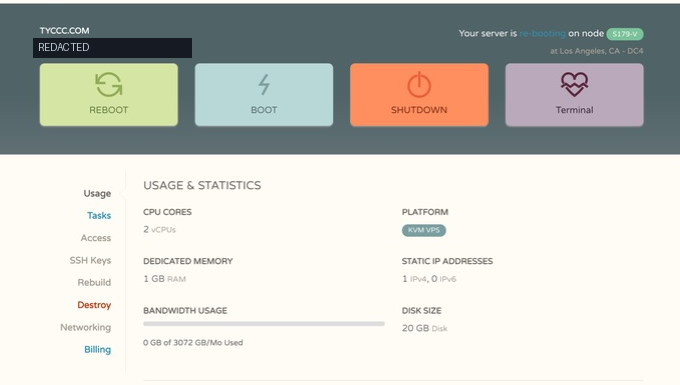
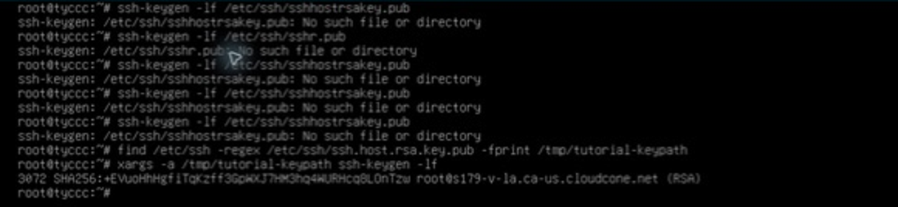

# 01 · 准备与核对服务器

这一课只做一件事：确认自己连到的是 tyccc，并了解它现在装了什么。先读 [[VPS与云服务商]]、[[IP地址与端口]]。本教程的 VPS 是远程 Linux 电脑，3x-ui 是稍后安装的管理软件；购买 VPS 不等于已经有代理节点。

## 准备一张私人信息卡

在密码管理器或仓库外记录：服务商登录入口、服务器名称、IP、SSH 端口、用户名、密码。它们分别用于登录服务商网站和登录 Linux，通常不是同一套密码。本次原始信息来自仓库外的 `account.md`，教程不复制其中内容。

文档以 `VPS_IP` 表示你自己的真实公网 IPv4。看到它时先替换再执行；不要把示例地址当成可用服务器。`127.0.0.1` 表示正在执行程序的那台电脑自己，后面通常不需要替换。

## 在服务商网页核对

1. 登录 CloudCone，进入 tyccc 实例详情。
2. 对照实例名称、IPv4、系统、CPU、内存和磁盘。不要只看浏览器标签标题。
3. 找到 Console/noVNC 入口。这相当于隔着网络查看服务器的显示器；SSH 无法连接时仍可能可用。



图中重点是实例状态、资源和控制台入口。服务商的状态刷新可能滞后：本次网页一度显示 re-booting，而系统实际已连续运行 41 天。判断应结合控制台和系统输出。

## 用终端连接

用户已允许使用保存了账号的 FinalShell，也允许本地终端。本次最终使用本地 SSH 通道执行命令，浏览器内完成面板配置。FinalShell 用户可双击保存的 tyccc 连接；第一次使用终端则输入：

```bash
ssh root@VPS_IP
```

密码输入时没有星号是正常的，输入后按回车。不要在聊天、截图或 Git 中展示它。登录成功会出现类似 `root@tyccc:~#` 的提示符，见 [[Linux与root]]、[[终端与命令行]]。

如果出现主机密钥变化，不要直接删除旧记录。本次确实遇到这个问题，通过服务商 noVNC 查看 RSA 指纹后才继续。完整过程见 [[主机密钥变化与noVNC输入问题]]。独立控制台上的命令为：

```bash
ssh-keygen -lf /etc/ssh/ssh_host_rsa_key.pub
```



## 查看服务器现状

在服务器终端逐行运行，不要复制前面的提示符：

```bash
cat /etc/os-release
uname -m
free -m
df -h /
ss -lntup
systemctl is-active x-ui
timedatectl status
```

`cat` 显示文件；`uname` 看 CPU 架构；`free` 看内存；`df` 看磁盘；`ss` 看监听端口；`systemctl` 看后台服务；`timedatectl` 看时间同步。输出多不等于报错，不懂可以逐项查 [[systemd与日志]]。

本次核对结果：

| 项目 | meu：已有服务 | tyccc：安装前 |
| --- | --- | --- |
| 系统 | Ubuntu 22.04.1，x86_64 | Debian 12，x86_64 |
| 内存 | 约 2 GB | 约 960 MB，另有 1 GB swap |
| 磁盘 | 约 40 GB | 约 20 GB，余量约 15 GB |
| 面板 | 3x-ui v3.6.0 | 未安装 |
| 监听 | 已有多个协议入口 | 仅 SSH TCP 22 |

没有发现需要迁移的 tyccc 旧面板。本次为它生成全新的凭据，不复制 meu 数据库。meu 的配置只作为对照，见 [[2026-09-07-实操日志]]。

**完成标准：** 能说明“我当前在哪一台服务器”，SSH 身份已核对，知道所选端口未被其他服务占用。下一课：[[02-安装面板与SSH隧道]]。

来源：[OpenSSH ssh 手册](https://man.openbsd.org/ssh)、[ssh-keygen 手册](https://man.openbsd.org/ssh-keygen)、[Debian 管理员手册](https://www.debian.org/doc/manuals/debian-handbook/)。
