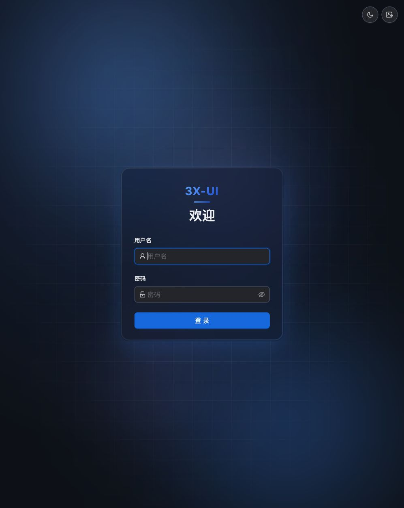
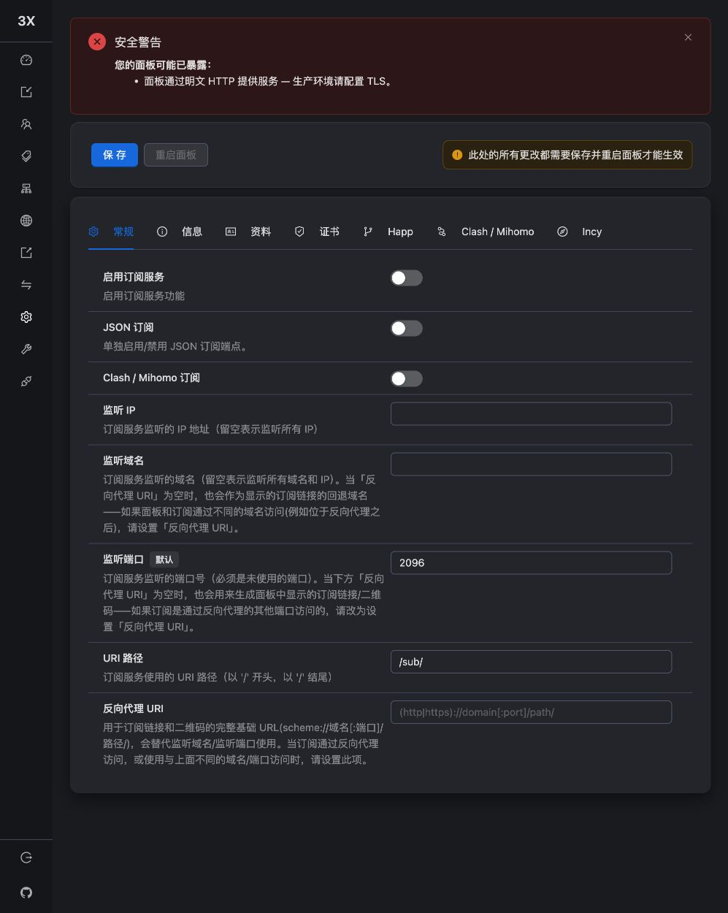

# 02 · 安装面板与 SSH 隧道

上一课：[[01-准备与核对服务器]]。这一课安装 [[3x-ui与Xray]]，让面板只接受服务器本机连接，再用 [[SSH隧道]] 从电脑访问。

## 本次版本

安装时使用 3x-ui **v3.7.0**（官方发布于 2026-08-24），配套 Xray **v26.7.28**。版本对应截图中的按钮和字段；其他版本的菜单可能不同。不要仅凭旧教程中的坐标点击。

以下命令在 **tyccc 服务器终端**运行：

```bash
curl -fL https://raw.githubusercontent.com/MHSanaei/3x-ui/v3.7.0/install.sh -o /root/install-3x-ui-v3.7.0.sh
less /root/install-3x-ui-v3.7.0.sh
bash /root/install-3x-ui-v3.7.0.sh v3.7.0
```

第一行从官方固定版本下载脚本；`-f` 让 HTTP 错误导致失败，`-L` 跟随重定向，`-o` 指定保存位置。第二行查看脚本，按 `q` 退出。第三行用 Bash 执行。脚本会安装依赖、下载面板和内核、创建服务。下载成功不代表脚本天然可信，固定官方来源便于复核。

本次自动化实际先下载同一版本脚本，再通过 SSH 文件传输送到服务器执行；安装前设置随机的 `XUI_USERNAME`、`XUI_PASSWORD`、`XUI_WEB_BASE_PATH` 环境变量。初学者可使用交互安装生成或设置独立强密码，将输出保存到私人信息卡。

## 安装时如何选择

| 问题或配置 | 本次选择 | 为什么 |
| --- | --- | --- |
| 数据库 | SQLite，选项 1 | 小型个人服务足够，无需再安装独立数据库服务 |
| 自定义面板端口 | 是，46832 | 避开已有端口；高端口本身不提供加密 |
| 面板 SSL | 跳过，选项 4 | 面板仅监听回环地址，外层用 SSH 加密 |
| 绑定 localhost | 是，127.0.0.1 | 公网不能直接打开管理页面 |
| 管理员及路径 | 新生成随机值 | 与服务器 root 密码分开 |

选项编号只对应这次的安装器。若显示不同文字，按问题含义选择，不要盲按数字。节点所需的 TLS 证书将在下一课单独签发，不受“面板 SSL 跳过”影响。

## 检查安装是否成功

```bash
systemctl is-active x-ui
ss -lntp
```

第一条应输出 `active`，第二条应出现 **127.0.0.1:46832**。如果是 `0.0.0.0:46832`，代表公网地址也能接收请求，应检查面板监听地址。不要通过“网页暂时打不开”推断它一定没有公网监听。

## 在电脑打开隧道

保留服务器窗口，另开一个 **自己电脑的终端窗口**，输入：

```bash
ssh -N -L 127.0.0.1:46832:127.0.0.1:46832 root@VPS_IP
```

`-N` 表示只转发端口，不启动远程命令行。左边 `127.0.0.1:46832` 是电脑入口；右边相同写法是服务器上的面板入口。窗口连接后没有新输出是正常的，关闭它或按 Control+C 就会断开。

本次执行器使用相同作用的 SSH 本地转发程序。用户名、密码和面板随机路径另存在仓库外的交付信息中。

在浏览器地址栏输入私人信息卡里的地址，结构如下：

```text
http://127.0.0.1:46832/你的随机面板路径/
```



填写**面板管理员**账号密码。SSH root 密码用来进入 Linux，不要混填。浏览器里的 HTTP 只走本机回环，电脑到 VPS 的这段流量已经由 SSH 加密。面板本身不认识外面的 SSH 隧道，因此仍可能提示 HTTP 不安全。

## 关闭默认订阅监听

这次安装器默认开启了公网 2096 的订阅服务。我们在浏览器中进入“面板设置 → 订阅”，关闭“启用订阅服务”，点击“保存”，再按提示“重启面板”。节点稍后通过单条链接导入。



作用：取消尚未配置安全访问方式的公开订阅入口。订阅 ID 与节点凭据仍需保密，关闭订阅不等于删除客户端。验证 `ss -lntp` 不再出现 2096，面板仍只监听 127.0.0.1。

**完成标准：** 浏览器可登录，终端显示服务 active，面板监听与订阅状态符合上面的描述。下一课：[[03-签发IP证书与自动续期]]。

来源：[3x-ui v3.7.0](https://github.com/MHSanaei/3x-ui/releases/tag/v3.7.0)、[安装指南](https://docs.sanaei.dev/docs/guide/installation/)、[SSH 本地转发手册](https://man.openbsd.org/ssh#L)。
