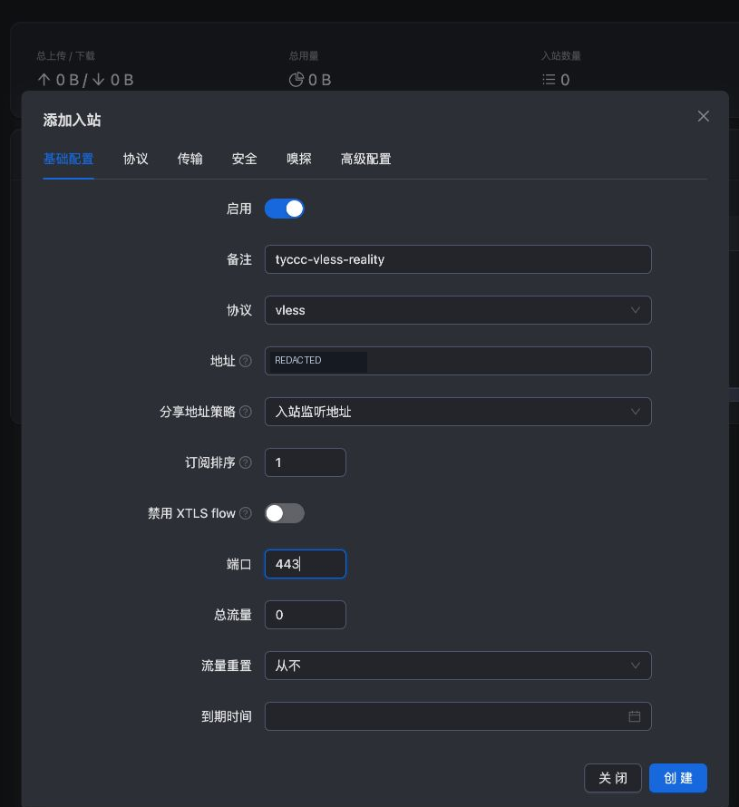
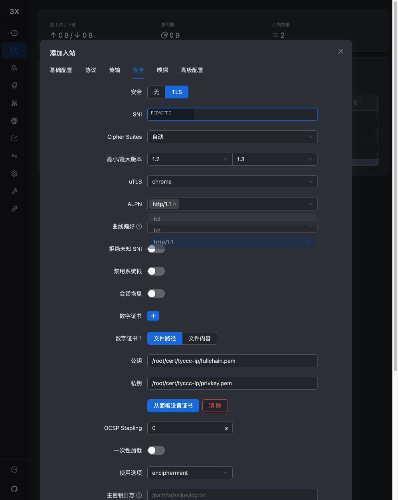
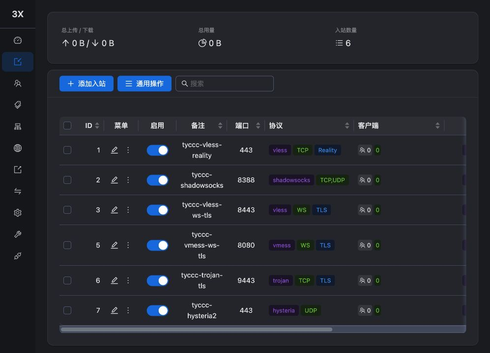

# 04 · 浏览器配置六种入口

上一课：[[03-签发IP证书与自动续期]]。这一课的操作实际使用电脑控制工具点击浏览器中的 3x-ui。每个入口都在“入站 → 添加入站”中创建，细节分别链接到协议页。

先读 [[协议传输与安全层]]。**协议、传输、安全是三个不同字段**，例如 VLESS + WebSocket + TLS。面板的一行只是入口；下一课关联客户端后才有可用身份。

## 先认识表单

左侧导航进入“入站”。如果菜单悬浮在表格上，点击侧栏顶部图钉固定它，本次曾因侧栏遮挡导致“添加客户端”点击不到。

点击“添加入站”，依次检查：

1. **基础配置：** 备注用于自己辨认；协议决定认证方式；地址填 tyccc 的公网 IPv4；端口按下表填写。
2. **协议：** 填该协议专用设置，例如 Shadowsocks 算法。VLESS 的 encryption/decryption 本次保持 none，外层仍必须用 REALITY 或 TLS。
3. **传输：** 选择 RAW/TCP、WebSocket 或 Hysteria 对应传输。
4. **安全：** REALITY 填配对参数；TLS 填证书路径；Shadowsocks 使用自身加密。
5. 本次不额外开启嗅探和复杂路由，保存后回表格检查备注、端口、协议、启用状态。

监听地址填公网 IP 的目的是明确使用这块 IPv4 地址，同时供面板导出节点地址。若留空，监听范围和分享地址策略会发生变化；若错填 127.0.0.1，外部客户端就无法直接连接。

## 按顺序创建

| 点击进入详细教程 | 端口 | 传输 | 安全 | 特别注意 |
| --- | --- | --- | --- | --- |
| [[VLESS-REALITY配置]] | TCP 443 | RAW/TCP | REALITY | 使用与服务端兼容的 Xray；Vision 仅用于该入口 |
| [[Shadowsocks-2022配置]] | TCP/UDP 8388 | TCP、UDP | 自身加密 | 服务器密钥和用户密钥都参与认证 |
| [[VLESS-WebSocket-TLS配置]] | TCP 8443 | WebSocket | TLS | 路径 `/vless-ws`；禁用 XTLS flow |
| [[VMess-WebSocket-TLS配置]] | TCP 8080 | WebSocket | TLS | 路径 `/vmess-ws`；注意内核兼容性 |
| [[Trojan-TLS配置]] | TCP 9443 | RAW/TCP | TLS | 使用客户端密码 |
| [[Hysteria2配置]] | UDP 443 | Hysteria 2 | TLS | TCP 443 与 UDP 443 可以同时使用 |

不要一次只抄表格就结束；进入对应文章对照各页截图。表格只提供总览。

## TLS 的公共字段

| 面板字段 | 本次填写 | 作用 |
| --- | --- | --- |
| SNI | tyccc 的真实 IP | 作为客户端验证身份的依据；IP 字面量通常不会在线路上发送 DNS SNI |
| 证书来源 | 文件路径 | 从服务器磁盘读取已经安装的证书 |
| 公钥/证书路径 | `/root/cert/tyccc-ip/fullchain.pem` | 含证书链，不是 REALITY 那种短公钥字符串 |
| 私钥路径 | `/root/cert/tyccc-ip/privkey.pem` | 读取私钥，不能填写到客户端 |
| ALPN：WebSocket | 只选 `http/1.1` | 这次 WS 使用 HTTP/1.1 升级 |
| ALPN：Trojan | `h2,http/1.1` | 本次保留面板默认 |
| ALPN：Hysteria2 | `h3` | QUIC 上的 HTTP/3 |

多选下拉框先删除不需要的标签，再选所需值。不要只在输入框打字却没有按回车确认。ALPN 和 SNI 的含义见 [[SNI]]、[[ALPN]]。

## 这次遇到的两个界面细节

**克隆不能改变协议。** 为了尝试复用 TLS 字段，本次克隆了一条新建的 VLESS 入站，发现克隆仍锁定协议，还会清空监听地址并改变部分选项。于是删除这条无客户端、未启用的临时克隆，重新“添加入站”创建 VMess。最终 ID 有跳号，正常；不要为了连续编号删除已有节点。

**保存和可用是两回事。** 截图中最初 6 条入站的客户端都是 0；这只说明入口创建好了。不要拿绿色开关当作连通测试结果。

**完成标准：** 6 条入站已创建，协议/端口正确，WS 禁用 Vision，TLS 文件路径正确。下一课：[[05-添加客户端与导出连接]]。

来源：[3x-ui 项目与说明](https://github.com/MHSanaei/3x-ui)、[Xray 传输配置](https://xtls.github.io/config/transport.html)、[TLS 配置](https://xtls.github.io/config/transports/tls.html)。
