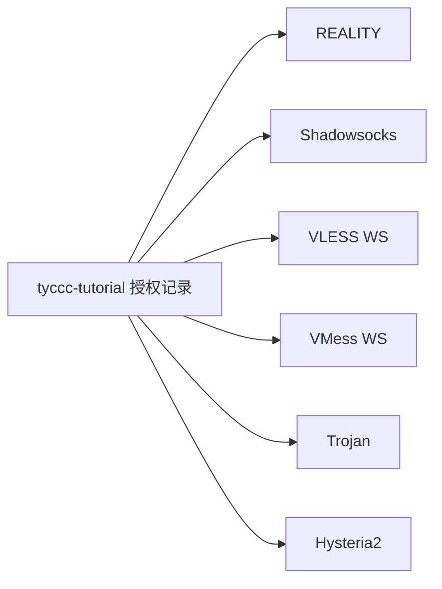
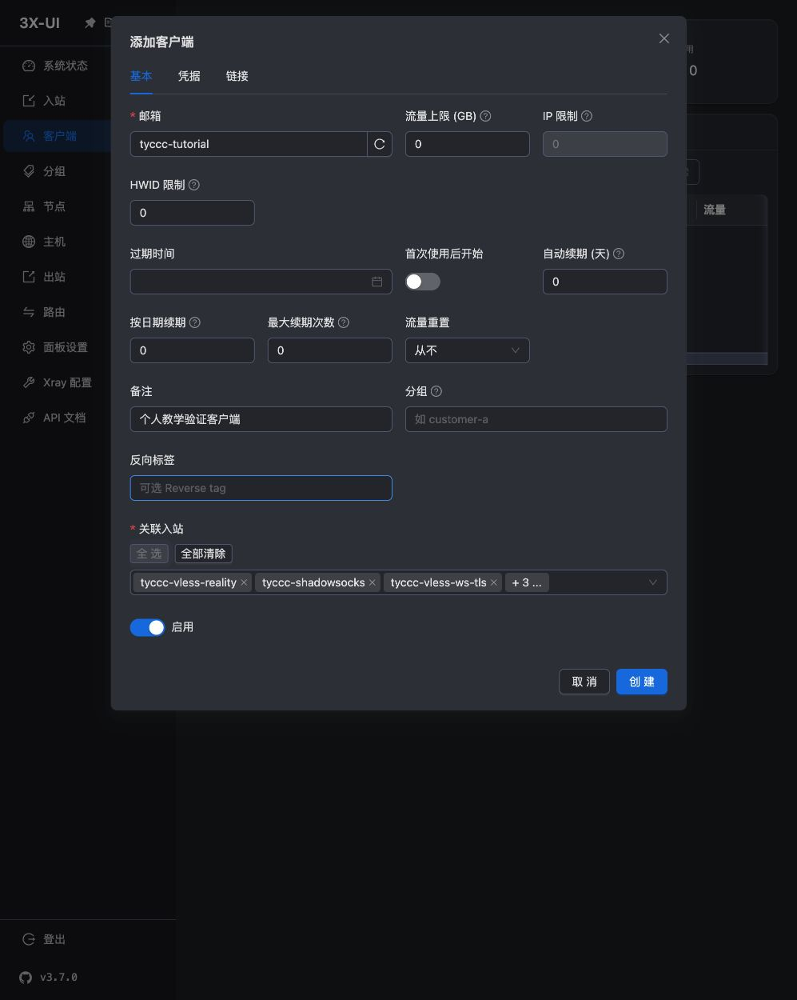
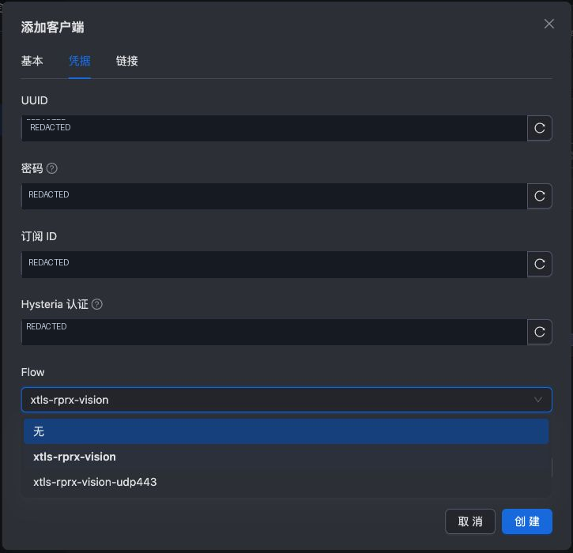
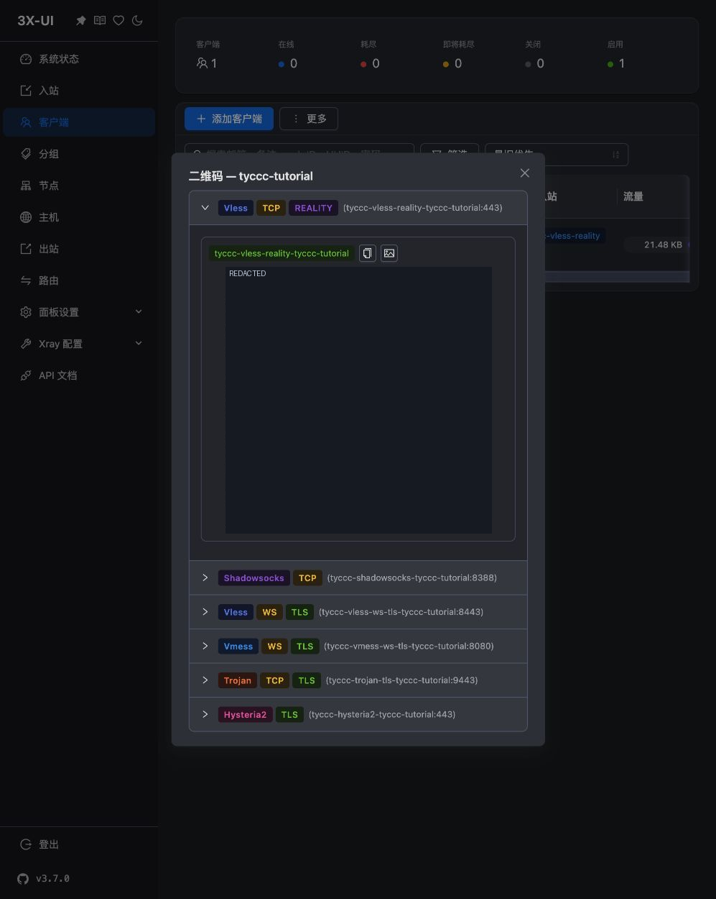

# 05 · 添加客户端与导出连接

上一课：[[04-浏览器配置六种入口]]。现在入口已经存在，给它们加上“谁可以使用”的身份。先读 [[UUID密码与订阅链接]]。

## 一个人、六个入口

3x-ui v3.7.0 有独立的“客户端”菜单。这里的客户端是一条授权记录，电脑上的 v2rayN 则是客户端软件，两个用法要区分。

1. 点击左侧“客户端 → 添加客户端”。
2. “邮箱”填 `tyccc-tutorial`。本次它是唯一标识，不是真正收邮件的地址。
3. 备注填“个人教学验证客户端”。流量上限 0 表示不设这项上限；到期时间留空表示不设到期日。IP 限制可能依赖附加功能，本次不启用。
4. 在“关联入站”点击“全选”，确认选择的是本次创建的 6 个入口。面板若还有别人的入口，应该逐一选择，而不是全选。

## 凭据页怎么填

保持面板新生成的 UUID、密码、订阅 ID、Hysteria 认证值，不复用 meu 的任何秘密。选择 Flow 为 `xtls-rprx-vision`，VMess 加密为 `auto`，点击“创建”。

这次面板将 Flow 保存为**入站关联的覆盖值**：REALITY 关联使用 `xtls-rprx-vision`，其他 5 条为空；VLESS WS 入站的“禁用 XTLS flow”也已开启。教程根据实际数据库和导出链接核对，不能假设“选一次 Flow 就适用所有传输”。

## 导出节点

在客户端列表点击二维码图标。弹窗按入站显示各节点：

1. 展开所需入站，每次只展开一条便于看完整二维码。
2. 手机可在支持该协议的客户端中扫描；电脑可以使用复制链接功能。
3. 不要把“复制二维码图片”当作“复制链接文本”。不同按钮可能只显示图标，应查看提示文字。
4. 将节点链接放在私人密码库。本次另外从真实截图解码二维码来核对导出内容，得到六条真实链接，保存在教程仓库外。

二维码就是凭据的另一种表示：遮住旁边的密码却保留完整二维码，仍然泄露了连接权限。

本次关闭公开订阅，因此以静态节点链接交付。修改服务器上的凭据、SNI、端口或路径后，要重新导出并更新客户端；旧的静态链接不会自动变化。

## 导入电脑软件

本机已有 v2rayN，但它附带的内核文件最初没有执行权限，因此本次验证使用了仓库外的可执行副本，并额外下载官方 Xray v26.7.28。没有替换原应用文件，也没有修改正在使用的系统代理。

具体导入界面与可复现验证见 [[06-连接验证与结果]]。不要把“导入成功”当作“连接成功”：它可能只证明链接语法能够解析。

**完成标准：** 客户端启用，关联 6 条入站，导出地址和端口正确，连接凭据保存在私人位置。下一课：[[06-连接验证与结果]]。

来源：[3x-ui v3.7.0](https://github.com/MHSanaei/3x-ui/releases/tag/v3.7.0)、[v2rayN 官方项目](https://github.com/2dust/v2rayN)。
