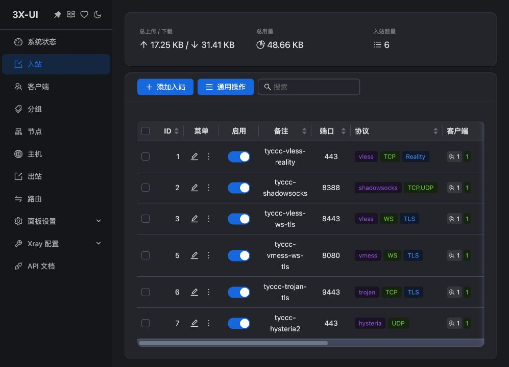

# 06 · 连接验证与结果

上一课：[[05-添加客户端与导出连接]]。这一课分清三种状态：“表单保存了”“端口在监听”“真的能访问目标”。只有第三种才满足本次验收。

## 本次实际结果

测试日期为 2026-09-07。所有正向测试都显式指定本机临时 SOCKS5 入口，通过待测协议访问 `https://api.ipify.org`，返回结果与 tyccc 的公网 IPv4 比较。TLS 校验没有关闭；REALITY 使用其专用验证。

| 入口 | 本次通过的客户端内核 | HTTPS 与出口 | 错误凭据 | 额外 UDP 测试 |
| --- | --- | --- | --- | --- |
| VLESS + REALITY + Vision | Xray 26.7.28 | 通过 | 错误 UUID 失败 | 本次未单独测试 |
| Shadowsocks 2022 | sing-box 1.12.22 | 通过 | 错误用户密钥失败 | DNS 回应通过 |
| VLESS + WS + TLS | sing-box 1.12.22 | 通过 | 错误 UUID 失败 | 本次未单独测试 |
| VMess + WS + TLS | Xray 26.7.28 | 通过 | 错误 UUID 失败 | 本次未单独测试 |
| Trojan + TLS | sing-box 1.12.22 | 通过 | 错误密码失败 | 本次未单独测试 |
| Hysteria2 | sing-box 1.12.22 | 通过 | 错误认证值失败 | DNS 回应通过 |

机器可读记录见 [验证结果](../05-探索记录/验证结果.json)。原始含地址日志只保存在仓库外。故障与修复过程见 [[REALITY握手与客户端兼容性排错]]，不能把初次失败从探索记录中删掉。



截图中的流量是辅助证据，截图本身不能证明流量目的地、认证是否正确或 UDP 可用。上表来自实际请求的结果。

## 新手用界面导入时怎么判断

1. 从 [[05-添加客户端与导出连接]] 获取自己节点的链接。
2. 在支持相应协议的客户端里新建一个独立分组，例如 `tyccc-tutorial-20260907`。静态节点分组不需要填写订阅 URL。
3. 使用“从剪贴板导入分享链接”，或手机的扫码入口。核对备注、服务器 IP、端口、TLS、WS 路径、REALITY SNI 与 Flow。
4. 核对实际运行内核版本，见 [[客户端软件与内核]]。REALITY 和 VMess 优先使用本次已验证通过的 Xray 26.7.28。
5. 先运行客户端内置真连接测试，再用下面的指定代理请求验证出口；不要只依赖 ping 延迟。

**实操边界：** 本次已打开本机 v2rayN V7.24.4，确认其中原有 MEU、tyccc 等分组和正在使用的其他节点。原生窗口控制随后不稳定，因此没有把 GUI 导入或 GUI 内的切换写成“已完成”。交付的六条链接与六个隔离内核配置均在仓库外，实际网络验证由内核完成；不改变原应用节点和现有系统代理。

## 在电脑终端复现测试

理解 [[SOCKS5与系统代理]] 后，使用交付的对应 JSON。配置含真实凭据，不要放进本教程 Git 仓库。以下命令中的路径是说明占位，需替换成自己的文件位置。

Xray 方案在**电脑终端窗口 A**运行：

```bash
/你的内核目录/xray run -test -c /你的私人目录/节点.json
/你的内核目录/xray run -c /你的私人目录/节点.json
```

sing-box 方案：

```bash
/你的内核目录/sing-box check -c /你的私人目录/节点.json
/你的内核目录/sing-box run -c /你的私人目录/节点.json
```

第一条只检查配置能否加载；第二条实际运行，窗口需要保持打开。另开**电脑终端窗口 B**，使用该 JSON 的本地监听端口，例如 49081：

```bash
curl --noproxy '' --proxy socks5h://127.0.0.1:49081 --max-time 15 https://api.ipify.org
```

`--proxy` 指定本次入口，`--noproxy ''` 清空可能让请求绕过代理的例外，`--max-time 15` 避免一直等待。返回一个 IP 后与自己的 VPS IP 对照，成功标准是两者相等。测试完成到窗口 A 按 Control+C 停止临时内核。

本次六个配置使用互不冲突的临时端口，精确值写在私人交付信息中。不要误把 v2rayN 当前的 10808 当成正在测试的新节点入口，否则可能验证了原有节点。

## 负向测试为什么必要

复制一份**客户端**测试配置，把其中 UUID 或密码改错，再用同一条命令访问。正确配置先成功、错误配置再失败，才支持“认证确实在起作用”的结论。如果两份都失败，不能宣称认证检查通过。

本次没有修改服务端真实凭据来制造故障。失败的错误码可能因协议不同而不同，例如 SSL 连接中断或超时；这些错误码不是通用的“密码错”判定器，需要结合前后对照。

## UDP 验证做了什么

本次通过 SOCKS5 UDP ASSOCIATE 建立转发，向 1.1.1.1 的 UDP 53 发送 `example.com` DNS 查询，核对事务 ID、无错误返回码和有效答案。Shadowsocks、Hysteria2 均通过。

这不是速度或耐久测试，没有测长期丢包、全部网站、手机网络或所有客户端版本。也没有观察未来的证书续期成功。下一课：[[07-用Obsidian阅读与Git保存]]；日常维护从 [[备份恢复与升级]] 开始。

来源：[curl 手册](https://curl.se/docs/manpage.html)、[SOCKS5 标准](https://www.rfc-editor.org/rfc/rfc1928)、[v2rayN](https://github.com/2dust/v2rayN)、[Xray 发布](https://github.com/XTLS/Xray-core/releases/tag/v26.7.28)。
