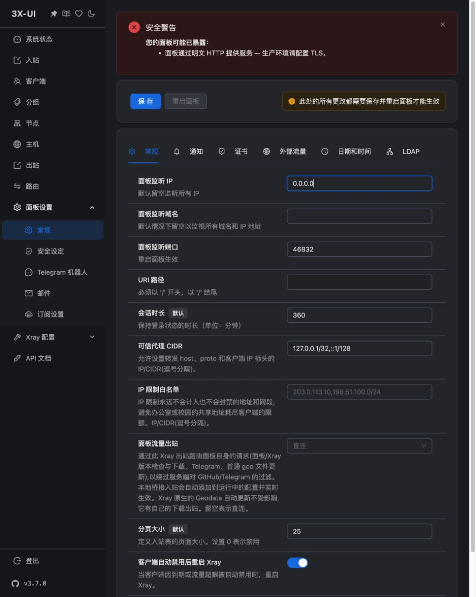
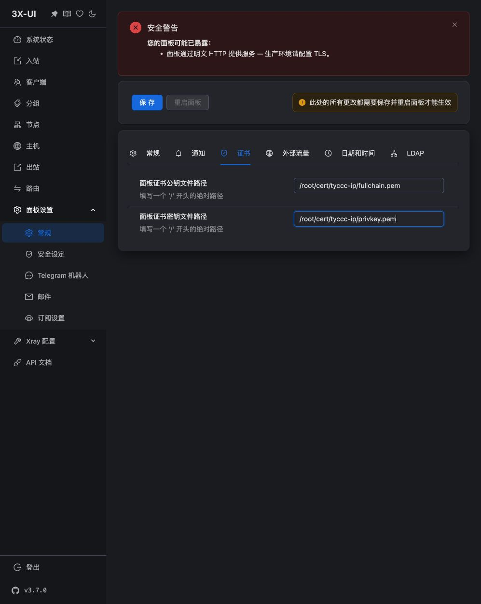

# 08 · 开放公网 HTTPS 面板

上一课：[[07-用Obsidian阅读与Git保存]]。本课记录 2026-09-07 用户要求“开放公网访问”后的实际变更。

现在可以直接用浏览器打开面板，不需要先运行 SSH 隧道。账号密码沿用原值。公开教程不放真实入口路径和凭据，请从私人连接信息取得完整地址。

## 先理解要改变什么

面板是管理服务器的网页；代理节点是客户端实际连接的服务。开放面板不会自动生成新的代理节点，也不能把面板网址当成订阅链接。本次只调整面板访问方式，公开订阅保持关闭。

原先的 `127.0.0.1` 表示服务器只接受从自己内部来的面板连接，电脑需要通过 [[SSH隧道]] 才能进入。将监听 IP 设为 `0.0.0.0` 后，程序可以接收外部连接；再配上 [[TLS证书与HTTPS]]，浏览器与面板之间传输的账号密码会受到 TLS 加密保护。登录认证仍然负责判断谁有权管理服务器。

## 第一步：保留能返回原状态的备份

修改前通过 SQLite 的备份功能生成数据库副本，并下载到仓库外的私人目录；修改后另存一份。数据库包含敏感信息，不能提交到公共 Git 仓库。一般备份和恢复方法见 [[备份恢复与升级]]。

本次私人副本分别为 `before-public-panel.db` 和 `after-public-panel.db`。前者对应原来的本地 HTTP 与 SSH 隧道方式，后者对应公网 HTTPS。恢复前需核对备份时间，避免同时覆盖后来新增的节点或客户端。

## 第二步：允许面板接收外部连接

先通过原来的 SSH 隧道进入面板，在左侧打开“面板设置 → 常规”，再选择页面顶部的“常规”标签。

| 字段 | 本次填写 | 为什么 |
| --- | --- | --- |
| 面板监听 IP | `0.0.0.0` | 接收外部网络接口上的连接 |
| 面板监听域名 | 留空 | 本次使用 IP 访问 |
| 面板监听端口 | `46832` | 保留现有端口，减少地址变化 |
| URI 路径 | 保留原来的随机路径 | 完整网址必须包含此路径 |

`0.0.0.0` 是程序的监听设置，不能把它填进浏览器当服务器地址。浏览器里要用自己 VPS 的真实公网 IP。[[防火墙与监听地址]] 解释了监听与防火墙放行的区别。



图中是保存重启前的状态，所以顶部仍显示 HTTP 警告。下一步同时配置证书，再保存并重启使其生效。

## 第三步：让面板使用 HTTPS

在同一页面切换到“证书”标签，使用 [[03-签发IP证书与自动续期]] 已部署的证书文件。

| 字段 | 本次填写 |
| --- | --- |
| 面板证书公钥文件路径 | `/root/cert/tyccc-ip/fullchain.pem` |
| 面板证书私钥文件路径 | `/root/cert/tyccc-ip/privkey.pem` |

这里填写的是**服务器上文件的位置**，不是电脑上的文件路径，也不是把私钥内容复制进输入框。证书证明服务器的 IP 身份，私钥用于相应的密码学操作，应留在服务器上。



点击顶部“保存”，然后点击“重启面板”，在弹窗中确认重启。重启时网页连接会短暂断开。

已有的 ACME 定时任务会检查续期、部署到上述路径并重启面板，所以面板会读取部署后的证书。本次没有等待到未来实际续期，不能把配置存在写成未来续期已经成功。

## 第四步：改用完整的公网地址

在浏览器地址栏输入这样的结构：

```text
https://你的服务器公网IP:46832/原来的随机URI路径/
```

必须同时保留 `https`、端口和路径。本次没有改为通常 HTTPS 使用的默认端口 443，因为服务器的代理服务已经在使用该端口。

旧的 `http://127.0.0.1:46832/...` 已不适用。如果把旧地址只改成 `https://127.0.0.1`，证书仍会不匹配：证书签给服务器公网 IP，不是电脑本机的 `127.0.0.1`。应使用正确的公网 IP 地址；证书错误需要核对地址、有效期和证书配置。

## 实际验证结果与边界

- 从电脑直接向公网地址发起 HTTPS 请求，关闭该测试程序的代理设置，不经过 SSH 隧道，使用默认信任库与证书身份校验：登录页返回 HTTP 200。
- 使用原有账号密码向页面实际使用的登录接口提交请求：返回成功；携带登录会话访问面板页面返回 HTTP 200。
- 在服务器核对服务为 `active`，监听端口包含面板 `46832` 和六条代理入口所需端口，数据库完整性为 `ok`，入站数仍为 6。
- 公网页面的内置浏览器导航多次超时，因此本次没有取得公网登录后的浏览器截图。上面的两张图是真实配置过程；登录成功的证据来自 HTTPS 接口验证，不能把它写成浏览器登录实测。

可复核的脱敏记录：[公网面板验证.json](../05-探索记录/公网面板验证.json)。本次未重新执行六种协议的全部通信对照测试；上一次的通信验收见 [[06-连接验证与结果]]。外部网络测试说明当前电脑这条网络路径可达，不代表所有地区和运营商都可达。

## 后续维护

面板现在可以从公网尝试登录，保管好密码与完整入口地址。若将来只允许固定地点访问，可结合云防火墙或系统防火墙限制管理端口的来源；更改规则前先保留一个可用的 SSH 会话，以便纠正误配置。

来源：[3x-ui 官方项目](https://github.com/MHSanaei/3x-ui)、[官方安装说明](https://docs.sanaei.dev/docs/guide/installation/)、[Let's Encrypt 的短期证书与 IP 证书说明](https://letsencrypt.org/2026/01/15/6day-and-ip-general-availability)。本课具体字段名称和保存重启流程以本次 v3.7.0 浏览器实操为依据。
