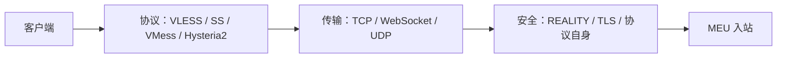

# MEU 五个入站：逐表单配置说明

这篇课把 MEU 当前的五条入站拆开讲。目标不是让人照抄一串“神秘参数”，而是让第一次使用 3x-ui 的人知道每个表单项在决定什么、客户端哪里必须跟着一致，以及什么情况下不要随意改动。

文中的“当前值”来自 2026-09-08 对 MEU 生效配置的只读核对。公开版本用“MEU 公网 IP”“已生成的 UUID/密码/认证值”“已配置的路径”替代真实凭据、订阅路径和证书文件位置；这些信息泄露后可以直接被他人使用。先读 [[入站出站与路由]]、[[协议传输与安全层]]、[[TLS证书与HTTPS]]。

## 先把五条入站看成五种组合

一条入站由四层组合而成：**协议**负责识别用户，**传输**决定数据怎样装进 TCP、WebSocket 或 UDP，**安全**负责 TLS/REALITY 等保护，**客户端凭据**决定谁能连进来。

| 订阅顺序 | 当前备注 | 协议 + 传输 + 安全 | 端口 | 用它解决什么 |
| --- | --- | --- | --- | --- |
| 1 | `vless+tcp+reality` | VLESS + RAW/TCP + REALITY | TCP `443` | 现代 VLESS 直连方案，使用 REALITY 身份验证。 |
| 2 | `personal-ss` | Shadowsocks + TCP/UDP | TCP/UDP `8388` | 简单、兼容面广，也可转发 UDP。 |
| 3 | `personal-vmess` | VMess + WebSocket，无额外 TLS | TCP `8080` | 保留的兼容节点；协议自身保护载荷。 |
| 4 | `ip-vless-ws-tls` | VLESS + WebSocket + TLS | TCP `8443` | 标准 HTTPS/WebSocket 形态，使用 IP 证书。 |
| 5 | `ip-hysteria2` | Hysteria2 + UDP/QUIC + TLS | UDP `443` | 在 UDP 网络可用时使用 QUIC，ALPN 为 `h3`。 |

它们不是五个“必须全部打开”的安全等级。它们是不同网络、客户端兼容性和传输方式的备用入口。客户端只要选择其中一条能正常连通的节点即可。

## 所有入站都先填写的“基础配置”表单

截图里的“基础配置”页控制服务怎样监听、怎样被订阅导出。它不决定 TLS 或 WebSocket，后两者在其他标签页填写。

| 表单项 | MEU 当前填写方式 | 意义与填写原则 |
| --- | --- | --- |
| 启用 | 开启 | 关闭后配置仍保存，但 Xray 不监听该入口。排错时可临时关闭一条，不要删掉仍需保留的凭据。 |
| 备注 | 五条备注如上表 | 只给人看，用协议+传输+安全命名最容易辨认；它不是连接密码。 |
| 协议 | 分别为 VLESS、Shadowsocks、VMess、Hysteria | 决定“协议”页有哪些字段。3x-ui 中已创建入站通常不能直接改协议；要换协议，新建一条更安全。 |
| 地址 | 留空 | 表示监听服务器的可用地址。这里的“监听地址”与“分享地址”不同；留空不等于把节点地址写进订阅。 |
| 分享地址策略 | 自定义 | 明确让订阅导出 MEU 公网 IP，不依赖面板猜测。 |
| 自定义分享地址 | MEU 公网 IP | 这是订阅中客户端要连接的地址。迁移到 IP 证书后五条都已统一为 IP，避免订阅仍导出旧域名。 |
| 订阅排序 | `1` 到 `5` | 只决定订阅列表展示顺序，不能改变优先级、性能或路由。 |
| 端口 | `443`、`8388`、`8080`、`8443`、`443` | TCP 与 UDP 可以复用同一个数字；例如 REALITY 使用 TCP 443，Hysteria2 使用 UDP 443，并不冲突。 |
| 总流量 / 流量重置 / 到期时间 | `0`、从不、留空 | 当前入站层没有总量和日期限制。若将来要限额，优先在“客户端”上按人设置，避免一人耗尽整条入站。 |

### 最容易混淆的三个“地址”

| 名称 | 控制什么 | 这次的填写 |
| --- | --- | --- |
| 监听地址 | Xray 在服务器哪个本地网卡接收连接 | 留空，接受服务器可用接口。 |
| 分享地址 | 订阅导出给客户端的主机名或 IP | MEU 公网 IP。 |
| TLS SNI / WebSocket Host | 客户端握手时附带的身份或 HTTP 字段 | 只在有对应传输/安全层时填写，不能把它当作监听地址。 |

## 每条入站的表单该怎样理解

### 1. VLESS + TCP + REALITY（TCP 443）

这条是截图中正在编辑的入口。VLESS 用 UUID 识别用户，本身不默认加密；当前保护来自 REALITY。Xray 官方说明中，VLESS 的 `decryption` 关闭时必须明确写为 `none`，而 VLESS 在公网应配合 TLS、REALITY 或 VLESS Encryption 使用。[VLESS 入站说明](https://xtls.github.io/config/inbounds/vless.html)

| 标签页 | 当前关键填写 | 为什么这样填 |
| --- | --- | --- |
| 基础配置 | 启用；端口 TCP `443`；自定义分享地址为 MEU 公网 IP；排序 `1` | 443 是常见 TLS 端口；分享地址让订阅导出正确公网端点。 |
| 协议 | VLESS；一个已启用客户端；UUID 由面板生成；`decryption=none`；用户 Flow 为 `xtls-rprx-vision` | UUID 是进入权限，不能手填同一个值给多人。`none` 表示不另开 VLESS Encryption，因为 REALITY 承担外层保护。Vision 只应在支持的 VLESS + TCP + REALITY 组合中使用，客户端必须同样选择 Vision。 |
| 传输 | RAW/TCP | 不再嵌套 WebSocket，层次少、开销低；客户端传输必须也是 TCP/RAW。 |
| 安全 | REALITY；目标站点、serverNames、shortId、私钥都已生成；`show=false`、`xver=0` | REALITY 用目标站点参数进行握手伪装与认证。私钥只留服务端，客户端使用配套公钥、SNI 和 shortId。不要为了“换一个看起来更好的网站”随意改 target；客户端参数会随之失配。 |
| 嗅探 | 开启；HTTP、TLS、QUIC、FakeDNS | 让 Xray 在有路由规则时能识别目标类型。当前默认直连时影响有限，不能把嗅探当作加密。 |
| 高级配置 | 保持默认 | 没有反向代理、外部代理或 PROXY Protocol 需求时，不增加高级字段。 |

**为什么端口 443 可以同时给 Hysteria2 用？** 因为本条监听 TCP，Hysteria2 监听 UDP。TCP 443 与 UDP 443 是两条不同的端口空间。

### 2. Shadowsocks（TCP/UDP 8388）

Shadowsocks 的优点是客户端实现多、配置短。MEU 当前使用 `chacha20-ietf-poly1305`，同一个入站同时接受 TCP 和 UDP。它没有单独 TLS/SNI 表单，因为加密与认证由协议的加密方法和密码完成。

| 标签页 | 当前关键填写 | 为什么这样填 |
| --- | --- | --- |
| 基础配置 | 启用；端口 `8388`；自定义分享地址；排序 `2` | 同时放行 TCP/UDP。防火墙也必须允许两种协议的 8388。 |
| 协议 | Shadowsocks；方法 `chacha20-ietf-poly1305`；面板生成密码；一个已启用用户 | 加密方法和密码是成对参数，客户端必须完全一致。此方法用于保留与旧客户端的兼容性。 |
| 传输 | TCP 与 UDP | UDP 支持有利于 DNS、实时通信等场景；网络限制 UDP 时，客户端可能只有 TCP 可用。 |
| 安全 | 无单独 TLS | 这是协议设计，不是忘记配置 TLS。不要给 SS 节点强填 TLS/SNI；客户端导出的 `ss://` 链接已经包含所需方法和密码。 |
| 嗅探 | 开启 | 与其他 TCP 入站一致，服务端路由需要时可利用目标类型。 |

新建节点时，若所有客户端都支持 SS2022，应评估官方推荐的 SS2022 方法；它改进了重放保护。当前这条保留旧方法是兼容性选择，不能在客户端未同步更换密码和方法时直接改。[Shadowsocks 入站说明](https://xtls.github.io/config/inbounds/shadowsocks.html)

### 3. VMess + WebSocket（TCP 8080）

这是一条保留的兼容入口。VMess 使用 UUID，并由协议自身保护载荷；当前没有额外 TLS。它不是 HTTPS 节点，因此不能配置成“证书验证已开启”的状态。

| 标签页 | 当前关键填写 | 为什么这样填 |
| --- | --- | --- |
| 基础配置 | 启用；端口 TCP `8080`；自定义分享地址；排序 `3` | 使用独立 TCP 端口，避免占用 443/8443。 |
| 协议 | VMess；一个 UUID 客户端；加密 `auto`；`disableInsecureEncryption=false` | `auto` 让客户端与服务端协商 VMess 的可用保护方式。后一个字段是兼容旧客户端的保留设置，不应被理解为 TLS 或身份校验。 |
| 传输 | WebSocket；路径已配置；Host 未额外配置 | 路径必须与客户端导出的链接一致。当前不额外指定 Host，因此不要在客户端凭空填一个域名。 |
| 安全 | `none` | 当前没有 TLS 证书、SNI 或 ALPN。若要改为 VMess + WS + TLS，应新建入口并让客户端重新导入；不能只在客户端勾选 TLS。 |
| 嗅探 | 开启 | 作用同上。 |

VMess 与 Shadowsocks 都能保护载荷，但它们不能提供普通 TLS/REALITY 的 HTTPS 外观；因此它们适合兼容性用途，不应被误解为与 TLS 入站完全等价。[Xray 传输与安全组合表](https://xtls.github.io/en/config/transport.html)

### 4. VLESS + WebSocket + TLS（TCP 8443）

这条是本次迁移到 IP 证书的节点。它把 VLESS 放进 WebSocket，再由 TLS 保护，适合学习“协议、传输、安全层各负责什么”。

| 标签页 | 当前关键填写 | 为什么这样填 |
| --- | --- | --- |
| 基础配置 | 启用；端口 TCP `8443`；自定义分享地址；排序 `4` | 不占用 TCP 443，仍可使用标准 TLS。 |
| 协议 | VLESS；`decryption=none`；用户 Flow 留空 | 外层 TLS 已提供保护，VLESS 不再另开 VLESS Encryption。Vision 不适用于这条 WS 组合，因此 Flow 必须留空。 |
| 传输 | WebSocket；路径已配置；Host 为 MEU 公网 IP | 客户端的路径与 Host 必须从当前订阅/分享链接导入。Host 统一为 IP，避免旧域名与 IP 证书产生身份混乱。 |
| 安全 | TLS；SNI 为 MEU 公网 IP；证书与私钥文件存在；ALPN `http/1.1` | IP SNI 与证书 SAN 都是同一个 IP，客户端可正常校验证书。WebSocket 使用 HTTP/1.1 握手，所以 ALPN 选择 `http/1.1`。私钥只由服务端读取。 |
| 嗅探 | 开启 | 保留统一路由行为。 |

这里最关键的是“三处一致”：**订阅地址 = TLS SNI = 证书 SAN**。任何一处仍是旧域名，客户端就可能出现证书不匹配或导出旧节点；完整排错见 [[MEU域名节点与IP证书兼容性]]。

### 5. Hysteria2（UDP 443）

3x-ui 在 Xray 中把它显示为 `hysteria` 协议，当前版本字段为 `2`，所以它是 Hysteria2。它用 UDP/QUIC，不是“TCP 上的 Hysteria”，因此防火墙必须允许 **UDP 443**。

| 标签页 | 当前关键填写 | 为什么这样填 |
| --- | --- | --- |
| 基础配置 | 启用；端口 UDP `443`；自定义分享地址；排序 `5` | 与 TCP 443 的 REALITY 并存，不会抢占端口。 |
| 协议 | Hysteria；版本 `2`；一个用户认证字段 | Hysteria2 使用 `auth` 识别用户，不是 VLESS/VMess UUID。客户端必须重新导入当前链接，不能把旧认证值手抄回来。 |
| 传输 | Hysteria/QUIC | 使用 UDP 承载 QUIC；若网络封锁 UDP，选择 TCP 节点作为回退。 |
| 安全 | TLS；SNI 为 MEU 公网 IP；证书与私钥文件存在；ALPN `h3` | QUIC/HTTP/3 使用 `h3`。IP 证书与 IP SNI 一致，保持客户端“跳过证书验证”关闭。 |
| 嗅探 | 当前关闭 | 当前没有依赖嗅探的 Hysteria 路由需求，关闭可减少额外解析；这不影响 TLS。 |

Xray 官方要求 Hysteria 的版本为 2，并说明认证用户字段与 Hysteria 传输层配合生效。[Hysteria 入站说明](https://xtls.github.io/config/inbounds/hysteria.html)

## 创建或修改时的安全顺序

1. **先定组合。** 先决定协议、传输和安全层，再创建入站；创建后不要把 VLESS 改成 VMess。
2. **先填基础配置。** 备注、端口、分享地址和订阅排序先清楚，避免订阅导出错误地址。
3. **生成凭据。** 让 3x-ui 生成 UUID、密码、shortId、Reality 密钥或 Hysteria 认证值；每个用户分开创建。
4. **让两端严格一致。** WebSocket 路径/Host、TLS SNI、Reality 公钥/shortId、SS 方法和 Hysteria `auth` 都必须以面板当前导出值为准。
5. **保存后重启并验证。** 检查 x-ui 服务、TCP/UDP 监听、订阅导出的五条链接和客户端实际连接。只看到“保存成功”不算完成。

## 修改前的快速检查表

| 想改什么 | 应同时核对什么 | 常见后果 |
| --- | --- | --- |
| 分享地址 | 订阅重新导出、客户端地址 | 订阅仍指向旧域名/IP。 |
| WebSocket 路径或 Host | 客户端节点重新导入 | 握手失败或连接被拒。 |
| TLS 证书、SNI 或 ALPN | 证书 SAN、客户端证书校验 | 证书不匹配，诱使人错误开启跳过验证。 |
| Reality target、serverName、shortId、密钥 | 整条 Reality 客户端链接 | 客户端无法认证；错误请求会走 REALITY target。 |
| SS 方法或密码 | 所有 SS 客户端 | 全部 SS 连接同时断开。 |
| Hysteria `auth` | 所有 Hysteria2 客户端 | 服务端会返回认证失败。 |

每次变更后都从 3x-ui 客户端页重新导出订阅，再在 v2rayN 的“订阅分组”中更新。订阅 URL 是一组节点的领取地址，不能用“从剪切板导入单条分享链接”处理；步骤见 [[3x-ui订阅表单核对清单]]。
