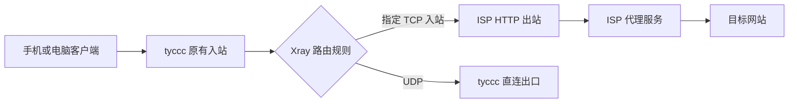

# 11 · 将 ISP 代理接入 tyccc 链式出口

这次实操把一份带账号密码的 ISP **HTTP 代理**接到 tyccc 的 3x-ui/Xray 后面。客户端仍只连接 tyccc 的原有节点；账号密码只保存在 tyccc 上，客户端订阅和分享链接都不用改。

真实 ISP 地址、账号、密码、面板地址、证书和订阅链接属于私密信息，不写进仓库。下文的标签、端口和结构用于解释和复现，不能直接代替自己的参数。

先读 [[入站出站与路由]]、[[链式代理与中转落地]]、[[TCP与UDP]]。

## 目标与实际链路



这里的“入站”是 tyccc 接收客户端连接的门；“出站”是 tyccc 访问下一站的方式；“路由规则”是两者之间的分流表。只有同时创建出站和规则，流量才会走 ISP。3x-ui 官方也把这两部分放在 Xray Settings 的 Outbounds / Routing 中，并说明规则按从上到下的顺序匹配。[3x-ui 出站与路由说明](https://github.com/MHSanaei/3x-ui/blob/main/docs/content/docs/zh/operations/outbounds-routing.mdx)

## 先核对供应商交付的是什么

这次交付包含地址、账号、密码和两个候选端口。不能因为名称里有“ISP”就假定协议是 SOCKS5，也不能假定两个端口都可用。

| 要核对的项目 | 本次结果 | 为什么先核对 |
| --- | --- | --- |
| 代理协议 | HTTP 代理 | Xray 的出站 `protocol` 必须与供应商协议一致。把 HTTP 当 SOCKS5 会在认证或握手时失败。 |
| 认证方式 | 用户名 + 密码 | 两项都填到服务端出站；它们不是客户端节点的 UUID。 |
| 可用端口 | `50100` 可用 | 另一个候选端口连接失败，因此没有加入生产路由。 |
| 预期出口 | 供应商交付的 ISP 地址 | 用一个出口 IP 查询服务实际核对，不能只看“连接成功”。 |

独立测试已验证：从 tyccc 使用该 HTTP 代理访问出口查询服务时，结果等于供应商交付的 ISP 地址。这样能先把“供应商代理不可用”和“Xray 路由没有命中”两个问题分开。

## 为什么只让 TCP 走 ISP

ISP HTTP 出站的结构如下，`address`、`user`、`pass` 必须替换为自己私密交付的信息：

```json
{
  "tag": "isp-http-outbound",
  "protocol": "http",
  "settings": {
    "address": "ISP_PROXY_ADDRESS",
    "port": 50100,
    "user": "ISP_USERNAME",
    "pass": "ISP_PASSWORD"
  }
}
```

Xray 官方文档规定 HTTP 出站使用这组扁平字段，并明确说明它**不能代理 UDP**。[Xray HTTP 出站](https://xtls.github.io/en/config/outbounds/http.html) 因此本次不能把所有节点“一键改成 ISP 出口”。正确的路由条件是同时限制入站标签和 `network: "tcp"`：

```json
{
  "type": "field",
  "inboundTag": [
    "in-443-tcp",
    "in-8388-tcpudp",
    "in-8443-tcp",
    "in-8080-tcp",
    "in-9443-tcp"
  ],
  "network": "tcp",
  "outboundTag": "isp-http-outbound"
}
```

| tyccc 入站 | 此次出口 | 原因 |
| --- | --- | --- |
| VLESS + REALITY（TCP 443） | ISP | 命中指定标签 + TCP。 |
| Shadowsocks 的 TCP 流量（8388） | ISP | 同一入站能处理 TCP 和 UDP；规则只选其中 TCP。 |
| VLESS WS + TLS（8443） | ISP | 命中指定标签 + TCP。 |
| VMess WS + TLS（8080） | ISP | 命中指定标签 + TCP。 |
| Trojan + TLS（9443） | ISP | 命中指定标签 + TCP。 |
| Hysteria2（UDP 443） | tyccc 直连 | HTTP 出站不能转 UDP。 |
| Shadowsocks 的 UDP 流量（8388） | tyccc 直连 | 同上。 |

这不是遗漏，而是把协议限制写成明确行为。若将来希望 UDP 也使用不同出口，需要另选一个支持 UDP 的下一跳协议和出站类型，并做独立测试。

## 在 3x-ui 中怎样填写

本次 tyccc 原有面板版本没有可持久化的“出站与路由模板”。直接修改 `/usr/local/x-ui/bin/config.json` 会在面板或服务重启时被重新生成，因此不能作为正式方案。先备份数据库和 `/etc/x-ui`，再升级到 3x-ui `v3.7.0`；升级后 6 个原有入站仍在，服务正常运行。

在面板中依次执行：

1. 打开 **Xray Settings → Outbounds**，新增 HTTP 出站。
2. 填写服务商的地址、已验证端口 `50100`、用户名和密码；标签填 `isp-http-outbound`。标签只用于路由识别，不能用备注代替。
3. 打开 **Routing**，新增上面的 TCP 规则。保留已有的 API、私有地址和 BitTorrent 阻断规则，并把 ISP 规则放在默认直连之前。
4. 保存。面板将模板写入自己的数据库并重载 Xray。

下表帮助逐项复核：

| 表单/字段 | 应填写什么 | 含义 | 常见错误 |
| --- | --- | --- | --- |
| 出站协议 | `http` | 告诉 Xray 用 HTTP CONNECT 方式联系代理商。 | 误填 `socks`。 |
| 地址与端口 | 供应商地址与已验证端口 | tyccc 的下一跳，不是客户端连接 tyccc 的端口。 | 填成 tyccc 自己的公网地址。 |
| 用户名、密码 | 供应商交付的认证值 | 由 tyccc 使用，客户端看不到。 | 填到客户端节点表单。 |
| 出站标签 | `isp-http-outbound` | 路由规则的目标名称。 | 标签和规则拼写不同。 |
| 入站标签 | 实际 Xray tag，不是备注 | 选择哪些连接进入 ISP 链。 | 用可读备注替代 tag，导致规则不命中。 |
| 网络 | `tcp` | 避开 HTTP 出站不支持的 UDP。 | 留空，意外让 UDP 命中。 |

## 验收：怎样证明它真的在工作

本次不只检查面板显示。完成以下四项后才标记为成功：

1. **代理本身**：在 tyccc 上经 HTTP 代理请求出口查询服务，出口等于 ISP 交付地址。
2. **真实节点**：本机通过 tyccc 的 VLESS + REALITY 节点发出 HTTPS 请求，出口同样等于 ISP 交付地址。
3. **重启持久性**：重启 `x-ui` 后，生成配置中仍有一个 `isp-http-outbound` 和一条只匹配五个 TCP 入站的规则。
4. **服务状态**：`x-ui` 为 active，原有 6 个入站仍能被面板生成。

本次四项都通过。第 2 项说明不是“tyccc 自己直连后看起来能上网”；第 3 项排除了手改生成文件在下一次重启失效的问题。

后续已把五个 TCP 协议各增加一条独立的直连入站，并保留原有 ISP 入站，从而在**同一个订阅**中形成可选择的两组出口。名称、排序、创建方式和 11 条节点的真实出口验收见 [[按使用场景组织ISP与直连订阅]]。

## 速度和保护边界

多一跳会新增延迟，吞吐受“客户端到 tyccc、tyccc 到 ISP、ISP 到目标”中最慢的一段限制。一个 ISP 地址也不保证所有网站、所有时段都更快；比较时要在相同客户端、相同节点、相同目标和相近时段测吞吐，而不是只比延迟数字。见 [[带宽流量延迟与丢包]]。

客户端到 tyccc 的 VLESS/TLS/REALITY 保护方式没有因本次改变而变弱；但 tyccc 到 ISP 服务使用的是供应商提供的 HTTP 代理协议。HTTP 认证只证明“是谁在用代理”，不等于为这一段额外提供 TLS。目标为 HTTPS 时，浏览器到目标网站本身的 HTTPS 仍是端到端的；仍应只把 ISP 凭据留在服务器私有配置中。

## 撤回步骤

1. 先删除或停用这条指向 `isp-http-outbound` 的路由规则并保存。
2. 用原有节点验证出口回到 tyccc 直连。
3. 确认没有其他规则引用该标签后，再删除 HTTP 出站并保存。
4. 只有面板无法启动或配置库损坏时，才从升级前的数据库备份恢复；整库恢复会覆盖之后的面板变更。

不要通过手改运行时 `config.json` 撤回，因为它不是面板的持久化来源。备份与恢复的边界见 [[备份恢复与升级]]。
