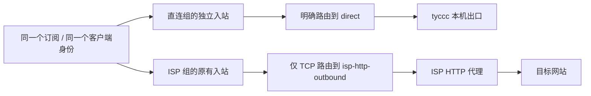

# 12 · 在一个订阅中按“用途”和“出口”组织节点

这一课把 tyccc 的一个订阅整理成两组：**直连出口**和 **ISP 出口**。订阅地址、用户身份和客户端导入方式都不变；更新同一个订阅后，节点名称会直接告诉使用者“这条流量从哪里出去、适合先拿来做什么”。

真实订阅地址、IP、账号、证书和密码不进入本仓库。本文中的端口和名称是这次实际配置的教学记录，但不能替换为别人服务器上的参数。

先读 [[入站出站与路由]]、[[链式代理与中转落地]]、[[协议传输与安全层]]。

## 先说结论：怎样选

不要把协议名当作“安全等级排名”。客户端到 tyccc 的连接都需要正确的协议认证；带 TLS 或 REALITY 的节点会加密传输层。访问 HTTPS 网站时，浏览器和目标网站之间还会有 HTTPS 保护。**节点名称中的“适用场景”是第一选择建议，不是隐私或速度承诺。**

| 你现在要做什么 | 先选哪一类 | 为什么 | 不适合时换什么 |
| --- | --- | --- | --- |
| 看视频、下载、希望低延迟 | `⚡ 直连出口｜视频/低延迟优先｜Hysteria2` | Hysteria2 基于 UDP/QUIC；网络对 UDP 友好时，常值得优先尝试。 | UDP 受限、卡顿或兼容性不好时，换直连 VLESS REALITY 或 Trojan。 |
| 当前网络限制较多，或要访问正常 HTTPS 网页 | `🛡️ 直连出口｜受限网络｜VLESS Reality` | REALITY 的握手外观更接近一个普通 TLS 连接，适合作为受限网络下的优先备选。 | 连接失败时试 Trojan TLS 或 VLESS WS TLS。 |
| 要使用 ISP 出口地址访问网页 | 名称以 `🏠 ISP出口` 开头的同类节点 | 这组 TCP 流量会由 tyccc 再转给 ISP HTTP 代理，网站看到的是 ISP 出口。 | 速度不够时改用同协议的 `直连出口` 节点。 |
| 老客户端或网络环境只认常见 TLS/网页传输 | `网页兼容｜Trojan TLS` 或 `网页兼容｜VLESS WS TLS` | 两者都采用常见的 TLS 网页连接方式；WS 会多一层封装，通常比 RAW/TCP 多一点开销。 | 优先换 Reality；仍不行再看客户端版本和网络。 |
| 需要简单、通用的备用方式 | `网页通用｜Shadowsocks` | 客户端支持广，配置概念相对少。 | 想要 TLS 网页兼容可改用 Trojan；想试 UDP 性能可选 Hysteria2。 |

> **纠正一个常见说法：**Hysteria2 不是“没有加密”。它使用 TLS；它没有的是 REALITY 这类握手伪装。它是否更快取决于手机网络、运营商对 UDP 的处理、丢包和服务器线路，必须实际测速。有关 UDP/QUIC 的基础见 [[TCP与UDP]]、[[QUIC]]；REALITY 的作用见 [[REALITY与Vision]]。

## 最终订阅长什么样

同一订阅内共 11 个节点，按照 `订阅排序` 显示为以下两组。emoji 和前缀不是协议参数，只是给人看的路标。

### 第一组：直连出口

| 顺序 | 订阅中显示的名称 | 协议与传输 | 服务端出口 | 建议用途 |
| --- | --- | --- | --- | --- |
| 1 | `⚡ 直连出口｜视频/低延迟优先｜Hysteria2` | Hysteria2 + TLS，UDP | tyccc 本机 | 视频、下载、低延迟优先时先试。 |
| 2 | `🛡️ 直连出口｜受限网络｜VLESS Reality` | VLESS + REALITY，TCP | tyccc 本机 | 受限网络、网页和日常敏感操作的优先候选。 |
| 3 | `🌐 直连出口｜网页通用｜Shadowsocks` | Shadowsocks，TCP/UDP | tyccc 本机 | 简洁通用的备用。 |
| 4 | `🌐 直连出口｜网页兼容｜VLESS WS TLS` | VLESS + WebSocket + TLS，TCP | tyccc 本机 | 网页/TLS 兼容性备用。 |
| 5 | `🌐 直连出口｜兼容备用｜VMess WS TLS` | VMess + WebSocket + TLS，TCP | tyccc 本机 | 旧客户端兼容备用。 |
| 6 | `🌐 直连出口｜网页兼容｜Trojan TLS` | Trojan + TLS，TCP | tyccc 本机 | 常见 TLS 网页传输的备用。 |

### 第二组：ISP 出口

| 顺序 | 订阅中显示的名称 | 协议与传输 | 服务端出口 | 使用提醒 |
| --- | --- | --- | --- | --- |
| 10 | `🏠 ISP出口｜日常网页｜VLESS Reality` | VLESS + REALITY，TCP | ISP HTTP 代理 | 想让 TCP 网页请求从 ISP 地址出去时优先。 |
| 11 | `🏠 ISP出口｜网页通用｜Shadowsocks（TCP经ISP）` | Shadowsocks，TCP/UDP | TCP 经 ISP；UDP 仍直连 tyccc | 名称特意保留括号，避免误以为 UDP 也走 ISP。 |
| 12 | `🏠 ISP出口｜网页兼容｜VLESS WS TLS` | VLESS + WS + TLS，TCP | ISP HTTP 代理 | 适合网页兼容路径，但多一跳通常较慢。 |
| 13 | `🏠 ISP出口｜兼容备用｜VMess WS TLS` | VMess + WS + TLS，TCP | ISP HTTP 代理 | 兼容备用。 |
| 14 | `🏠 ISP出口｜网页兼容｜Trojan TLS` | Trojan + TLS，TCP | ISP HTTP 代理 | 兼容备用。 |

`10` 到 `14` 故意与直连组隔开。3x-ui 按数字排序；空出来的数字让今后增加一组时仍容易阅读。[[UUID密码与订阅链接]] 解释为什么用户身份相同也能得到多条不同节点。

## 为什么不能只复制一条分享链接

一条入站连接的出口由 Xray 路由规则决定。原来的五个 TCP 入站已经匹配 `isp-http-outbound`，所以它们不能同时又作为“直连版”分享给同一位用户。



因此，本次为五种 TCP 协议各新建一个**同参数、不同端口**的直连入站，并把同一个客户端附加到新入站。客户端的订阅 ID 没变，所以一个订阅地址可以生成全部 11 条分享链接；端口和入站标签不同，所以路由能够区分出口。

Hysteria2 原本就是 UDP 入站，ISP HTTP 出站不能代理 UDP，因此它保留为直连节点。Shadowsocks 同时支持 TCP/UDP：ISP 版只让 TCP 命中 ISP 规则，直连版则两种网络都从 tyccc 直接出去。这个限制来自 HTTP 出站能力，而不是面板遗漏；详见 [[将ISP代理接入tyccc链式出口]] 与 [Xray HTTP 出站文档](https://xtls.github.io/en/config/outbounds/http.html)。

## 3x-ui 中实际做了什么

### 1. 先备份，再开放新端口

在新建入站前，备份面板数据库；然后在服务器防火墙放行五个新端口（TCP，Shadowsocks 另加 UDP）。没有这一步，面板里显示“启用”也可能从外网连不上。端口与监听地址的区别见 [[IP地址与端口]]、[[防火墙与监听地址]]。

本次直连副本使用独立端口：`2443`、`18388`、`18443`、`18080`、`19443`。这些数值不是标准答案；复现时应先检查冲突，再记录自己的选择。

其中直连 REALITY 副本必须使用不同 TCP 端口，因为原来的 443/TCP 已留给 ISP 组的 REALITY 入站。Xray 会提示“REALITY 监听非 443 端口，封锁风险可能增加”。这是两组在同一台 IP、同一份订阅中并存的代价，因此 `🛡️ 直连出口｜受限网络｜VLESS Reality` 是一个可测的备用选择，不能被描述为比原 443/TCP 节点更隐蔽。若以后必须同时让两条 REALITY 都使用 443/TCP，需要额外的公网 IP 或重新设计入口，不能在同一 TCP 端口创建两个独立入站。

### 2. 创建直连副本并附加已有客户端

在 3x-ui 的 **入站**页面，对每种 TCP 入站逐项复制：协议、传输、安全层、证书或 REALITY 参数、路径和分享地址保持一致，只改端口、备注和排序。

不能把原入站的 `clients` 列表原样塞进“新增入站”表单。3x-ui 把 email/订阅 ID 作为全局客户端身份；重复创建会被判为重复 email。正确流程是：

1. 新建一个暂时没有客户端的入站；
2. 在 **客户端**管理中，把已有客户端“附加”到这个新入站；
3. 确认新旧入站各有同一位客户端；
4. 再从同一个订阅地址刷新节点。

这样共享的是同一份身份和流量限制，复制的是不同的网络监听器。3x-ui 的客户端 API 也把“创建客户端”和“把已有客户端附加到多个入站”分开设计。[3x-ui API 说明](https://github.com/MHSanaei/3x-ui)

### 3. 写清楚两套路由

ISP 组保留已有规则：指定原有五个入站标签，且只匹配 `tcp`，目标为 `isp-http-outbound`。直连组新增一条明确规则，指定五个新入站标签，目标为 `direct`。

```json
{
  "type": "field",
  "inboundTag": [
    "DIRECT_REALITY_TAG",
    "DIRECT_SHADOWSOCKS_TAG",
    "DIRECT_VLESS_WS_TAG",
    "DIRECT_VMESS_WS_TAG",
    "DIRECT_TROJAN_TAG"
  ],
  "outboundTag": "direct"
}
```

标签是 Xray 内部名称，备注才是订阅中给人看的名称，二者不能混用。路由按顺序命中，所以保留已有的私网/API/BT 阻断规则，并把这两条组规则放在默认出口之前。具体表单位置见 [[入站出站与路由]]。

## 怎样验收：不要只看“延迟”

完成后，不能只点客户端的延迟测试。延迟能说明握手是否有响应，不能证明 ISP 出口真的生效。本次验收使用真实客户端内核逐一通过所有 11 个节点请求出口 IP 查询服务，结果如下：

| 检查 | 结果 | 证明什么 |
| --- | --- | --- |
| 5 条 ISP TCP 节点 | 通过；出口与 tyccc 本机不同 | ISP 路由真实命中。 |
| 5 条直连 TCP 节点 | 通过；出口等于 tyccc | 独立直连副本和 `direct` 规则生效。 |
| Hysteria2 | 通过；出口等于 tyccc | UDP 节点仍能正常直连。 |
| 订阅导出 | 11 条链接 | 同一订阅包含两组完整选择。 |
| 服务与监听 | `x-ui` active；新端口均监听 | 面板保存后的运行状态正常。 |

你也可以用下面的手工方法复查：

1. 在客户端更新**原来的同一个订阅地址**，确认出现 `直连出口` 和 `ISP出口` 两类名称。
2. 连一条 `直连出口`，打开出口 IP 查询网页；结果应是 tyccc 的公网出口。
3. 连对应的 `ISP出口`，再查一次；结果应变化为供应商提供的 ISP 出口。
4. 用同一个固定视频、相同清晰度和相近时段比较吞吐；不要用不同节点的毫秒延迟直接下“谁更快”的结论。

ISP 组多经过一台上游代理，速度略慢是正常现象：它增加了一段网络路径，也受上游服务的带宽和拥塞影响。若目标是速度，先用直连 Hysteria2 或直连 REALITY；若目标是指定 ISP 出口，再选 ISP 组。速度判断方法见 [[带宽流量延迟与丢包]]。

## 客户端要不要重新手工添加

不用。只要你使用的是该客户端对应的订阅地址，执行“更新订阅”即可拿到新名称和新增直连节点。已有的旧节点不会因此失效，但会被新名称替换为更清楚的说明。不要把订阅 URL 当作单条分享链接粘贴到“从剪贴板导入分享链接”；前者应在客户端的**订阅管理**中添加或更新。[[3x-ui订阅表单核对清单]] 记录了这两个入口的区别。

## 后续维护规则

新增协议时，先决定它属于哪一个出口组，再同时完成四件事：新入站、客户端附加、防火墙、路由规则。最后用出口查询验证，不要只凭面板流量数字判断。

若 ISP 上游不稳定，先临时停用 ISP 组的路由或入站，直连组仍可用；不要删除客户端身份或整份订阅。撤回链式出口的边界见 [[将ISP代理接入tyccc链式出口]]。
