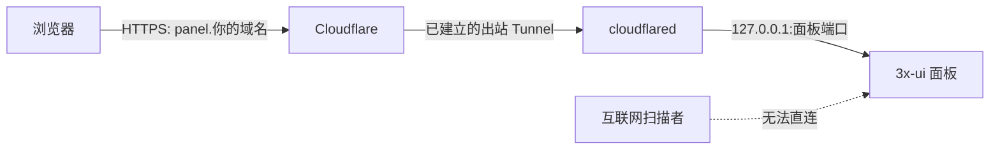

# 用 Cloudflare Tunnel 隐藏 3x-ui 面板 IP

> [!summary]
> 这一课处理的是 **3x-ui 管理面板**，不是代理节点本身。完成后，浏览器访问 `https://panel.你的域名/随机面板路径/`；服务器无需把面板端口暴露给互联网。VLESS、VMess、Trojan、Shadowsocks 与 Hysteria2 的连接地址不会因此自动变成域名。

## 想解决什么问题

直接通过 `服务器 IP:面板端口` 登录管理面板时，访问者能看到服务器 IP，而且该端口长期对公网开放。随机路径只能降低被扫描到后台页面的概率，不能让端口消失。

Cloudflare Tunnel 让服务器主动连向 Cloudflare。浏览器先连 `panel.你的域名`，Cloudflare 再沿已建立的出站通道把请求送到服务器的本机面板。服务器最终可把 3x-ui 只绑定到 `127.0.0.1`，公网便不能直接连面板端口。



## 这套方案保护什么，不保护什么

| 对象 | 结果 | 原因 |
| --- | --- | --- |
| 3x-ui 管理面板 | 可以隐藏服务器 IP，并关闭公网面板端口 | Tunnel 只把 Web 请求送到本机服务 |
| 代理节点入口 | 仍可能暴露节点服务器 IP | TCP/UDP 代理协议不是这条 Web Tunnel 的转发对象 |
| 订阅地址 | 不会被自动改写 | 订阅由 3x-ui 的订阅设置单独控制 |
| SSH | 不受影响 | Tunnel 不替代 SSH；保留 SSH 作为紧急维护入口 |

> [!warning]
> 不要把现有 VLESS Reality、Hysteria2 等协议端口直接套到普通 Cloudflare CDN/Tunnel 网站路由中。它们不是普通网页服务，错误改动会让客户端失联。

## 本次实际环境的设计

| 项目 | 采用值 | 这样做的意义 |
| --- | --- | --- |
| Tunnel 名称 | `tyccc-panel` | 名称只说明用途，不混入节点或客户端名称 |
| 公网主机名 | `panel.tanyou.cc.cd` | 管理入口独立于根域名，后续可单独迁移或停用 |
| 本机服务 | `https://127.0.0.1:面板端口` | 请求不再需要从公网进服务器 |
| Origin TLS 校验 | 关闭 | 面板当前证书不是为 `127.0.0.1` 签发；这一跳仅在服务器回环地址内 |
| 3x-ui 监听地址 | `127.0.0.1`（Tunnel 验证后设置） | 即使 Tunnel 配置被误删，公网也不能直接连接面板 |

## 操作步骤

### 1. 在 Cloudflare 创建 Tunnel

进入 **Networking → Tunnels → Create Tunnel**，创建 `tyccc-panel`。创建后的页面会显示连接器安装说明和一段仅用于该 Tunnel 的令牌。

这不是代理节点密码；它的作用是让服务器上的 `cloudflared` 证明“我是这个 Tunnel 的连接器”。令牌不能写进 Git、截图或聊天记录。

### 2. 在服务器安装并启动连接器

在 Debian 服务器上安装 `cloudflared`，然后按 Tunnel 页面给出的命令注册为 systemd 服务。服务启动后，Tunnel 页面应从 **Inactive** 变为 **Healthy** 或显示至少一个 replica。

验证命令：

```bash
systemctl is-active cloudflared
cloudflared --version
```

预期分别为 `active` 和版本号。若没有连接，先不要改变 3x-ui 的监听地址，否则会把自己锁在面板外。

### 3. 添加 Public Hostname

打开该 Tunnel 的 **Routes**，新增一条 Public Hostname：

| 表单项 | 填写 | 含义 |
| --- | --- | --- |
| Subdomain | `panel` | 形成独立的管理入口 |
| Domain | `tanyou.cc.cd` | 选已托管到 Cloudflare 的域名 |
| Type | `HTTPS` | 面板本身使用 HTTPS |
| URL | `127.0.0.1:面板端口` | cloudflared 在服务器内部访问面板 |
| No TLS Verify | 开启 | 允许回环请求使用面板现有证书 |

保存后 Cloudflare 自动创建指向 Tunnel 的 DNS 记录。这里不需要填写服务器 IP。

### 4. 先验证新域名，再收口旧入口

在浏览器打开：

```text
https://panel.你的域名/随机面板路径/
```

能看到 3x-ui 登录页，说明域名路由和 Tunnel 均已工作。随后在服务器执行：

```bash
x-ui setting -listenIP 127.0.0.1
x-ui restart
```

这一步把面板从所有网卡改为只监听本机。cloudflared 与面板在同一台服务器，仍可访问；公网 IP 加面板端口应变为连接失败。

> [!danger]
> 这是一项有影响的改动。必须在新域名可登录、且仍保留一个 SSH 会话时执行；不要先执行它再测试 Tunnel。

### 5. 为面板加第二道登录门（推荐）

Tunnel 只隐藏网络入口，3x-ui 账号密码仍是第一道认证。还可在 **Cloudflare Zero Trust → Access → Applications** 新增 Self-hosted Application，域名填 `panel.你的域名`，策略只允许自己的邮箱。

这样访问顺序变成：Cloudflare Access 身份验证 → 3x-ui 用户名密码。配置 Access 策略属于账号权限变更，应只给确实需要管理面板的人。

## 验收清单

- [ ] Tunnel 状态为 Healthy，至少 1 个 replica。
- [ ] `https://panel.你的域名/随机面板路径/` 显示 3x-ui 登录页。
- [ ] 使用域名能完成一次登录。
- [ ] 服务器上的 `cloudflared` 服务为 `active`。
- [ ] 面板改为 `127.0.0.1` 监听后，公网 IP 加面板端口无法访问。
- [ ] 原有代理节点及订阅仍可用。
- [ ] 已配置 Cloudflare Access 的邮箱策略（可选但推荐）。

## 排错

| 现象 | 优先检查 |
| --- | --- |
| Tunnel 显示 Inactive | `cloudflared` 是否安装、服务是否启动、连接令牌是否对应正确 Tunnel |
| 域名返回 502 | Tunnel 已连接但本机服务地址、协议或端口填错；检查 `https://127.0.0.1:面板端口` 是否可达 |
| 域名仍打不开 | Cloudflare DNS 是否已生成 `panel` 记录；等待 DNS 生效后重试 |
| 改监听后面板打不开 | 通过 SSH 运行 `x-ui setting -listenIP 0.0.0.0 && x-ui restart` 回滚，然后重新核对 Tunnel |
| 代理节点失联 | 这不应由面板 Tunnel 引起；检查是否误修改了入站端口、路由或 Xray 配置 |

## 参考

- [Cloudflare Tunnel 概览](https://developers.cloudflare.com/tunnel/)
- [Cloudflare Tunnel：发布应用](https://developers.cloudflare.com/tunnel/setup/)
- [Cloudflare Access：Self-hosted 应用](https://developers.cloudflare.com/cloudflare-one/applications/configure-apps/self-hosted-apps/)
- [[08-开放公网HTTPS面板]]
- [[04-运维与排错/3x-ui订阅表单核对清单]]

