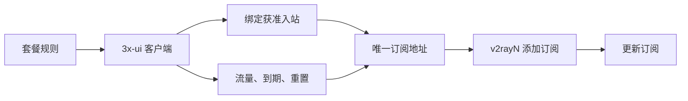
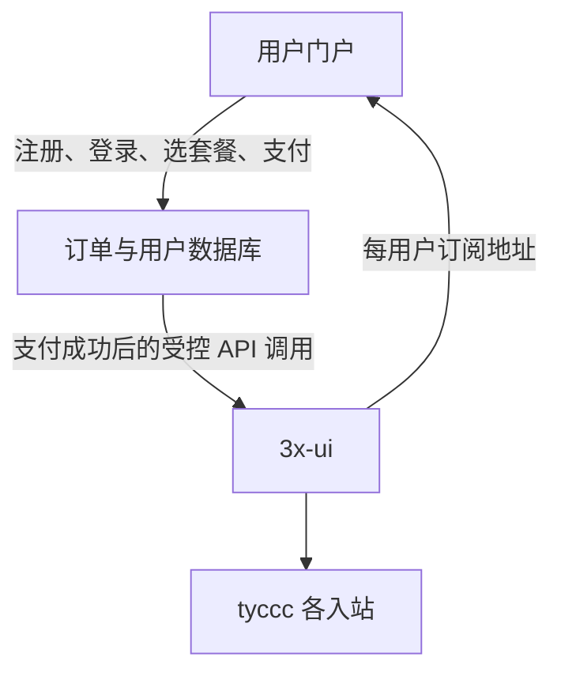

# 从 3x-ui 入站管理到用户订阅套餐

> [!summary]
> 3x-ui 管的是服务器、入站和客户端凭据；“套餐”则是把**允许使用哪些节点、能用多少流量、何时失效、是否自动重置**组合成可出售的规则。现有 tyccc 可以先用 3x-ui 实现统一订阅和配额；注册、下单与支付需要另建用户门户或接入专门的商业面板。

## 先纠正一个操作：分享链接不等于订阅

单个 `vless://`、`trojan://` 等分享链接只代表一条配置。“从剪贴板导入分享链接”只能逐条导入，不能识别一个订阅地址。

每个用户应有一个 3x-ui **客户端记录**，并有唯一的 **Sub ID**。该客户端被绑定到哪些入站，它的订阅地址就返回哪些节点。用户只需要把这个 HTTPS 地址作为“订阅”添加到 v2rayN，之后点“更新订阅”就能收到节点、名称和可用范围的变动。

### v2rayN 正确导入方式

1. 在 3x-ui 的 **Clients / 客户端** 页面打开某个用户，复制其 **Subscription / 订阅地址**，不是复制单条分享链接。
2. 在 v2rayN 打开 **订阅分组**，新增订阅，把地址粘贴进去并保存。
3. 执行“更新订阅”。列表会一次出现该用户被允许的全部节点。
4. 将来服务器端增删节点或调整套餐，只要更新订阅即可；用户不用再次逐条导入。

> [!warning]
> 订阅地址相当于该用户的访问凭据。泄漏后应为该客户端更换 Sub ID 或凭据，并让旧地址失效。

## 当前已实施的基础配置

tyccc 现已建立两个管理员用客户端组：

| 客户端组 | 当前成员 | 用途 |
| --- | --- | --- |
| `直连` | 暂无 | 将来放入只允许直连节点的用户 |
| `全线路` | `tyccc-personal` | 当前个人客户端，可使用直连和 ISP 两套节点 |

当前 `tyccc-personal` 已绑定 11 个入站，因此它的**统一订阅**会返回全部 11 条节点配置。客户端组的用途是筛选和批量管理；订阅里具体出现哪些节点，仍由该客户端绑定的入站决定。

统一订阅服务也已启用并仅监听服务器本机地址。后续通过 Cloudflare Tunnel 把订阅域名转发到它，用户访问的是 HTTPS 域名，服务器的订阅端口不会直接暴露到公网。

### 管理员从哪里复制统一订阅地址

登录 [[13-用Cloudflare-Tunnel隐藏3x-ui面板IP|3x-ui 面板]] 后，依次进入：

1. 左侧 **客户端**。
2. 找到目标用户，例如 `tyccc-personal`，打开其详情。
3. 在 **订阅 / Subscription** 区域复制“标准订阅地址”。
4. 用户在 v2rayN 使用“订阅分组 → 添加订阅”，而不是“从剪贴板导入分享链接”。

不要把订阅地址写进公开文档或截图；它带有该用户的专属标识，等同于可用凭据。

## 套餐如何真正限制“直连”与“ISP”

3x-ui 的“客户端组”适合筛选、批量操作和统计；它本身不是访问控制。**真正的限制来自“这个客户端绑定了哪些入站”。**

tyccc 现有节点可按出口分成两套入站集合：

| 入站集合 | 给谁 | 包含内容 |
| --- | --- | --- |
| `DIRECT` | 只允许直连出口的用户 | 直连 Reality、直连 WS/TLS、直连 VMess、直连 Trojan、直连 Shadowsocks、Hysteria2 |
| `FULL` | 可同时使用直连和 ISP 出口的用户 | `DIRECT` 全部节点，加上 ISP Reality、ISP WS/TLS、ISP VMess、ISP Trojan、ISP Shadowsocks |

例如创建“直连月付 100G”用户时，只把其客户端绑定到 `DIRECT` 入站；订阅内根本不出现 ISP 节点。即使用户知道 ISP 节点名称，也没有该节点的凭据，无法连接。

## 可直接落地的套餐模板

| 套餐名 | 可见节点 | 总流量 | 重置 | 到期建议 | 适用场景 |
| --- | --- | ---: | --- | --- | --- |
| 直连月付 100G | `DIRECT` | 100 GB | 每月 | 按订单周期续费 | 追求速度、看视频、日常使用 |
| 全线路月付 100G | `FULL` | 100 GB | 每月 | 按订单周期续费 | 既要直连速度，也需要 ISP 出口选择 |
| 直连临时 10G | `DIRECT` | 10 GB | 从不重置 | 可设 7 或 30 天到期 | 短期试用或临时任务 |
| 全线路临时 10G | `FULL` | 10 GB | 从不重置 | 可设 7 或 30 天到期 | 短期体验全部线路 |

“每月 100G”应设置总流量 100 GB 和每月重置周期；“一次性 10G”设置总流量 10 GB，重置设为从不。到期日期控制的是时间，流量上限控制的是用量；两者都满足时用户才可继续使用。

## 3x-ui 内的管理员操作模型

为每个真实用户创建一条唯一客户端记录，不要多人复用同一个 UUID、密码或订阅地址。

1. 建立客户端组：`DIRECT-MONTHLY`、`FULL-MONTHLY`、`DIRECT-TEMP`、`FULL-TEMP`。
2. 新建客户端，填写用户标识、唯一 Sub ID、流量、到期时间、重置周期和设备/IP 限制。
3. 按所购套餐绑定 `DIRECT` 或 `FULL` 入站集合。
4. 复制该客户端的**合并订阅地址**给用户。
5. 续费时调整到期与配额；升级套餐时补绑 ISP 入站；降级时解绑 ISP 入站并让用户更新订阅。

用户组名称是管理员的运营标签；入站绑定才是实际权限边界。这样既可批量筛选“临时 10G 用户”，又不会让他们看到不该使用的节点。

## 注册、购买与支付为何需要另一个系统

3x-ui 不是电商系统：它没有面向终端用户的注册页、套餐商品、订单状态、支付回调、退款、发票或用户自助改密流程。把管理员面板直接开放给用户也会暴露服务器和其他用户的管理能力，不能这样做。

适合现有 tyccc 的分层方式如下：

建议保留 3x-ui 作为节点控制层，再在独立域名部署用户门户。门户只拿到一个**最小权限、可撤销**的 3x-ui API 凭据，用它执行创建客户端、修改配额、绑定入站和生成订阅等动作；不要把 3x-ui 管理员账号给门户用户。

### 两条实施路线

| 路线 | 能满足什么 | 代价 | 推荐时机 |
| --- | --- | --- | --- |
| 先用 3x-ui 人工运营 | 统一订阅、直连/全线路权限、月流量与临时流量 | 注册、付款、续费需要人工处理 | 用户数量少、先验证套餐设计 |
| 独立用户门户 + 3x-ui API | 注册、套餐、订单、支付回调、自助订阅与自动开通 | 需要开发、数据库、支付合规与运维 | 准备稳定对外提供服务 |

不建议为了支付功能立刻迁移到只支持部分协议的面板。当前 tyccc 有 VLESS Reality 与 Hysteria2；选替代系统前必须逐项验证它能否保留这些节点，以及能否表达 `DIRECT` / `FULL` 两套权限。

## 建议的实施顺序

1. **先做人工套餐版。** 在 tyccc 按上表创建 4 个测试用户，验证每个用户的订阅内容、流量封顶与重置行为。
2. **再定业务规则。** 确定月付是按自然月还是付款日起算、临时流量是否有到期日、超额后是停用还是仅禁止 ISP 节点。
3. **最后做门户。** 先完成注册、订单和管理员确认开通；支付回调自动开通应在支付渠道、退款规则、日志和防刷策略明确后再加入。

## 参考

- [3x-ui：客户端与流量、到期、分组、订阅](https://docs.sanaei.dev/docs/config/clients/)
- [3x-ui：订阅服务](https://docs.sanaei.dev/docs/config/subscription/)
- [3x-ui：配置与 API、IP 限制](https://github.com/MHSanaei/3x-ui/wiki/Configuration)
- [[12-按使用场景组织ISP与直连订阅]]
- [[13-用Cloudflare-Tunnel隐藏3x-ui面板IP]]
