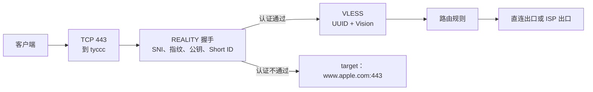
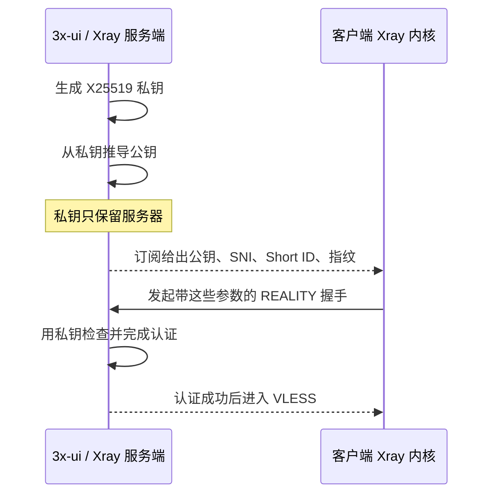

# 第 15 课：读懂 VLESS + REALITY + RAW 入站的每一个字段

这篇只拆解 tyccc 的 **VLESS + REALITY + RAW/TCP** 入站。目标不是背一张表，而是让你知道每个字段在连接的哪一步生效、它和哪些字段必须配套，以及什么时候该保留默认值。

> 本课按 2026-09-17 从 tyccc 面板读取的实际配置编写。为了安全，UUID、私钥、短 ID 和订阅令牌均不写入仓库。当前这条入站使用 TCP `443`、VLESS、REALITY、`xtls-rprx-vision`；REALITY 的 target 与 SNI 白名单为 `www.apple.com`；嗅探关闭；**最小客户端版本为空，并未设置为 `26.3.27`。**

## 先建立一张地图：一条连接分成四层

“VLESS + Reality + TCP”不是一个单独协议名，而是几层部件叠在一起。把它想成进一栋楼：端口是楼门，VLESS 是门禁，RAW 是走廊，REALITY 是把门口伪装成普通 HTTPS 的接待方式。



| 层次 | tyccc 的选择 | 负责什么 | 不能负责什么 |
| --- | --- | --- | --- |
| 入口 | TCP `443` | 接收客户端连接 | 不决定加密强度；端口号本身不是密码。 |
| 代理协议 | VLESS | 用 UUID 识别“谁可以使用这条入站” | VLESS 的 `decryption=none` 不单独加密内容。 |
| 传输 | RAW/TCP | 让字节直接走 TCP，不再套 WebSocket | 不负责身份验证或伪装。 |
| 传输安全 | REALITY | 用 TLS 外观、密钥与短 ID 认证合法客户端 | 不决定最终从直连还是 ISP 出口离开。 |
| 流控 | Vision | 优化这组 VLESS + REALITY + RAW 的数据传递 | 不是额外加密层。 |

Xray 把“传输方法”和“传输安全”明确分为两层；REALITY 只能和 RAW、XHTTP、gRPC 一起使用。[Xray：传输配置](https://xtls.github.io/en/config/transport.html)

## 面板中“TCP”和“RAW”为何像是两个名字

你可能在 3x-ui 表单里先看到“TCP”，又在分享链接或新版 Xray 文档里看到“RAW”。这通常不是两条不同的传输。

- 旧配置和部分面板把这种方式显示为 `tcp`，并且 `header.type=none`。
- 新版 Xray 文档把同一类“直接在底层 TCP 字节流上传输、不再包一层 HTTP/WebSocket”的方式称为 **RAW**。
- 所以这条入站的实践含义是：**TCP 连接 + 无伪造 TCP Header + REALITY**。导入客户端时，传输应保持 RAW/TCP，不能改成 WebSocket。

RAW 少了一层 WebSocket/HTTP 封装，协议层次更少。它的代价是不能拿 WebSocket 的路径、Host、CDN 网页入口那套字段来套用；REALITY 的配置也因此必须完整匹配。

## 基础配置：入口在哪里等你

| 表单字段 | 当前选择 | 为什么这样选 | 什么时候改 |
| --- | --- | --- | --- |
| 启用 | 开启 | 让 Xray 创建监听入口。 | 排错或维护时临时关闭。 |
| 备注 | `🏠 ISP出口｜日常网页｜VLESS Reality` | 这是给订阅用户看的用途说明，不参与协议。 | 出口策略或用途变化时改名。 |
| 监听地址 | 当前绑定 tyccc 公网地址 | 指定 Xray 在哪块网卡上接收 TCP 443。 | 多 IP 服务器、只想内网监听时才调整。 |
| 端口 | TCP `443` | 443 是常见 HTTPS 端口，便于网络兼容和学习对照。 | 同一 IP 上已有另一个 TCP 服务占用 443 时，必须换端口或重新设计入口。 |
| 分享地址 | 监听地址策略 | 订阅导出的节点地址应是实际 VPS 地址。它和订阅下载域名是两件事。 | 节点迁移到专用域名或新 IP 时同步修改。 |
| 流量/到期 | 不限量、从不重置 | 当前个人客户端没有套餐限制。 | 给用户配置月流量或一次性流量时，在“客户端”层设置。 |

一个数字端口由“传输协议 + 数字”共同确定。TCP 443 和 UDP 443 可以同时存在，因此 tyccc 的 Hysteria2 也能使用 UDP 443；两个 TCP 入站不能同时抢占同一 IP 的 TCP 443。

## 协议页：VLESS、UUID 和 Vision

### VLESS 为什么写 `decryption = none`

VLESS 是轻量的代理协议。它用 UUID 识别客户端，但传统 VLESS 本身不自动给公网连接增加一层加密。因此这个字段的 `none` 不是“裸奔”，它的意思是“不要在 VLESS 这一层另开旧式 VLESS Encryption”。本条连接的保护由外层 REALITY 提供。

把它理解为两道不同的门：UUID 决定你是否有进门资格；REALITY 决定门口如何认证并保护连接。两者缺一不可。VLESS 在公网中应搭配 TLS、REALITY 或 VLESS Encryption 使用，官方 VLESS 文档也要求 `decryption` 明确配置。[Xray：VLESS 入站](https://xtls.github.io/en/config/inbounds/vless.html)

### UUID 从哪里来，为什么不能共享

点击 3x-ui 的“添加客户端”或 UUID 生成按钮时，面板生成一个随机 UUID。它是用户凭据，客户端订阅会带上该 UUID，服务端据此识别用户和统计流量。

- 每个人、每台要独立限额的设备，都应使用不同 UUID/客户端记录。
- UUID 可以发给该用户的客户端，不能提交到公开 Git 仓库。
- UUID 泄露时，直接停用或替换该客户端；不要只改节点备注。

### `xtls-rprx-vision` 为什么要选

Vision 是 VLESS 的流控模式，用于 VLESS + REALITY + RAW/TCP 这类组合。它优化这条已认证连接里的数据传递方式。客户端和服务端必须同时支持并一致；只改一端会导致连接失败或回落到不兼容状态。

它不是“更高级的加密”，也不适用于 WebSocket 入站。VLESS 官方文档把 Vision 作为受支持的 flow 值，并要求双方一致。[Xray：VLESS 配置与 Flow](https://xtls.github.io/en/config/inbounds/vless.html)

## 安全页：REALITY 到底在做什么

REALITY 会让连接的 TLS 握手外观参考一个真实 HTTPS 站点，同时只让携带正确 REALITY 参数的客户端进入 VLESS。认证失败的连接会被转发到 `target`，而不是直接露出一个明显的代理错误页。[Xray：REALITY](https://xtls.github.io/en/config/transports/reality.html)

它不是“访问 Apple 的中转服务”，也不是在 Apple 上申请的证书。`www.apple.com` 是这台服务器在认证失败时会连接的目标站点，也是握手外观所参考的对象。

### 为什么要生成密钥：公钥和私钥分别做什么

REALITY 需要一对 X25519 密钥来让客户端证明“我拿到了这条私有配置”，并让客户端验证自己连接到的是持有服务端私钥的一方。



| 字段 | 从哪里来 | 放在哪里 | 能否公开 |
| --- | --- | --- | --- |
| 私钥 `privateKey` | 3x-ui 的“生成密钥对”，底层等价于 `xray x25519` | 只在服务端 REALITY 设置 | **不能**。泄露后应重新生成整对密钥并让客户端更新。 |
| 公钥 `publicKey` / `pbk` | 由同一私钥推导出来 | 导出的订阅或分享链接，供客户端填写 | 可以随节点发给授权用户；它不是登录密码。 |
| UUID | 3x-ui 创建客户端时生成 | 服务端客户端列表和该用户的订阅 | 只发给对应用户。 |
| Short ID | 管理员或面板生成的短十六进制值 | 服务端列表和客户端 `sid` | 不应公开贴在教程里；它不是私钥，但属于连接凭据的一部分。 |

官方说明要求服务端私钥用 `xray x25519` 生成，客户端使用配对的公钥。[Xray：REALITY 密钥字段](https://xtls.github.io/en/config/transports/reality.html#privatekey)

### 为什么选择 `x25519 (native)`

**X25519** 是一种用于密钥协商的现代椭圆曲线算法。3x-ui 的 `x25519 (native)` 是面板对“由当前 Xray 原生支持的 X25519 方法生成 REALITY 密钥对”的显示；它不是一个网站、证书品牌或出口线路。

选择它的理由很实际：REALITY 的标准配置就是 X25519 密钥对，主流 Xray 客户端能够识别这类公钥。它生成的是一对长期配置凭据，不是每次打开网页都重新生成的临时密码。

不要把这里的 X25519 和 TLS 握手里的“曲线偏好”混为一谈。前者是 **REALITY 客户端与服务器的密钥对**；后者是 TLS 握手时双方协商算法的能力列表。它们名称相同，但字段位置和作用不同。

### 为什么安全层选 REALITY

`security = reality` 告诉 Xray：这条 RAW/TCP 连接要使用 REALITY 的握手认证和外观，而不是普通证书 TLS 或 `none`。

- 选 `none`：这条公网 VLESS 入口失去 REALITY/TLS 保护，不适合当前设计。
- 选 `tls`：你需要自己的证书、私钥、正确的 SNI/证书域名或 IP；这是另一种配置方案。
- 选 `reality`：不使用你自己的公网证书，而是依赖 target、密钥、公钥、SNI、指纹和 Short ID 的配套组合。

REALITY 并不让所有流量“变成真正 Chrome 浏览器”。它让 TLS 握手的若干可观察特征更接近正常 HTTPS，同时用它自己的凭据识别合法客户端。

### uTLS 为什么选 `chrome`

TLS 建连的第一段问候包叫 **ClientHello**。不同软件的 ClientHello 细节不同，例如支持哪些加密套件、扩展的顺序、ALPN 内容。uTLS 能模拟常见客户端的这类“指纹”。

`chrome` 是一个常见、兼容度高的选择，原因是 Chrome 的 TLS 指纹在普通网络中很常见。它只是模拟 **TLS ClientHello 的一部分特征**，不代表你的 Xray 客户端拥有完整 Chrome 的网络行为，也不代表实际浏览器必须是 Chrome。Xray 官方也明确说明 uTLS 只模拟 ClientHello 指纹，其余行为仍可能不同。[Xray：TLS 指纹与 uTLS](https://xtls.github.io/en/config/transports/tls.html#fingerprint)

在 3x-ui 的 REALITY 表单中，这个值往往随订阅导出给客户端使用。保持 `chrome` 的原则不是“永远最好”，而是：**服务端给出的客户端参数、订阅导出的参数与客户端实际内核能力必须一致。** 不要为了手机是 Android 就随意改成 `android`；先保留已验证可用的 `chrome`，有明确兼容问题再单独测试。

### target 为什么是 `www.apple.com:443`

当前 tyccc 的 target 是 `www.apple.com:443`，允许的 SNI 也是 `www.apple.com`。选择 target 时看的是它是否能稳定完成符合预期的 TLS 握手，而不是“这个品牌看上去是否高级”。

这项选择要同时满足：

1. 目标站点公开可访问，并稳定支持 TLS；
2. target 接受你放进 `serverNames` 的 SNI；通常它们保持一致；
3. 目标的证书和握手行为适合你实际测试过的客户端；
4. 不随意选择 CDN 后面、可能导致你的 VPS 被滥用为端口转发的目标。

Xray 官方特别提醒：认证失败的 REALITY 流量会被转发至 target；若 target 使用特殊 IP，例如 CDN，扫描后可能带来被滥用和额外流量的风险。选 target 后也应做实际握手测试，不要只凭网站知名度替换。[Xray：target 与失败连接的转发行为](https://xtls.github.io/en/config/transports/reality.html#target)

因此，“因为 Apple 比较大，所以一定最好”是错误理由。这里保留 `www.apple.com:443` 的理由是：它是当前已部署、已验证能工作的配对 target；改变它是一次需要重新验证的配置变更。

### SNI 是什么，为什么要等于 `www.apple.com`

SNI 的全称是 **Server Name Indication**。客户端在 TLS ClientHello 中提前告诉对方“我想访问哪个主机名”。普通 HTTPS 服务器可以据此选出正确证书；REALITY 同样用它判断客户端请求的主机名是否在服务端允许列表中。

本条入站中三项的关系是：

```text
target       = www.apple.com:443     # 服务端失败时转发到哪里
serverNames  = [www.apple.com]       # 服务端接受哪些 SNI
serverName   = www.apple.com         # 客户端实际发送哪一个 SNI
```

客户端 `serverName` 必须是服务端 `serverNames` 里的一个值。通常应与 target 一致，因为 target 需要能接受这个名字并给出合理的 TLS 响应。把客户端 SNI 改成随机域名，或只改服务端其中一处，通常会造成握手失败或异常回落。有关 SNI 的网络基础，见 [[SNI]]；字段约束见 [Xray：serverNames 与 serverName](https://xtls.github.io/en/config/transports/reality.html#servernames)。

### Short IDs 是什么，为什么要生成多个

Short ID 是一串短的十六进制标识。它参与 REALITY 的客户端识别：服务端维护一个允许列表，客户端必须从中使用一个匹配值。它不是代替 UUID 的用户套餐系统，也不是加密算法。

当前 tyccc 为这条入站保留了 **8 个** Short ID。这样做的好处是可以为不同客户端、后续轮换或测试留出多个可用值，而不必因为一个短 ID 失效就重建整条入站。

格式要求很具体：只能用 `0`–`f`，字符数必须为偶数，最多 16 个十六进制字符。两位十六进制代表一个字节；奇数长度会报错。客户端的 `sid` 必须是服务器列表中的一个值。[Xray：shortIds 的格式和匹配规则](https://xtls.github.io/en/config/transports/reality.html#shortids)

实际管理建议：

- 让 3x-ui 生成，不要用 `1234`、生日、用户名这类可猜的值；
- 不要把具体 Short ID 写到公开教程、截图或 Git；
- 轮换时先在服务端新增一个 ID，更新客户端后再删除旧 ID，避免把自己锁在门外；
- Short ID 与 UUID 是两层不同凭据：前者用于 REALITY 入口识别，后者用于 VLESS 用户和流量统计。

### 最小客户端版本：为什么不是 26.3.27

`minClientVer` 是 REALITY 的可选字段，用来拒绝版本低于指定版本的 **Xray 核心**。它填写的是类似 `x.y.z` 的核心版本号，不是 v2rayN、v2rayNG 的界面版本号。

当前 tyccc 的实际值是空，因此它**不强制最低 Xray 版本**。你提到的 `26.3.27` 不应被当作这条入站已启用的限制；可能来自别的面板默认值、其他教程或客户端信息。

| 做法 | 结果 | 适用情形 |
| --- | --- | --- |
| 留空（当前做法） | 不因这一字段拒绝旧核心；兼容范围更大 | 先保证自己的多台设备稳定连接。 |
| 填某个最低版本 | 服务端拒绝更旧的 Xray 核心 | 你已盘点所有客户端，并且需要禁止有已知兼容问题的老核心。 |

所以它不是“填越新越安全”。如果把它填成你未测试的版本，旧手机或桌面客户端可能直接无法连接。升级或设置门槛前，先在各客户端查看 **Xray core** 版本，再用一台非主力设备测试。官方将 `minClientVer` 定义为可选、格式为 `x.y.z` 的版本限制。[Xray：minClientVer](https://xtls.github.io/en/config/transports/reality.html#minclientver)

### `show=false` 与 `xver=0`

- `show=false`：不开启 REALITY 调试输出。生产环境保持关闭，避免日志产生不必要的连接细节；排错时可以短暂开启，结束后关闭。
- `xver=0`：没有启用 PROXY Protocol 的回落协议版本。当前没有前置负载均衡或反向代理要传递源地址，因此保留 `0`。它不等于“协议版本 0”，也不等于客户端版本。

## 嗅探：要不要启用

**当前 tyccc 的这条入站是关闭的，保持关闭是合理的。**

嗅探发生在 REALITY/VLESS 认证成功之后。Xray 从后续连接最开始的少量数据中识别 HTTP Host、TLS SNI 或 QUIC 信息，让路由规则能按“目标域名”分流。它不能替代 REALITY，不能给连接加密，也不能改变 TLS ClientHello 的伪装。

| 你的路由需求 | 是否考虑启用 | 原因 |
| --- | --- | --- |
| 只按入站标签决定“直连出口 / ISP 出口” | 关闭 | 当前路由不需要从目标域名再判断一次。 |
| 要让某些网站直连、某些网站走 ISP，规则依赖域名 | 启用，并只选需要的 HTTP/TLS/QUIC 项 | 路由需要知道实际域名。 |
| 只是想“更隐蔽”或“更安全” | 不要为了这个启用 | 嗅探不提供握手伪装和加密。 |

启用后，Xray 只能读取协议起始处本来可见的路由元数据，不会解开目标 HTTPS 网页正文；但这仍是服务端额外处理的连接信息。没有域名分流需求时，保持当前关闭配置更简单，也更容易排错。有关路由位置，见 [[入站出站与路由]]。

## 一张“服务端和客户端必须匹配”的清单

下面的字段最值得在“连接失败”时逐项核对。不要把服务端私钥复制到客户端。

| 参数 | 服务端入站 | 客户端订阅/节点 | 失配后的常见结果 |
| --- | --- | --- | --- |
| 服务器地址与 TCP 端口 | 监听地址、443 | 节点地址、443 | 无法建立 TCP 连接。 |
| VLESS UUID | 客户端列表 | 节点 `id` | 握手后被拒绝或无可用用户。 |
| Flow | `xtls-rprx-vision` | 同样选择 Vision | REALITY/VLESS 连接不兼容。 |
| 传输 | TCP，等价 RAW | RAW/TCP | 一端改成 WS 会连不上。 |
| 安全 | `reality` | `reality` | 客户端误设 TLS/none 会失败。 |
| 私钥 / 公钥 | 只保存私钥 | 只使用配对公钥 `pbk` | 公私钥不成对则认证失败。 |
| target | 服务端才填 | 不填 target | 客户端把 target 当作服务端配置会被错误识别。 |
| serverNames / SNI | 允许列表 | 选其中一个 SNI | SNI 不在列表或目标不接受时失败。 |
| Short ID | 允许列表 | 选其中一个 `sid` | 未命中则不会进入 REALITY/VLESS。 |
| 指纹 | 分享参数/客户端兼容提示 | `chrome` | 改成不兼容值可能握手失败或外观异常。 |

## 修改前后的安全操作顺序

1. 在 3x-ui 下载数据库备份，并保存在仓库外；数据库内含所有客户端凭据。
2. 一次只改一组耦合字段。改密钥时连同公钥、Short ID、客户端订阅一起更新；改 target 时连同 SNI/白名单一起验证。
3. 保存后先用一个测试客户端更新订阅，确认可以连接和访问网页。
4. 再检查 3x-ui 的入站流量、出口 IP 和客户端日志。
5. 最后才删除旧 Short ID、旧密钥或旧客户端。这样失败时仍有回退入口。

不要在公开 Git、聊天记录或截图中写私钥、订阅 URL、UUID、Short ID、ISP 账号密码。知识库只记录字段含义、脱敏截图和验证方法。

## 继续学习

- [[协议传输与安全层]]：先掌握“协议、传输、安全”三层的通用区别。
- [[REALITY与Vision]]：理解 REALITY 与 Vision 的基础关系。
- [[SNI]]、[[TLS证书与HTTPS]]：理解普通 TLS 中的域名、证书和握手。
- [[客户端软件与内核]]：区分 v2rayN/v2rayNG 的界面版本与实际 Xray core 版本。
- [Xray REALITY 官方字段说明](https://xtls.github.io/en/config/transports/reality.html)：升级 Xray 或 3x-ui 前，以这个页面和发布说明复核字段。
