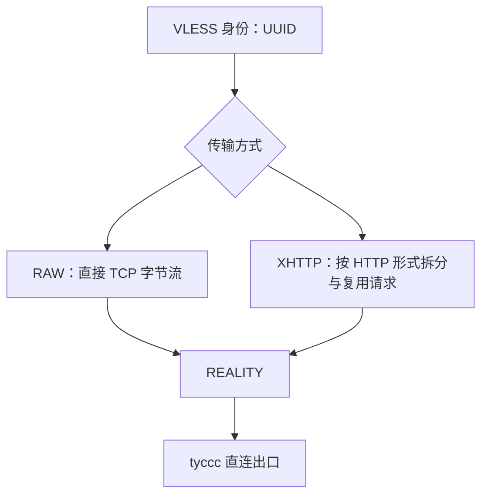

# 第 16 课：新增 XHTTP 与 TUIC v5 实验入站

这次在 tyccc 新增两条**直连出口**实验节点。它们已经加入 `tyccc-personal` 的统一订阅；更新订阅后会出现 13 条节点。

| 节点名称 | 协议组合 | 公网端口 | 为什么存在 |
| --- | --- | --- | --- |
| `🧪 直连出口｜实验｜VLESS XHTTP Reality` | VLESS + XHTTP + REALITY | TCP `2444` | 对照 VLESS RAW/REALITY 与 XHTTP 传输的差异。 |
| `🧪 直连出口｜实验｜TUIC v5（UDP）` | TUIC v5 + QUIC/TLS | UDP `4443` | 与 Hysteria2 对照 UDP/QUIC 网络下的体验。 |

> 这两条是学习和测试节点，不要因为“新”就替换日常可用节点。先在自己的网络和客户端上测速、看视频、访问网页，再决定是否长期保留。

## 为什么先升级 3x-ui

原面板为 3x-ui `3.7.0`，Xray 为 `26.7.28`。它已经支持 XHTTP，却没有 TUIC 服务端程序，因此不能把 TUIC 正确纳入面板管理和统一订阅。

部署前已用 SQLite 在线备份保存面板数据库到仓库外的私有目录。随后升级到官方稳定版 **3x-ui `3.8.5`**，其中包含 Xray `26.9.9` 和 `tuic-server`。升级后面板、Cloudflare Tunnel 与原有 11 条入站均保持运行。

TUIC 在 3x-ui 中不是 Xray 核心的一条普通入站，而是由面板启动并管理的 `tuic-server` 进程；这也是旧面板缺少二进制时不能“手填一条 JSON”解决的原因。[3x-ui：TUIC 的架构说明](https://github.com/MHSanaei/3x-ui/blob/main/docs/content/docs/en/config/tuic.mdx)

## 1. VLESS + XHTTP + REALITY

### 它和原来的 VLESS RAW/REALITY 有什么不同

两条节点的 VLESS 身份认证与 REALITY 安全层相同，区别在**传输层**：

| 字段 | 本次 XHTTP 选择 | 理由 |
| --- | --- | --- |
| 协议 | VLESS，`decryption=none` | UUID 负责用户身份；保护由 REALITY 提供。 |
| 传输 | XHTTP，`mode=auto` | 让 Xray 根据连接情况选择合适的 XHTTP 交互方式，适合先做对照实验。 |
| XHTTP 路径 | 面板外生成的随机路径 | 让不同实验入站不要共用同一个固定路径；它不是密码。 |
| 安全 | REALITY | 沿用已验证的握手认证模型。 |
| target / SNI | `www.apple.com:443` / `www.apple.com` | 与已验证的 Reality 目标保持一致。参见 [[15-读懂VLESS-REALITY-RAW入站的每一个字段]]。 |
| 密钥对 | 新生成、独立于原 RAW Reality | 不修改或复用原节点的私钥；新节点泄露或轮换时不影响旧节点。 |
| Vision Flow | 留空 | 当前 Vision 适用于 RAW/TCP + TLS/REALITY；本条 XHTTP + REALITY 不使用 Vision。 |
| 出口 | tyccc 直连 | ISP 路由只匹配原有的指定 TCP 入站；新节点不在该列表中。 |

Xray 把 XHTTP 视作一种传输方法，而不是新的代理协议；它可以和 REALITY 组合。协议、传输和安全层的兼容关系应以 [Xray 传输配置表](https://xtls.github.io/en/config/transport.html) 为准。

## 2. TUIC v5

TUIC 建立在 QUIC 上，因此客户端到服务器走 UDP。它和 Hysteria2 一样适合测试“UDP 网络是否比 TCP 网络更顺”，但两者不是同一协议，也没有谁天然更快。

| 字段 | 本次选择 | 意义 |
| --- | --- | --- |
| 端口 | UDP `4443` | 和 Hysteria2 的 UDP 443 分开，便于独立观察和排错。 |
| TLS 证书 | tyccc 现有 IP 证书 | QUIC 强制使用 TLS；证书仍由服务器保存私钥。 |
| SNI | tyccc 公网 IP | 与该 IP 证书的 SAN 对应，客户端可以正常校验。 |
| 拥塞控制 | BBR | 作为吞吐量测试的起点；速度仍受运营商、丢包和服务端线路影响。 |
| ALPN | `h3` | 表明这是一条 HTTP/3/QUIC 风格的 TLS 协商。 |
| UDP Relay Mode | `native` | 使用 QUIC Datagram 方式转发 UDP，按面板的推荐默认值设置。 |
| 0-RTT | 开启 | 已连接过的客户端可能减少重新连接时的握手往返；首次连接没有这项收益。 |
| 出口 | tyccc 直连 | TUIC 由独立 sidecar 服务处理，不走 Xray 的 ISP HTTP 链式出站规则。 |

每个 TUIC 客户端需要 UUID 和密码。为了保持这位用户一个订阅内拿到所有节点，本次把既有的 `tyccc-personal` 客户端附加到 TUIC 入站，由面板生成 `tuic://` 分享信息；私密凭据不写入教程。

一个限制需要记住：当前 3x-ui 的 TUIC sidecar 能按入站统计流量，但不能像 Xray 入站一样可靠地执行“每个用户的流量额度”。如果将来做 100 GB/月套餐，TUIC 不应成为唯一可用节点；应保留 VLESS、Trojan、Shadowsocks 等支持单用户统计的节点。[3x-ui：TUIC 流量与客户端限制](https://github.com/MHSanaei/3x-ui/blob/main/docs/content/docs/en/config/tuic.mdx)

## 客户端如何获得新节点

1. 在 v2rayN 或 v2rayNG 中选择现有 `tyccc-全线路` 订阅。
2. 执行“更新订阅（不使用代理）”。
3. 确认出现上述两条 `🧪 直连出口｜实验` 节点。
4. 先测试延迟，再选择一个节点作为活动节点，访问网页或播放同一段视频进行对比。

若 TUIC 没有显示或无法导入，先检查客户端使用的内核是否支持 TUIC v5。若 XHTTP 无法导入，检查客户端 Xray core 是否足够新；客户端界面版本和核心版本是两回事，见 [[客户端软件与内核]]。

## 本次验证

验证在新增后完成，且不改变系统代理：

| 检查 | 结果 |
| --- | --- |
| XHTTP Reality 使用正确凭据访问 HTTPS | 通过，出口为 tyccc 直连地址。 |
| XHTTP Reality 使用错误凭据 | 被拒绝。 |
| TUIC v5 使用正确凭据访问 HTTPS | 通过，出口为 tyccc 直连地址。 |
| TUIC v5 使用错误密码 | 被拒绝。 |
| 两条节点出现在 `tyccc-personal` 统一导出中 | 通过。 |
| 面板与 Cloudflare Tunnel 服务 | 均为运行状态。 |

这证明“可建立连接”与“错误凭据不能进入”两件事。它不等于宣布某个协议在所有手机网络下更快；性能结论仍要在相同网络、相同目标网站、相近时间段里测量。

## 如何比较 Hysteria2、TUIC 和 XHTTP

建议一次只切换一个变量：

1. 同一手机、同一 Wi-Fi 或同一蜂窝网络；
2. 依次使用 Hysteria2、TUIC、VLESS RAW Reality、VLESS XHTTP Reality；
3. 每条节点测三次延迟，打开同一个视频并观察缓冲；
4. 记录丢包网络、UDP 受限网络和普通网络下的差异；
5. 将结果写到 [[带宽流量延迟与丢包]]，不要只凭一次峰值速度下结论。

返回 [[12-按使用场景组织ISP与直连订阅]]，了解“直连出口”和“ISP 出口”在订阅中应如何命名和选择。
