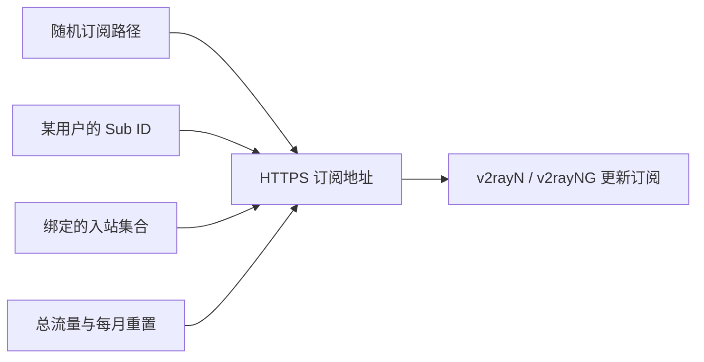

# 第 17 课：轮换订阅路径与创建每月 100GB 订阅

这次完成两件彼此有关的事：把默认、容易猜测的订阅路径换成随机长路径；再建立一个真正按用户**合并计量**、每月重置的 100GB 订阅身份。

> [!important]
> 实际订阅地址、Sub ID 和面板账号都放在仓库外的 `account.md`，不写进 Git 仓库、公开笔记或截图。旧订阅地址在轮换后会失效，这是预期行为。

## 先区分三个容易混淆的东西

| 名称 | 它是什么 | 泄漏后的影响 |
| --- | --- | --- |
| 订阅路径 | 服务器 URL 中的一段入口，例如 `/随机目录/` | 它不是登录密码，但改成随机长路径能减少扫描器命中默认 `/sub/` 的概率。 |
| Sub ID | URL 末尾、属于某个客户端的专属标识 | 相当于领取该用户全部节点的通行证；泄漏后应轮换。 |
| 客户端记录 | 3x-ui 中的一位用户、其流量与可用入站的总账本 | 决定能看到哪些节点、用了多少流量、何时被停用。 |

随机路径不是抵抗 DDoS 的工具。它只避免众所周知的默认路径被随手探测；真正的凭据仍是不可公开的 Sub ID 和各节点的认证信息。Cloudflare Tunnel 让订阅服务只在服务器本机监听，见 [[13-用Cloudflare-Tunnel隐藏3x-ui面板IP]]。

## 本次建立的两个订阅身份

| 订阅身份 | 节点数量 | 流量规则 | 为什么这样设 |
| --- | ---: | --- | --- |
| `tyccc-personal`（原全线路） | 13 | 不限额 | 管理员自用，包含直连、ISP、XHTTP 与 TUIC 实验节点。 |
| `tyccc-monthly-100g`（每月 100GB） | 12 | 总量 100 GiB；每月 1 日重置 | 用来演示可运营的按月配额。它不包含 TUIC。 |

这里的 **100 GiB** 是面板使用的二进制计量：`100 × 1024³` 字节。面板界面常把它写作“100 GB”，日常使用时可把它理解为 100GB 套餐额度。

### 为什么 100GB 是“全节点合计”，而不是每条节点各 100GB

新版 3x-ui 把同一客户端记录的流量记到一个总账本。这个客户端同时挂在 12 条入站上：无论用户切换哪条已授权节点，上传和下载都会累加到同一个 100GB 上限；达到上限会停用该客户端，下一次月度重置再恢复。

这正是创建**一个客户端记录，再附加多条入站**的意义。若为每条节点分别创建不同用户，才会变成“每条各有一份额度”，通常不符合套餐预期。

### 为什么不把 TUIC 放进 100GB 套餐

当前 3x-ui 的 TUIC 服务端按**入站**统计流量，不能可靠实施“每一位客户端各自 100GB”的上限。若把 TUIC 放入这个套餐，它可能成为绕过总配额的入口。

因此本次 100GB 订阅包含 VLESS、VMess、Trojan、Shadowsocks、Hysteria2 和 XHTTP，但排除 TUIC；全线路管理员订阅仍保留 TUIC 供实验。等面板支持可靠的 TUIC 单用户配额后，再重新评估是否加入。

## 在 3x-ui 面板里如何复现

以下操作不会展示真实 URL 或凭据。

1. 打开 **客户端**，选择“添加客户端”。
2. 用户标识填写易辨认的内部名，例如 `tyccc-monthly-100g`；每位真实用户都要用不同标识。
3. **总流量**填写 `100` GB；**到期时间**留空表示不限日期。
4. **流量重置**选“每月”，重置日选 `1`。这表示按自然月的第一天清零，不是从首次使用之日起算 30 天。
5. 勾选套餐允许的入站。全线路 100GB 选择所有可逐用户限额的入站；不要选择 TUIC。
6. 保存后，在客户端详情复制该用户的“标准订阅地址”。
7. 给客户端加上用户组标签 `每月 100GB`，方便筛选、批量续费和统计。

> [!warning]
> “客户端组”是管理标签；它不会自己限制权限。真正限制某用户能使用什么的是第 5 步的**入站绑定**。

## 用户在 v2rayN 中如何更新

1. 在 `account.md` 取对应套餐的最新地址，只把它保存到自己的客户端。
2. 在 v2rayN 的 **订阅分组**中新建或编辑订阅，将 URL 粘贴到“可选地址”。
3. 点击“更新订阅（不使用代理）”。
4. 全线路订阅应得到 13 条节点；每月 100GB 订阅应得到 12 条节点，且没有 TUIC。

旧地址返回失败或空内容时，不要把它当成服务故障：随机路径轮换后，旧地址本来就应当失效。改用 `account.md` 中的新地址即可。

## 本次验证记录

| 检查 | 结果 |
| --- | --- |
| 面板新管理员账号和密码登录 | 已验证。 |
| 随机订阅路径配置与面板重启后加载 | 已验证。 |
| 全线路订阅导出 | 13 条节点。 |
| 每月 100GB 订阅导出 | 12 条节点。 |
| 100GB 总量、每月 1 日重置 | 已从面板客户端记录复核。 |
| TUIC 不在限额订阅中 | 已复核。 |

## 常见误解

- **“把路径从 `/sub/` 改掉就绝对安全。”** 不对。路径只是降低被猜中的概率；订阅 URL 仍须当作敏感凭据。
- **“分组等于权限。”** 不对。分组只方便管理员筛选；入站绑定才决定订阅中有哪些节点。
- **“每月重置会自动续费。”** 不对。它只清零流量计数；到期日、支付和续费仍需单独管理。
- **“100GB 用户可以使用所有 13 条节点。”** 当前不对。TUIC 没有可靠的每客户端额度，因此限额套餐刻意不给它。

继续阅读 [[14-从3x-ui入站管理到用户订阅套餐]] 了解套餐与用户门户的边界；服务器的外部暴露面和防护见 [[tyccc-性能与暴露面审计]]。

## 参考

- [3x-ui 客户端 API：创建、绑定、配额与流量重置](https://github.com/MHSanaei/3x-ui/blob/main/docs/content/docs/en/reference/api/clients.mdx)
- [3x-ui 订阅服务 API](https://github.com/MHSanaei/3x-ui/blob/main/docs/content/docs/en/reference/api/subscription-server.mdx)
- [3x-ui TUIC 配置与流量限制](https://github.com/MHSanaei/3x-ui/blob/main/docs/content/docs/en/config/tuic.mdx)
