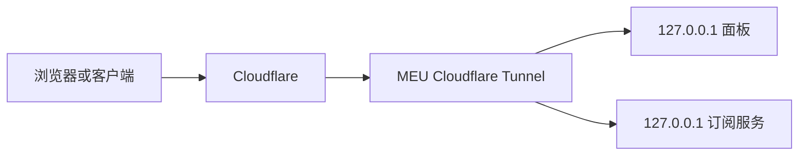

# MEU：迁移直连、ISP 出口、统一订阅与 100GB 限额

> 状态：2026-09-17 已完成。MEU 的面板与订阅均已通过 Cloudflare Tunnel 用域名提供服务；两项服务只监听 `127.0.0.1`，不能再从公网 IP 的原端口直接访问。

## 这次迁移要解决什么

MEU 原来有五条独立的入站，每条连接信息要单独导入。现在把它整理成和 tyccc 相同的使用方式：一个用户拿到一条订阅地址，就可以得到一组按用途命名的节点；其中网页类节点可以选择“直连出口”或“ISP 出口”。

[[入站出站与路由]] 中的“入站”是用户进入 VPS 的门，“出站”是 VPS 访问网站时离开的门。ISP 出口不是把所有流量强行套一层，而是给特定的 TCP 节点准备的另一扇门。

## 迁移时的安全原则

1. **先备份，后修改。** 修改前保存了面板数据备份；旧监听器没有删除。
2. **旧端口保留为直连。** 旧分享链接继续可用，避免把现有客户端全部弄断。
3. **ISP 使用新端口。** ISP 版本是新建的副本，路由规则只匹配这些新副本的标签；直连节点不会误走 ISP。
4. **Hysteria2 保持直连。** 它基于 UDP；当前购买的 HTTP 型 ISP 代理只适合 TCP，不能可靠地承担它的 UDP 流量。参见 [[TCP与UDP]] 与 [[链式代理与中转落地]]。

## 现在有哪些节点

| 使用场景 | 直连出口 | ISP 出口 | 为什么这样放 |
|---|---|---|---|
| 视频、低延迟 | Hysteria2 | 不提供 | UDP 协议，速度优先 |
| 受限网络、常规隐蔽连接 | VLESS Reality | VLESS Reality | REALITY 不依赖站点证书 |
| 普通网页兼容 | Shadowsocks | Shadowsocks（TCP 经 ISP） | 客户端覆盖广 |
| 兼容备用 | VMess WS TLS | VMess WS TLS | 适合需要 WebSocket 的旧客户端 |
| 网页兼容 | VLESS WS TLS | VLESS WS TLS | TLS/WebSocket 的常见组合 |

“ISP 出口”比直连多一次转发，速度稍慢是正常现象。它的价值是让目标网站看到 ISP 提供的出口地址；它并不提升 VPS 到客户端的线路质量。

## 两个统一订阅用户

| 用户 | 用途 | 流量规则 | 重置方式 |
|---|---|---:|---|
| `meu-personal` | 自己的全线路订阅 | 不限额 | 不适用 |
| `meu-monthly-100g` | 需要配额的订阅 | 100 GiB | 面板当前版本按 30 天自动重置 |

面板当前的客户端流量字段使用“间隔天数”实现自动重置，因此这里设置为 30 天。它接近“每月 100GB”，但不是每个自然月 1 日零点重置。若以后需要严格按自然月结算，应升级到支持 `trafficReset=monthly` 的面板版本，或额外建立一个经过审阅的月初重置任务；不能只把界面文案写成“每月”就假设规则已经生效。

## 如何验证没有配错

1. 在面板的“客户端”页面确认两个用户都已启用，100GB 用户显示 `100.00 GB` 的总额度。
2. 打开两个用户各自的订阅二维码或“订阅信息”，确认全线路订阅与 100GB 订阅都能导出 9 条节点。
3. 在客户端连接一条“直连出口”节点，访问 IP 查询网站，记录出口地址。
4. 再连接相同协议的“ISP 出口”节点，重复查询。两次结果应不同，第二次应是 ISP 出口地址。
5. 分别看面板流量计数是否增长。[[链式代理与中转落地]] 解释了为什么要同时看客户端、面板和服务商三种计数。

不要把订阅地址、二维码、UUID、密码或 Reality 私钥写进本文档或 Git。它们等价于钥匙，应只保存在权限为 600 的 私密的 `account.md` 中。

## 域名入口与收口监听：已完成

使用的域名是 `meumall.cc.cd`，两个子域名各做一件事：

- `panel.meumall.cc.cd`：面板入口
- `sub.meumall.cc.cd`：订阅入口

实际采用的路径如下。服务端先主动建立到 Cloudflare 的出站连接；浏览器或客户端只访问域名。因而 DNS 不会直接把面板或订阅服务指向源站 IP。

已经完成以下收口：

1. 面板监听地址改为 `127.0.0.1`。
2. 订阅监听地址改为 `127.0.0.1`。
3. 两个新的 HTTPS 订阅地址已写入私密的 `account.md`；旧订阅路径已失效。
4. UFW 已启用默认拒绝入站，只保留 SSH 与各代理节点真正使用的 TCP/UDP 端口。
5. Fail2ban 与 cloudflared 均设为运行状态。

这不会让代理节点本身自动改成域名。Cloudflare Tunnel 这里承载的是网页形式的面板和订阅请求；用户实际建立代理连接的节点仍按原有 IP 与端口工作。需要理解这个边界，请看 [[域名节点显示与隐藏源站IP]] 与 [[防火墙与监听地址]]。

## 交付后的检查清单

- [x] 面板域名可登录，且管理员登录已验证。
- [x] 两个域名路由均已建立，源站只接收本机回源。
- [x] 全线路订阅和每月 100GB 订阅各导出 9 条节点。
- [x] 防火墙、Fail2ban、3x-ui、cloudflared 均在运行。
- [x] 完整登录地址与两条私密订阅链接只保存在 `account.md`，没有提交到 Git。

详细的原理、创建顺序和故障排查见 [[19-MEU-Cloudflare-Tunnel域名入口与安全收口]]。
