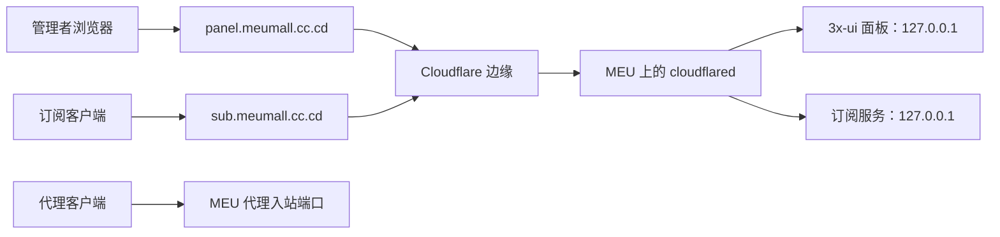

# MEU：Cloudflare Tunnel 域名入口与安全收口

> 状态：2026-09-17 已完成并外网验证。面板和订阅的完整私密地址仅记录在仓库外的 `account.md`。

## 这次实际解决了什么

MEU 以前把 3x-ui 面板端口和订阅端口直接开在公网 IP 上。即使地址路径很长，扫描器仍可发现端口并反复尝试访问。现在它们改为通过 `panel.meumall.cc.cd` 和 `sub.meumall.cc.cd` 访问，服务器不再接受来自公网到这两个服务端口的连接。

这里的“隐藏 IP”有明确边界：隐藏的是**面板和订阅服务的源站入口**，并不是让代理入站的 IP 消失。VLESS、VMess、Shadowsocks 和 Hysteria2 的实际连接仍要由客户端直连 VPS 的代理端口。参见 [[域名节点显示与隐藏源站IP]]。

## 最终结构

Tunnel 是服务器主动向 Cloudflare 发起的连接。它不像传统端口转发那样要求 Cloudflare 从互联网主动敲开服务器的面板端口，因此收口后服务器只需要允许自己的出站连接。

## 两条路由分别做什么

| 域名 | 回源服务 | 用途 | 是否应当公开原端口 |
|---|---|---|---|
| `panel.meumall.cc.cd` | 本机 HTTPS 面板服务 | 管理入站、客户端、流量和路由 | 否 |
| `sub.meumall.cc.cd` | 本机 HTTPS 订阅服务 | 客户端拉取统一订阅 | 否 |

面板自身仍保留登录认证和随机登录基础路径；订阅链接还包含随机路径与每个用户独有的 Sub ID。它们都是钥匙的一部分，不能写进公开 Git 仓库。

> [!WARNING]
> 随机路径只能降低默认路径被随手探测的机会，不能抵抗 DDoS，也不能代替账户密码、Cloudflare 防护、限速或防火墙。

## 为什么回源证书校验被关闭

3x-ui 原先给本机服务配置的是 IP 证书。Tunnel 连接 `https://127.0.0.1:端口` 时，证书名称和 `127.0.0.1` 不匹配，因此 Tunnel 路由为这两个受控的本机 HTTPS 回源启用了“跳过回源证书校验”。

这项设置只影响 **cloudflared 到同一台服务器的 loopback 回源**，不影响用户浏览器到 Cloudflare 的 HTTPS 校验。浏览器仍由 Cloudflare 提供有效的域名证书。更理想的长期做法是让本机服务使用 Cloudflare Origin Certificate 或匹配域名的证书，再重新开启回源校验。

## 防火墙最终规则

UFW 使用“默认拒绝入站、默认允许出站”。保留的类别是：

| 类别 | 保留原因 |
|---|---|
| SSH | 维护服务器；使用限制规则减轻密码暴力尝试 |
| VLESS / VMess WebSocket 与 Reality 的 TCP 端口 | 现有直连和 ISP 节点需要 |
| Shadowsocks TCP/UDP 端口 | 协议同时支持 TCP 与 UDP |
| Hysteria2 的 UDP 443 | QUIC/UDP 传输所必需 |

面板端口和订阅端口没有加入防火墙白名单，因为 Tunnel 从 `127.0.0.1` 回源，不依赖公网入站。Fail2ban 持续监测 SSH 登录失败并临时封禁异常来源。

## 如何在不泄露密钥的情况下验收

1. 用 `account.md` 中的完整面板地址打开登录页并登录。
2. 在“客户端”分别打开全线路用户和每月 100GB 用户的订阅二维码；不要把二维码截图公开发出。
3. 在 v2rayN 新建订阅分组，将对应完整 URL 粘贴进去后执行“更新订阅”。两个订阅都应出现 9 条节点。
4. 在面板查看 100GB 用户的已用量和剩余量；流量到达额度时应停止服务，重置周期按当前面板设置的 30 天计算。
5. 连接一条“直连出口”和一条“ISP 出口”的同协议节点，分别查询出口 IP。地址不同即说明链式 ISP 出口仍在生效。
6. 若域名能打开而订阅为空，先检查客户端是否使用了完整 URL；“域名根目录”或只粘贴二维码标题都不是订阅地址。

## 出现故障时的判断顺序

| 现象 | 先检查什么 | 常见原因 |
|---|---|---|
| 域名显示 Cloudflare 502/1033 | Tunnel 状态 | `cloudflared` 服务停止，或 Tunnel 未连接 |
| 面板域名打开但不能登录 | 登录基础路径与账号 | 少写了随机基础路径，或账号密码不一致 |
| 订阅返回空内容 | 完整订阅 URL、用户启用状态 | 漏掉随机路径或 Sub ID，用户被禁用、到期或用尽流量 |
| 订阅能导入但节点无法连通 | 对应入站端口与 UFW | 客户端协议参数不匹配，或误删了代理端口防火墙规则 |
| 只有 ISP 节点慢 | 链式出口和 ISP 网络 | 多了一跳；先用直连节点做对照 |

## 维护边界

修改面板监听地址、订阅监听地址或防火墙前，先确认 Tunnel 正常且手头有 SSH 连接。先验证新的入口，再关闭旧入口，才能避免把自己锁在服务器外。

相关知识：[[13-用Cloudflare-Tunnel隐藏3x-ui面板IP]]、[[防火墙与监听地址]]、[[链式代理与中转落地]]、[[17-轮换订阅路径与创建每月100GB订阅]]。
