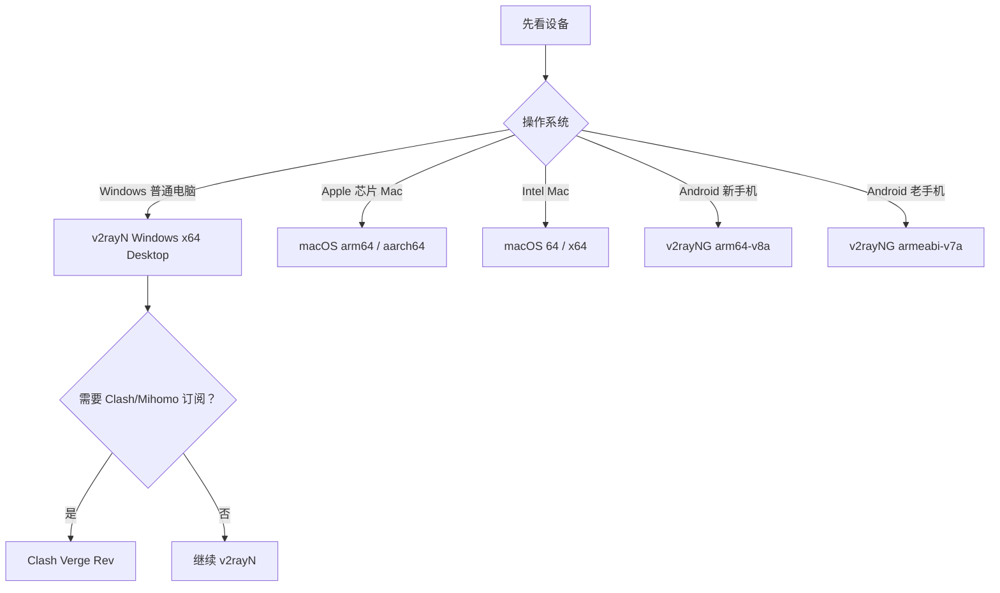

# 客户端离线分发包与版本选择

> 目的：把官方客户端安装包保存在本地，方便无法访问 GitHub 的用户通过 U 盘、网盘或局域网获取。软件包存放在教程仓库外的 `客户端离线分发包/`，不会提交到 Git。

## 为什么要做离线包

“用户能拿到订阅”与“用户能自行下载客户端”是两件事。网络、设备权限或 GitHub 可访问性都可能让第二步失败。离线包让管理员可把经过来源记录和哈希校验的文件直接交给用户，但它不能包含订阅链接、二维码、密码或账号。

## 当前存档范围

| 客户端 | 平台和架构 | 选择原因 |
|---|---|---|
| v2rayN | Windows x64 的 WPF 与 Avalonia Desktop 两种界面；Intel / Apple 芯片 Mac | 适合本教程里的 VLESS、VMess、Shadowsocks、Hysteria2 等节点 |
| v2rayNG | Android `arm64-v8a` 与 `armeabi-v7a` | 覆盖绝大多数新旧 Android 手机 |
| Clash Verge Rev | Windows x64 常规包、含 WebView2 兼容包、Windows ARM64、Intel / Apple 芯片 Mac | 用于支持 Clash/Mihomo 格式订阅的用户 |

存档采用稳定版：v2rayN `7.24.9`、v2rayNG `2.2.6`、Clash Verge Rev `2.5.2`。每个文件的官方来源在离线包的 `来源与版本.json`；传输完整性由同目录 `SHA256SUMS.txt` 检查。

## 选文件的最短路径

## v2rayN 名称中的重点

- `64` 是 Intel/AMD 的 64 位架构；普通 Windows 10/11 与 Intel Mac 选它。
- `arm64` 是 ARM 64 位架构；Apple 芯片 Mac 必须选它。少数 Windows ARM 电脑也选它。
- `86` 是 32 位 Windows，只适合老设备。
- `desktop` 不是台式机版本，而是 Avalonia Desktop 界面；没有 `desktop` 的 Windows 包是 WPF 界面。两者目标功能相近，普通用户只选一个。
- `.zip` 是解压即用的便携包，`.dmg` 是 macOS 安装镜像，`.sig` 是签名文件而不是软件。

v2rayN 官方的发布文件说明见：[Release files introduction](https://github.com/2dust/v2rayN/wiki/Release-files-introduction)。截图中可见的 v2rayN `7.25.1` 是预发布版；离线包使用的 `7.24.9` 是较适合普通分发的稳定版。

## 如何安全转发

1. 连同 `README.md`、`SHA256SUMS.txt` 和所选安装包一起发送。
2. 告诉用户只运行与自己设备匹配的文件，不要把 `.sig` 当安装包。
3. 用户安装软件后，再私下发送属于他的订阅 URL 或二维码。
4. 用户出现“软件打不开”时，先核对系统架构和 SHA-256，再排查软件权限；不要要求用户公开订阅链接来证明问题。

参见 [[UUID密码与订阅链接]]、[[05-添加客户端与导出连接]]、[[3x-ui订阅表单核对清单]]。
