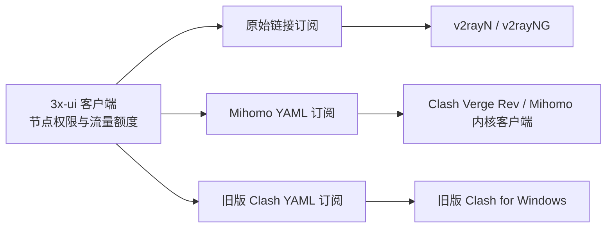

# 第 22 课：同一组节点，为什么要准备三种订阅格式

**现在 tyccc 和新 MEU 都有三种订阅入口。** 账号和流量额度仍由 3x-ui 中同一个客户端管理；三个地址只是把同一组可用节点翻译成不同软件能读懂的格式。完整地址保存在仓库外的 `account.md`，不要写进教程、Git、群聊或公开截图。

## 先选软件，再选地址

| 你使用的软件 | 该复制哪种地址 | 为什么 |
|---|---|---|
| v2rayN（Windows、macOS）、v2rayNG（Android） | `account.md` 中原有的“全线路订阅”或“每月 100GB 订阅” | 它们识别节点分享链接列表；原地址保持不变。 |
| Clash Verge Rev（Windows、macOS、Linux）、其他使用 Mihomo 内核的软件 | 同一套餐对应的 **Mihomo / Clash Verge Rev 订阅** | Mihomo 需要一份 YAML 配置，里面包含节点、节点组和基础规则。 |
| 旧版 Clash for Windows | 同一套餐对应的 **旧版 Clash for Windows 订阅** | 旧内核不能理解 VLESS、REALITY、Hysteria2、TUIC、XHTTP 等新配置。兼容版只提供它能识别的节点。 |

“订阅地址”是一个 HTTPS 网页地址。客户端定期下载它，并用返回的内容更新节点。**它不是单条节点的分享链接**：不要把整条订阅 URL 粘贴进“从剪贴板导入节点”。

## 这次在面板改了什么

两台 3x-ui 面板原来均已开启原始链接订阅，但 `Clash / Mihomo` 输出处于关闭状态。本次打开该输出，把面板展示给用户的 Clash 订阅基础地址设为各自订阅域名下的 `/mihomo/`，同时保留 `subClashAutoDetect=false`。这样，v2rayN 原地址继续返回原始链接，不会因为软件的 User-Agent 被意外改成 YAML。

3x-ui v3.8.5 的订阅服务按**路径**决定格式：`/mihomo/` 返回完整的 Mihomo YAML；`/clash-legacy/` 返回旧版 Clash 兼容 YAML。同一个 Sub ID 在三种格式中指向同一个客户端，因此它的节点权限、累计用量和月度额度一致。这里的 `` 是私密令牌；真实地址只从 `account.md` 复制，不要用字面上的占位符。

我们没有改动入站协议、节点端口、出站路由、Cloudflare 公开路由或原始订阅路径。订阅域名原本就把所有请求转发给 3x-ui 的订阅服务，因此新增格式无需再建 DNS 记录。

## 验收结果（2026-10-09）

| VPS 与套餐 | 原始链接 | Mihomo YAML | 旧版 Clash YAML |
|---|---:|---:|---:|
| tyccc 全线路 | 13 | 13 | 4 |
| tyccc 每月 100GB | 12 | 12 | 4 |
| 新 MEU 全线路 | 8 | 8 | 2 |
| 新 MEU 每月 100GB | 7 | 7 | 2 |

四份 Mihomo 配置均通过 YAML 结构检查，并用本机 Clash Verge Rev 附带的 **Mihomo 内核**执行配置加载测试，结果全部成功。旧版 Clash 格式也通过 YAML 结构检查，且输出只包含 VMess 与 Trojan；本机没有安装旧版 Clash for Windows，因此尚未在其图形界面做导入测试。原始订阅在改动前后的节点数保持一致。

旧版列表变短是**有意筛选**，不代表线路损坏。本次两台服务器的 Shadowsocks 使用旧 Clash 不支持的加密方式，也不会出现在兼容版中。想使用全部协议，应选 Mihomo 内核客户端。不要为凑齐数量而关闭证书校验或降低服务端加密配置。

对每台 VPS 的三个格式分别检查订阅响应头：全线路的 `total=0`（不设总量）；100GB 组的 `total=100 GiB`。这说明换订阅格式不会绕过流量限制。按月重置仍由面板客户端配置执行，订阅 YAML 本身只负责把额度信息展示给支持它的客户端。

## 用户怎样导入

1. 打开工作目录的 `account.md`，先选 **tyccc** 或 **MEU**，再选 **全线路** 或 **每月 100GB**。
2. 根据上表复制对应的软件格式地址。不同格式不能随意互换。
3. 在 Clash Verge Rev 中进入“订阅／配置”，新建**远程订阅**，粘贴 **Mihomo / Clash Verge Rev 订阅**地址并导入。下载后选择该配置，再到“代理”页选择节点。旧版 Clash for Windows 则导入“旧版 Clash for Windows 订阅”。
4. 在 v2rayN 中使用“订阅分组设置 → 可选地址 (Url)”，保存后执行“更新订阅”；v2rayNG 中也要使用新增订阅入口，不能选“导入分享链接”。
5. 若某软件提示格式错误，先确认复制的是它对应的地址类型，再确认订阅页能返回内容。`-1` 延迟或测速失败是另一类问题，需要继续检查节点、证书和网络。

“Windows、macOS、Android、iOS、鸿蒙”是**设备系统**；“v2rayN、Clash Verge Rev”等是**客户端软件**。本次解决的是订阅**格式**兼容性，不等于每种系统都已有可用的原生客户端。尤其纯鸿蒙设备，仍需单独确认所选应用是否能运行 Mihomo 内核并导入 YAML。

## 出处与后续复查

- [3x-ui v3.8.5 对应的订阅文档](https://github.com/MHSanaei/3x-ui/blob/v3.8.5/docs/content/docs/en/config/subscription.mdx)：三种输出格式、Mihomo 与旧版 Clash 的路径、兼容范围。
- [Clash Verge Rev 官方配置说明](https://clashvergerev.com/en/guide)：远程配置要求 Clash 格式，支持读取 `Subscription-Userinfo`。
- [Clash Verge Rev 订阅导入说明](https://clashvergerev.com/en/guide/profile)：远程 URL 的导入入口。

以后新建客户端时，它会继续拥有独立的 Sub ID。应从面板复制该客户端对应的订阅地址，再按本课选择格式；不要把某个现有用户的 URL 转发给其他人，否则他们会共用流量额度和访问权限。
