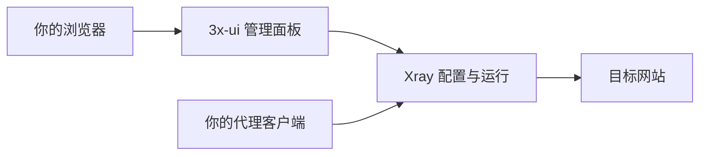

# 3x-ui 与 Xray

3x-ui 是操作面板，Xray 是执行代理通信的核心程序。你在网页表单中填写配置，面板把它整理给核心执行。

面板能打开，只能证明管理页面可以访问。核心可能没有启动，客户端也可能填错参数。因此还需要测试真实通信。

“入站”是服务器接收代理客户端连接的入口。“客户端”在面板中常指被允许使用这个入口的一条用户记录；在电脑上则通常指 v2rayN 等应用。两种语境不要混淆。

“出站”决定服务器如何继续连接目标；“路由”决定一项请求使用哪个出站。本次基础目标是让自己的客户端通过 tyccc 访问目标，并观察结果。

面板账号、代理用户 UUID、SSH root 密码是三套不同的身份信息。分享代理节点不需要附带 root 密码或面板管理员密码。

继续阅读：[[协议传输与安全层]]、[[UUID密码与订阅链接]]。来源：[3x-ui 官方介绍](https://docs.sanaei.dev/zh/docs/)、[Xray 官方项目](https://github.com/XTLS/Xray-core)。
