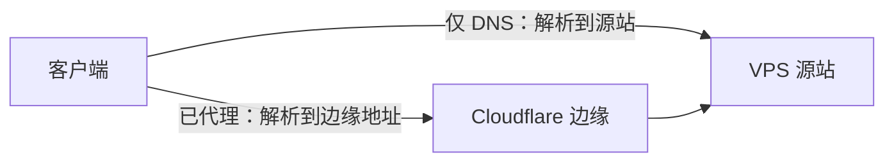

# CDN 与 DNS 代理状态

[[域名与DNS|DNS]] 负责查名字对应的信息。CDN 是分布在多个地点、承接请求的网络服务。在 Cloudflare 中，同一条 DNS 记录是否开启代理，会改变客户端实际连接的下一站。

这张图只表示请求方向；域名需要由你控制，并配置正确的记录。DNS 解析成功与 TLS 证书验证成功是两项检查。

## 灰云与橙云

仅 DNS（常见为灰云）让客户端按记录连接源站；已代理（常见为橙云）让相应受支持的请求经过 Cloudflare。普通代理支持指定端口和 WebSocket，但不是任意 TCP、UDP 协议的通用中转。真实部署要检查端口、传输与当前产品限制。[端口说明](https://developers.cloudflare.com/fundamentals/reference/network-ports/)、[WebSocket 说明](https://developers.cloudflare.com/network/websockets/)

所以，“申请证书必须永远关闭云朵”与“打开云朵能让任意节点恢复”都不准确。证书验证方式、DNS 记录、转发路径和网络端口决定具体要求。HTTP-01 和 DNS-01 的条件也不同，见 [[ACME与证书续期]]。

## 与本次 tyccc 的关系

当前 TLS 入口使用 IP 证书，面板也直接使用公网 IP 的 HTTPS 地址，没有部署 CDN。增加域名后，仍需要让证书身份与实际访问方式一致，不能随便把 IP 替换成另一个名字。

开启 CDN 可能改变路径、延迟和可用性，不保证更快。若将来做 CDN 实验，单独验证“客户端到边缘”和“边缘到源站”，保留直连对照，避免同时改域名、端口、协议和证书后无从排错。
