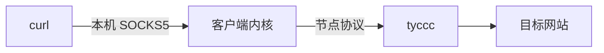

# SOCKS5 与系统代理

SOCKS5 是软件把网络请求交给代理程序的一种接口。本次验证时，内核在**电脑本机** 127.0.0.1 的临时端口提供 SOCKS5，curl 把请求交给它，内核再使用 VLESS 或其他协议连接 VPS。

SOCKS5 本地端口不是 VPS 端口。`socks5h://` 中的 `h` 让目标域名通过代理处理，减少本地 DNS 条件对这次测试的干扰。

系统代理是操作系统给应用的一项代理设置；并非所有软件都遵守它。TUN 则会通过虚拟网络接口接管更多流量，范围更广。本次测试显式指定代理，没有切换用户已有系统代理或启用 TUN。

FinalShell 与代理客户端在同一台电脑时，可在支持该功能的 SSH 客户端中使用本机代理端口；应读取软件实际 SOCKS 或混合端口，不能硬记视频里的 7897，也不必因此开启“允许局域网连接”。这是 SSH 连接经过代理，仍要正常核对主机指纹与 SSH 认证。

若是购买的远程 SOCKS 服务，还要区分入口地址和最终出口。SOCKS5 本身不提供传输加密，用户名密码认证也不是加密层。公网对接的注意点见 [[链式代理与中转落地]]。

来源：[SOCKS5 RFC 1928](https://www.rfc-editor.org/rfc/rfc1928)、[curl 代理说明](https://curl.se/docs/manpage.html#--proxy)。
