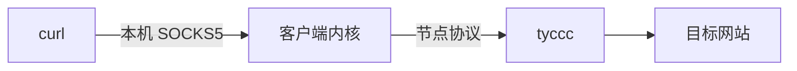

# SOCKS5 与系统代理

SOCKS5 是软件把网络请求交给代理程序的一种接口。本次验证时，内核在**电脑本机** 127.0.0.1 的临时端口提供 SOCKS5，curl 把请求交给它，内核再使用 VLESS 或其他协议连接 VPS。

SOCKS5 本地端口不是 VPS 端口。`socks5h://` 中的 `h` 让目标域名通过代理处理，减少本地 DNS 条件对这次测试的干扰。

系统代理是操作系统给应用的一项代理设置；并非所有软件都遵守它。TUN 则会通过虚拟网络接口接管更多流量，范围更广。本次测试显式指定代理，没有切换用户已有系统代理或启用 TUN。

来源：[SOCKS5 RFC 1928](https://www.rfc-editor.org/rfc/rfc1928)、[curl 代理说明](https://curl.se/docs/manpage.html#--proxy)。
