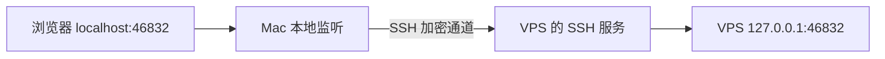

# SSH 隧道

SSH 隧道把一个本地端口收到的连接，经过加密的 SSH 通道送到远端指定地址。本次用它访问只在 VPS 本机监听的面板。



手动连接的命令模板：

```bash
ssh -N -L 127.0.0.1:46832:127.0.0.1:46832 root@你的服务器IP
```

`-N` 表示不启动远程交互命令，`-L` 表示本地转发。第一个地址和端口属于你的电脑，后面的地址和端口由远端服务器访问。两处 `127.0.0.1` 指向不同的机器。

保持这条命令运行，再打开 `http://127.0.0.1:46832/你的面板路径/`。网页到本机隧道入口使用 HTTP，跨公网那一段由 SSH 加密；不能把“通过隧道使用 HTTP”照搬成“公网直接使用 HTTP”。

关闭隧道后，面板在服务器上仍可运行，但本地浏览器无法再通过这个入口访问。已有代理客户端的连接并不依赖管理隧道。

来源：[OpenSSH ssh 手册的 -L 与 -N](https://man.openbsd.org/ssh)。
