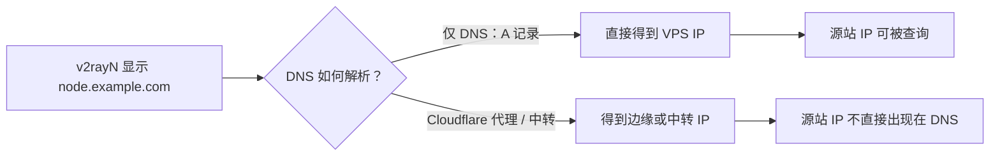

# 域名节点显示与真正隐藏源站 IP

v2rayN 的“地址”列显示域名，不等于服务器 IP 已经隐藏。域名只是给连接一个名字；客户端最终仍要把它解析成 IP 并建立连接。

## 截图中那种“网站地址”可能是什么

同一个域名配不同端口，可以把很多节点放到一个主机名下。这个域名常见有三种实现：

| 方式 | v2rayN 显示 | 源站 IP 是否真正隐藏 | 适合当前哪些协议 |
| --- | --- | --- | --- |
| DNS-only A/AAAA 记录 | 域名 | 否。查询 DNS 仍会得到 VPS IP。 | 全部；只是让界面更整洁。 |
| Cloudflare 代理的 HTTP/WebSocket 服务 | 域名 | 在 DNS 层面是。客户端连接 Cloudflare 边缘。 | 通常只适合 WebSocket/HTTPS 类节点。 |
| 独立中转 VPS 或付费 L4 服务 | 域名 | 对终端用户隐藏原 VPS；中转自身 IP 仍公开。 | 可按服务能力承载 TCP/UDP，但增加成本与一跳延迟。 |

截图里的 AnyTLS 节点使用同一个域名和很多非标准端口，不能仅凭界面判断它用了哪种方式。若该域名是 DNS-only，它的源 IP 仍可以被 DNS 查询到；域名只改变“显示方式”。

## tyccc 现在的情况

tyccc 的**面板**与**订阅**已经通过 Cloudflare Tunnel 使用域名，且服务仅监听本机；这里的源站端口没有直接暴露。

代理节点不同：VLESS Reality、Shadowsocks、Hysteria2、TUIC、Trojan 和部分 WebSocket/TLS 节点需要让 v2rayN/v2rayNG 直接建立各自的 TCP 或 UDP 连接。免费 Cloudflare Tunnel 的公开主机名面向 HTTP/HTTPS；非 HTTP 服务通常要求终端用户也安装 `cloudflared`，不适合普通 v2rayN 用户。UDP 的 Hysteria2/TUIC 更不能用当前这条面板 Tunnel 透明承载。[Cloudflare：已发布应用协议](https://developers.cloudflare.com/cloudflare-one/networks/connectors/cloudflare-tunnel/routing-to-tunnel/protocols/)

所以，不能把 tyccc 的 13 条节点简单地全部改成一个 Cloudflare 域名，就期待既不显示 IP、又不改客户端、还能支持所有协议。

## 如果只希望 v2rayN 不直接显示 IP

可以建立例如 `node.你的域名` 的 DNS-only 记录，再把 3x-ui 的“分享地址”改成它。这样客户端界面会显示域名，但 DNS 仍可还原 IP。

对于 Shadowsocks 和 VLESS Reality，这种改动较直接：客户端连接的地址变成域名；Reality 的 SNI 仍可按原配置使用伪装目标。对于 Hysteria2、TUIC、Trojan、WebSocket/TLS，则还要签发覆盖该域名的 TLS 证书，并把服务端证书和客户端 SNI 一起改好；当前 IP 证书不能自动匹配新域名。

这是一种“更好看、方便未来换 IP”的方案，不应写成“隐藏源站”的安全措施。

## 如果真正目标是隐藏 tyccc 代理源站

可选架构如下：

1. **仅保护面板和订阅：维持现状。** 当前 Cloudflare Tunnel 已做到，最简单，也不影响节点性能。
2. **只把 WebSocket/TLS 节点迁到可代理的 HTTPS 端口并经 Cloudflare。** 可隐藏这部分节点的源站，但 Reality、Shadowsocks、Hysteria2、TUIC 仍需其他方案；还要重新设计证书、端口和客户端配置。
3. **使用独立中转 VPS。** 用户连接中转域名，中转再转发到 tyccc；可以隐藏 tyccc IP，但增加维护、费用和延迟。
4. **使用支持 TCP/UDP 的付费 L4 代理服务。** 例如 Cloudflare 文档提到可通过 Spectrum 为 TCP/UDP 应用提供路由；是否适合代理服务、具体费用与条款必须在购买前逐项确认。[Cloudflare：Published applications](https://developers.cloudflare.com/cloudflare-one/networks/connectors/cloudflare-tunnel/routing-to-tunnel/)

> [!warning]
> 无论使用哪种方案，都不要把“域名显示”误认为“抗 DDoS”。若攻击者已经知道并攻击公网代理 IP，服务器本地防火墙无法挽回被上游带宽塞满的链路。

关联阅读：[[域名与DNS]]、[[CDN与DNS代理状态]]、[[13-用Cloudflare-Tunnel隐藏3x-ui面板IP]]、[[tyccc-性能与暴露面审计]]。
