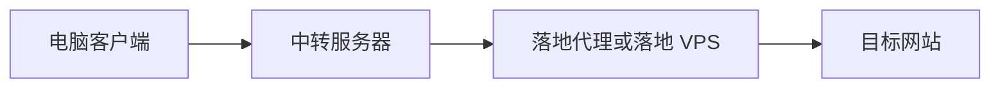

# 链式代理与中转、落地

普通节点由一台服务器接收请求，再访问目标网站。链式代理让请求再经过一个代理服务。把它想成转运：前一站负责接力，最后一站负责向目的地发出请求。

“中转”和“落地”是这条路径中的角色，不是服务器永久的身份。只要上述请求完整经过这条链，目标网站通常看到的是最后一站的出口地址。响应通过已有连接返回，不需要另建一条反向入站。

## 中转解决路径，落地决定最后出口

好的中转路径可能改善到落地的连接质量，也会增加一跳、资源消耗和维护点。如果原来的直达路径已经很好，增加中转可能更慢。带宽还受整条路径最窄的一段限制，见 [[带宽流量延迟与丢包]]。

最后一站可以是普通 VPS，也可以是某个代理产品。它不会因为被叫作“落地”就成为住宅 IP；资源类型需要另行核实，见 [[住宅IP与机房IP]]。

## 配置发生在哪里

| 位置 | 要解决的问题 |
| --- | --- |
| 中转的入站 | 哪些客户端可以把请求交给中转 |
| 中转的出站 | 用什么协议、地址与凭据联系落地 |
| 中转的路由 | 哪些入站请求要走这条出站 |
| 落地的入站或商家代理端口 | 是否接受中转发来的连接 |

Xray 路由按规则顺序选择匹配的出站。因此仅创建一个出站，不代表流量已经走过去。见 [[入站出站与路由]] 与 [Xray 路由文档](https://xtls.github.io/config/routing.html)。

## 两种布置方法不能混淆

服务器端链式代理在中转服务器完成下一跳。客户端通常仍只配置连接中转的节点；无需把住宅账号一起发给每台客户端。

客户端链式代理则由电脑上的代理软件安排多级连接，其功能名和配置格式取决于软件。这与服务器端“入站 → 路由 → 出站”不是同一处配置，导入一个普通节点链接也不一定包含整条链的信息。

## 每一段都要看保护方式

电脑到中转使用 TLS 或 REALITY，并不自动加密中转到落地。标准 SOCKS5 本身不提供传输加密；用户名密码认证也不能当作加密通道。若对接公网代理服务，应核实它支持的受保护连接方式及客户端支持情况。[Xray SOCKS 说明](https://xtls.github.io/config/outbounds/socks.html)、[SOCKS 用户名密码认证 RFC 1929](https://www.rfc-editor.org/rfc/rfc1929)

如果两台 VPS 都由你管理，可选择双方支持的加密协议，例如合适的 Shadowsocks 配置。两台机器都在海外，并不意味着中间网络天然可信，也不能直接断言某协议一定更快。

当前教程已有 tyccc 到 ISP HTTP 出站的实测配置；它只处理五个 TCP 入站，Hysteria2 与 Shadowsocks 的 UDP 仍直连。完整表单、验证和撤回步骤见 [[11-将ISP代理接入tyccc链式出口]]。[[09-链式代理实验设计]] 保留为开始前的通用设计课。
