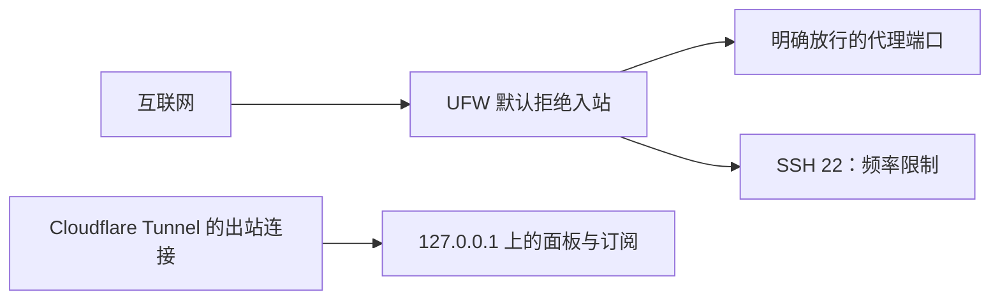

# 防火墙与监听地址

监听地址决定程序在哪个网络入口等待连接。`127.0.0.1` 是本机回环地址，像“只对本机开放的窗口”；`0.0.0.0` 常表示监听所有 IPv4 接口。防火墙则决定到达主机的数据包能否进入。

tyccc 当前把 3x-ui 面板和订阅服务分别放在本机回环地址，通过 [[13-用Cloudflare-Tunnel隐藏3x-ui面板IP|Cloudflare Tunnel]] 提供域名访问；它们不再接受公网 IP 加端口的直连。代理入站仍需要公开，因为手机和电脑必须从互联网连接它们。

| 操作 | 能证明什么 | 不能证明什么 |
| --- | --- | --- |
| `ss -lntup` | 本机哪些 TCP/UDP 端口正在监听 | 云端或上游网络是否已拦截攻击。 |
| `ufw status numbered` | UFW 管理的允许与拒绝规则 | 所有公网端口在外部一定可达。 |
| 从另一台机器连接 | 这条外部网络路径可用 | 长期速度或抗 DDoS 能力。 |
| `systemctl is-active 服务名` | 服务进程受 systemd 管理且运行 | 配置一定符合业务需求。 |

UFW 默认拒绝未列出的入站端口。它可减少扫描和误开端口，却无法处理已经占满 VPS 上游带宽的大流量攻击；这类风险需要服务商上游防护、备用 IP 或临时停用受攻击入站。完整实测和剩余风险见 [[tyccc-性能与暴露面审计]]。

来源：[Ubuntu UFW](https://help.ubuntu.com/community/UFW)、[OpenSSH 手册](https://man.openbsd.org/ssh)。
