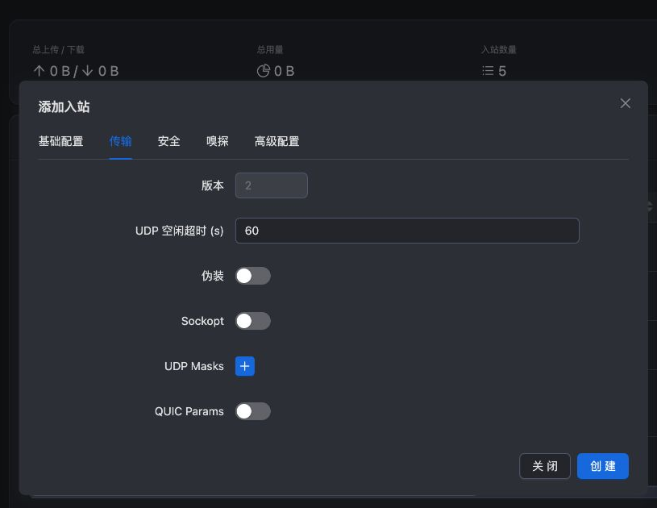
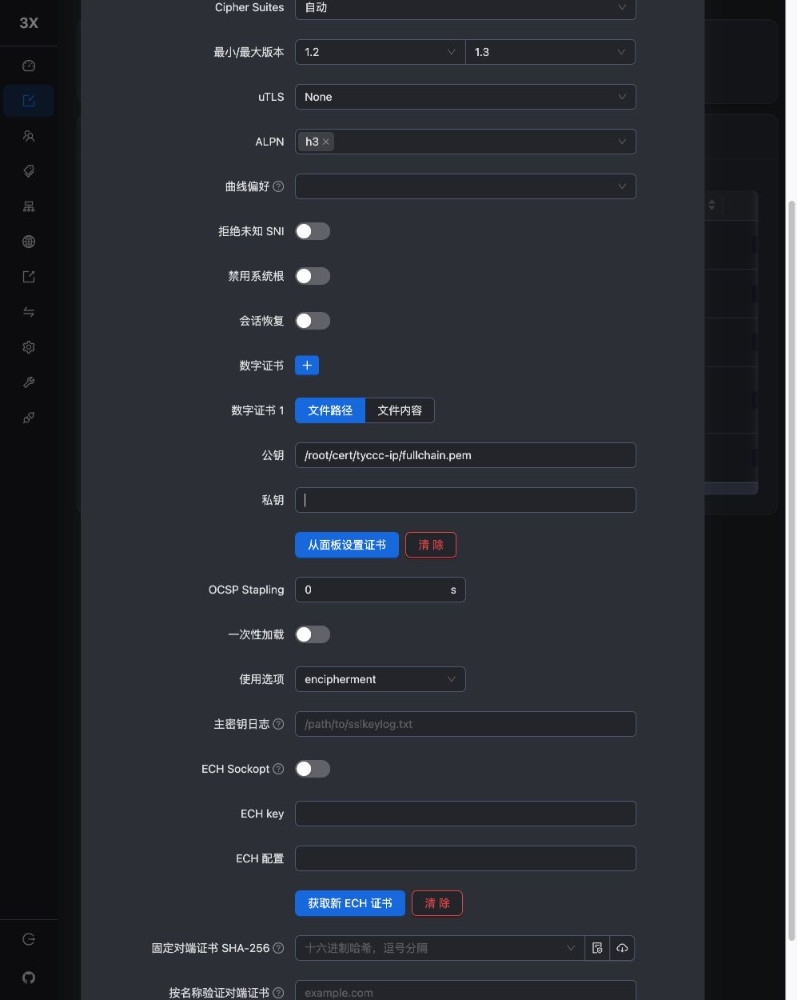

# Hysteria2 配置

Hysteria2 使用 [[QUIC]]，底层依赖 UDP。本次 3x-ui 的协议下拉叫 **hysteria**，传输页版本为 **2**，导出链接叫 `hysteria2://`。不能只凭下拉显示名称判断它是旧版 Hysteria。

## 浏览器步骤

1. 添加新入站，备注 `tyccc-hysteria2`，协议 hysteria，地址 VPS_IP，端口 **443**。
2. 传输页确认 Hysteria 版本 **2**，UDP 空闲超时保持 60 秒。
3. 本次移除了面板预置的空 Salamander 掩码，不启用额外混淆。如果以后启用，服务端和客户端的密码必须一致。

4. 安全使用 TLS，SNI 为 VPS_IP，证书和私钥文件仍为上一课部署的路径，ALPN **h3**。

5. 保存并关联客户端。它使用“凭据”页中的 **Hysteria 认证**字段；不要误取面板管理员密码。

## 为什么不和 REALITY 冲突

REALITY 监听 **TCP 443**，Hysteria2 监听 **UDP 443**。TCP 与 UDP 使用不同的端口空间，所以可以同时出现同一个数字。只放行 TCP 443 无法满足 Hysteria2，见 [[TCP与UDP]]。

QUIC 在 UDP 上实现加密和可靠传输机制，不能简单理解成“不可靠 UDP 所以只能传不重要数据”。实际效果还受本地网络的 UDP 限制、丢包和拥塞影响；本次只验证可用性，没有做速度排名。

## 实测

sing-box 1.12.22 通过此节点访问 HTTPS，出口为 tyccc；通过同一节点转发 UDP DNS 查询也得到有效回应。错误 Hysteria 认证值无法通过。客户端 TLS 验证开启，没有使用 insecure。

本次没有人为填写超出线路能力的带宽数字，也没有启用端口跳跃。以后需要时，先按 [Hysteria 带宽说明](https://v2.hysteria.network/docs/advanced/Full-Client-Config/) 理解对应拥塞控制模式，不能把表单数字当作购买额外带宽。

来源：[Xray Hysteria 入站](https://xtls.github.io/config/inbounds/hysteria.html)、[Hysteria2 服务端指南](https://v2.hysteria.network/docs/getting-started/Server/)、[sing-box Hysteria2 出站](https://sing-box.sagernet.org/configuration/outbound/hysteria2/)。返回 [[04-浏览器配置六种入口]]。
