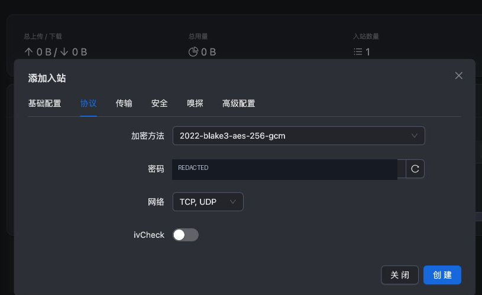

# Shadowsocks 2022 配置

Shadowsocks 是应用代理协议。本次学习它的密码和 UDP 机制，使用 `2022-blake3-aes-256-gcm`。数字 2022 表示协议家族版本，不是安装年份。先读 [[协议传输与安全层]]、[[加密与认证]]。

## 浏览器步骤

在“入站 → 添加入站”：基础页备注 `tyccc-shadowsocks`，协议 Shadowsocks，地址填 VPS_IP，端口 **8388**。进入“协议”，算法选 `2022-blake3-aes-256-gcm`，网络包含 TCP 和 UDP，保留新生成的服务器密码。安全页保持“无”，这里指**没有额外的 TLS 层**，不代表 Shadowsocks 明文传输。

保存，再按 [[05-添加客户端与导出连接]] 关联客户端。8388 是习惯用端口，不是协议强制要求；换端口必须同步修改客户端和防火墙。

## 两段密钥为什么都要有

这次面板采用多用户 AEAD-2022。服务端有一个服务器密钥，客户端记录另有用户密钥；导出时把它们按 `服务器密钥:用户密钥` 组合。不要手工只取其中一段，也不要用随意几个汉字替代所需长度的 Base64 密钥。

客户端有的链接把算法和密码放在 Base64 中，有的使用 URI 转义的明文字段。本次面板输出后者。链接解析不能只假定一种写法。本次直接读取面板二维码，避免人工拼接错误。

## 实际效果与边界

sing-box 1.12.22 实测 HTTPS 请求从 tyccc 出口返回；另通过 SOCKS5 UDP 转发查询 DNS，回应的事务 ID 和有效答案均匹配。错误用户密钥不能完成代理访问。

Xray v26.7.28 对 Shadowsocks 输出弃用提示，提及缺少前向保密等因素。本教程保留它作为兼容性与分层教学，不保证将来内核仍支持。不要把这条提示误读成“本次端口没有启动”。

**失败先检查：** 算法一致吗？两段密钥完整吗？8388 的 TCP、UDP 都允许吗？只测网页不能证明 UDP 可用。

来源：[Shadowsocks AEAD 2022 规范](https://shadowsocks.org/doc/sip022.html)、[sing-box Shadowsocks 多用户说明](https://sing-box.sagernet.org/manual/proxy-protocol/shadowsocks/)、[Xray Shadowsocks 入站](https://xtls.github.io/config/inbounds/shadowsocks.html)。返回 [[04-浏览器配置六种入口]]。
