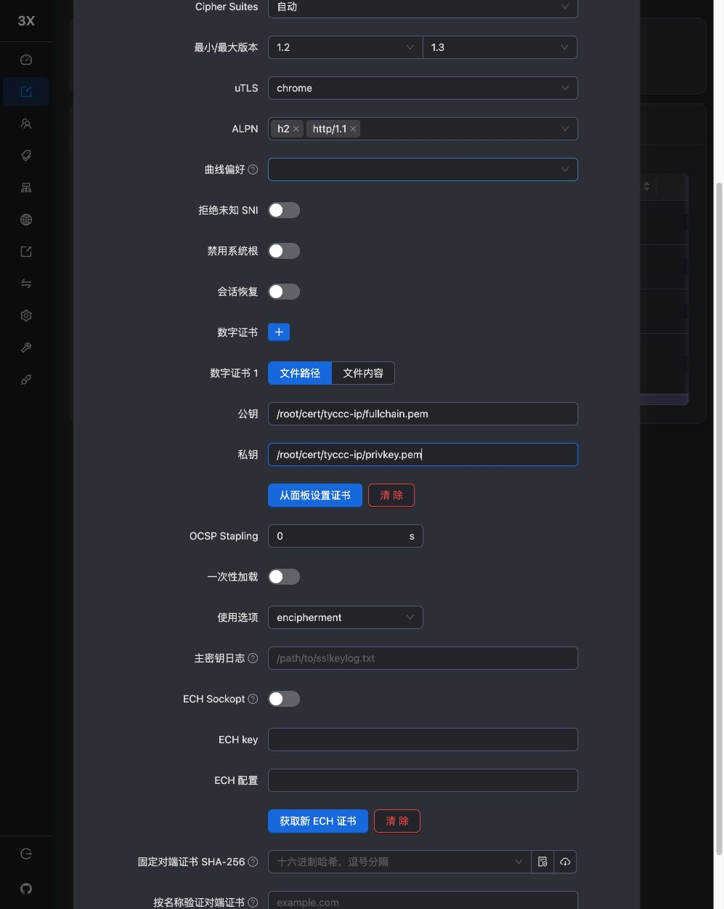

# Trojan + TLS 配置

Trojan 在 TLS 内使用密码认证。本次端口 9443 上没有部署普通网站，不能把“用了 TLS”理解成“访问这个地址就一定有网页”。先读 [[TLS证书与HTTPS]]、[[加密与认证]]。

## 浏览器步骤

“入站 → 添加入站”，备注 `tyccc-trojan-tls`，协议 Trojan，地址 VPS_IP，端口 **9443**。传输保持 RAW/TCP；安全选 TLS。

填写 SNI 为 VPS_IP，证书文件 `/root/cert/tyccc-ip/fullchain.pem`，私钥文件 `/root/cert/tyccc-ip/privkey.pem`。ALPN 保留 **h2、http/1.1**。保存后关联客户端，使用该客户端的密码，导出 `trojan://` 节点。

## 两道检查分别做什么

TLS 先让客户端确认“我连的是证书中的服务器”，并保护传输；Trojan 密码再让服务器确认“这个使用者有权限”。证书可以正确但密码错误；密码正确而证书身份不匹配，也不应继续连接。

本次 sing-box 1.12.22 的 HTTPS 请求成功从 tyccc 出口返回，错误密码失败，证书验证没有关闭。未配置 fallback 网站、CDN 或域名分流。

Xray v26.7.28 对这种无 Flow 的 Trojan 配置有弃用提示，推荐其他方案；这里作为协议对照保留。提示不等于本次不可用，也不保证长期支持。

来源：[Xray Trojan 入站](https://xtls.github.io/config/inbounds/trojan.html)、[sing-box Trojan](https://sing-box.sagernet.org/configuration/outbound/trojan/)。返回 [[04-浏览器配置六种入口]]。
