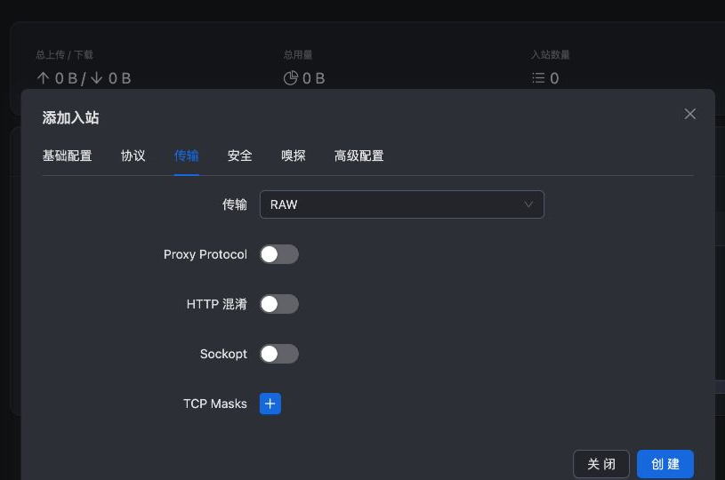
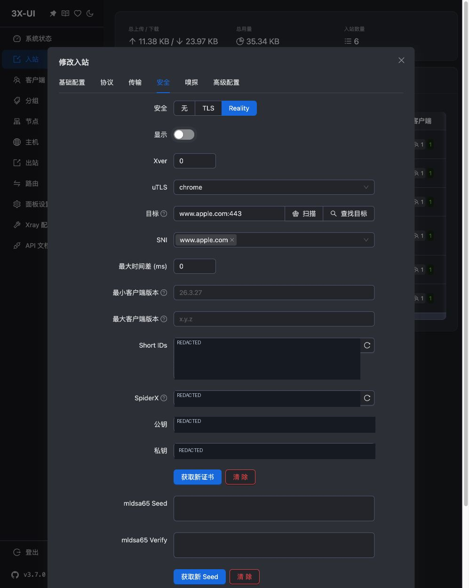

# VLESS + REALITY + Vision 配置

本次的主线方案是 **VLESS + RAW/TCP + REALITY + Vision**。先读 [[REALITY与Vision]]。这里不使用上一课的 IP 证书，而由 REALITY 的配对参数验证服务端。

## 浏览器按这些字段填写

“入站 → 添加入站 → 基础配置”：备注 `tyccc-vless-reality`，协议 VLESS，地址 VPS_IP，端口 **443**，不打开“禁用 XTLS flow”。协议页 encryption/decryption 为 none。


传输选 **RAW/TCP**。RAW 表示直接以 TCP 承载，不再额外套 WebSocket。不要因为名字不同误以为 RAW 和 TCP 是两种对立协议。



安全页选择 Reality，按最终验证成功的配置填写：

| 字段 | 本次最终值 | 含义 |
| --- | --- | --- |
| 目标 | `www.apple.com:443` | 服务器与之进行 TLS 交互的目标；不等于用户代理出口 |
| SNI | `www.apple.com` | 客户端须匹配服务端允许的名称 |
| uTLS | chrome | 使用相应握手指纹实现 |
| Xver | 0 | 不向目标附加 PROXY protocol 头 |
| 最大时间差 | 0 | 保持本次默认 |
| 最小/最大客户端版本 | 留空 | 注意当前 Xray 的最小值默认是 26.3.27，不是“不限制” |
| Short IDs | 面板随机生成 | 允许的短标识；导出客户端取其中一个 |
| 公钥、私钥 | 点击“获取新证书”生成新配对 | 此按钮在 REALITY 页生成密钥，不是向 Let's Encrypt 签发证书 |
| ML-DSA Seed / Verify | 留空 | 本次不启用这项可选扩展 |
| 显示 | 关闭 | 仅诊断期间临时开启过 |



保存并按 [[05-添加客户端与导出连接]] 关联用户，该关联的 Flow 应为 **xtls-rprx-vision**。

## 先从 VPS 检查目标

在服务器执行：

```bash
openssl s_client -connect www.apple.com:443 -servername www.apple.com -tls1_3 -alpn h2 </dev/null
```

本次输出 TLSv1.3、X25519、ALPN h2、`Verify return code: 0 (ok)`。这证明基本 TLS 条件满足，**还不能代替真正的 REALITY 代理测试**。目标的可达性和响应会变化，之后复现仍要重新检查。

## 为什么最终选择 Apple

最初使用 `www.microsoft.com:443`。它通过了 OpenSSL TLS 检查，但实际 REALITY 请求失败；核对导出公钥、私钥推导结果、Short ID、SNI 均一致，重启核心也未解决。仅把目标和 SNI 换成已检查的 Apple，并使用 Xray 26.7.28，实际 HTTPS 请求成功。我们没有确定旧目标失败的底层原因，详细记录见 [[REALITY握手与客户端兼容性排错]]。

新版核心还明确提示最低客户端版本默认 26.3.27。不要为了让旧客户端通过而随意降低限制；本次交付的测试内核是官方 Xray 26.7.28。旧 sing-box 1.12.22 不在本方案验证通过的客户端范围内。

## 最后验证

从面板重新导出节点后，Xray 26.7.28 成功访问 HTTPS，返回的公网出口等于 tyccc；故意使用错误 UUID 则失败。客户端中的服务器地址仍是 **tyccc IP**，不是 apple.com。目标网站没有变成你的 VPS，也不需要你的 Apple 账号。

REALITY 公钥在数学上叫公钥，但在这个方案里也是客户端持有的认证材料，按当前文档的语义应保密；不能因名称含“公”就发到公开仓库。

来源：[REALITY 参数与最低版本说明](https://xtls.github.io/config/transports/reality.html)、[VLESS 与 Vision](https://xtls.github.io/config/outbounds/vless.html)、[Xray v26.7.28](https://github.com/XTLS/Xray-core/releases/tag/v26.7.28)。返回 [[04-浏览器配置六种入口]]。
