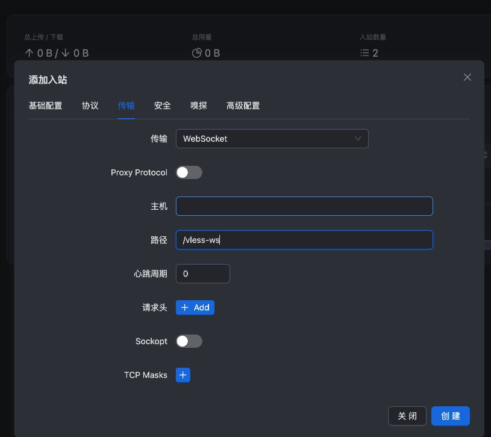

# VLESS + WebSocket + TLS 配置

把这一组合读成三件事：VLESS 识别授权用户，[[WebSocket]] 承载连接，[[TLS证书与HTTPS|TLS]] 保护外层并验证服务器身份。本次直接连接 IP，没有配置 CDN 或网站反向代理。

## 浏览器步骤

1. 添加新入站，备注 `tyccc-vless-ws-tls`，协议 VLESS，地址 VPS_IP，TCP 端口 **8443**。
2. 基础页打开 **禁用 XTLS flow**。这条 WS 链路不使用 REALITY 那条入口的 Vision。
3. 协议页 encryption/decryption 保持 none。
4. 传输选 WebSocket，路径填 **`/vless-ws`**，Host 留空，其余默认。

5. 安全选 TLS，SNI 填 VPS_IP，证书模式选文件路径，填 `fullchain.pem` 与 `privkey.pem` 的完整服务器路径，ALPN 只保留 **http/1.1**。

6. 保存，关联客户端，导出链接。客户端应有 `type=ws`、`path=/vless-ws`、`security=tls`，Flow 为空。

## 为什么路径要一致

WebSocket 连接先发起 HTTP 请求，服务端按路径接受升级。把 `/vless-ws` 错写成 `/vless`，TLS 仍可能成功，但 HTTP 升级失败。路径不是密码，也不是匿名保证；认证仍靠 UUID。

这里 ALPN 使用 http/1.1 是为了本次 WebSocket 升级方式。不能因为 h2 “数字更大”就随意添加。使用 IP 证书时客户端必须核对 IP SAN，不能随便填一个域名。

## 已验证的效果

sing-box 1.12.22 使用实际导出链接可访问 HTTPS，出口为 tyccc；更换错误 UUID 后访问失败。没有开启跳过证书验证。流量经过 WS 不代表可随意接入任何 CDN，各供应商的代理端口、TLS 与使用规则还需另行配置。

本次 Xray 对 WebSocket 输出弃用提示；XHTTP 是其建议迁移方向之一，见 [[主流协议选择地图]]。先学会这次的结构，再评估迁移，避免混用不同传输的参数。

来源：[Xray VLESS 入站](https://xtls.github.io/config/inbounds/vless.html)、[WebSocket 配置](https://xtls.github.io/config/transports/websocket.html)、[TLS 配置](https://xtls.github.io/config/transports/tls.html)。返回 [[04-浏览器配置六种入口]]。
