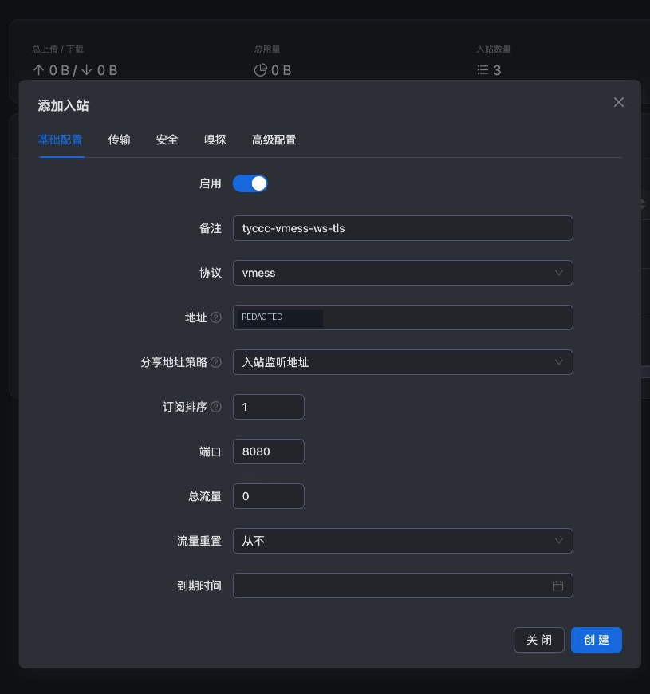
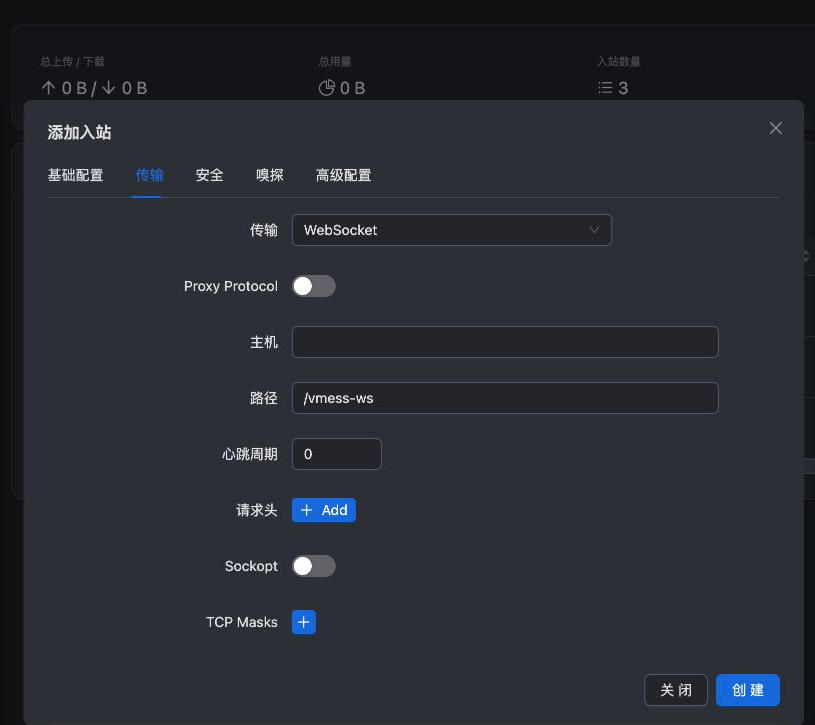
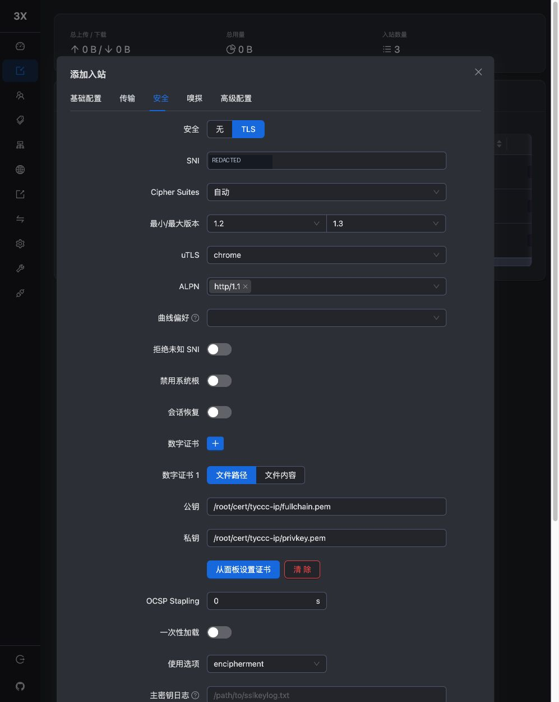

# VMess + WebSocket + TLS 配置

VMess 用 UUID 识别用户，自身也有加密机制；TLS 是另外一层。meu 的已有入口显示 VMess + WS，本次在 tyccc 上增加 TLS，便于学习服务端身份验证。先读 [[UUID密码与订阅链接]]、[[NTP与时间同步]]。

## 浏览器步骤

1. 点击“添加入站”，不要克隆 VLESS 后试图修改协议，现有入站的协议选择被锁定。
2. 基础页备注 `tyccc-vmess-ws-tls`，协议 VMess，地址 VPS_IP，TCP 端口 **8080**。

3. 传输选 WebSocket，路径 **`/vmess-ws`**，Host 留空。

4. 安全选 TLS，SNI 填 VPS_IP，公钥/证书路径 `/root/cert/tyccc-ip/fullchain.pem`，私钥路径 `/root/cert/tyccc-ip/privkey.pem`，ALPN 仅 **http/1.1**。

5. 保存，关联客户端，VMess 加密保持 auto。本次使用 AEAD 模式，客户端 alterId 为 0。

## 哪些错误长得很像

系统时间明显偏离、UUID 错误、WS 路径错误、内核不兼容，都可能表现为“连上又断开”。按证书、传输、认证顺序检查，不能只看到 SSL 错误就认定服务器证书坏了。

本次同一条面板导出的 VMess 链接，**sing-box 1.12.22 验证失败，而 Xray 26.7.28 成功**。成功测试确认证书校验开启、HTTPS 返回 tyccc 出口、错误 UUID 无法访问。我们未进一步证明旧 sing-box 失败的具体实现原因，因此不能把推测写成确定结论。

后续复现优先使用本次验证通过的 Xray 版本。Xray 对 VMess 与 WebSocket 都输出弃用提示，未来升级前阅读发布说明并做备份。

来源：[VMess 入站](https://xtls.github.io/config/inbounds/vmess.html)、[VMess 出站](https://xtls.github.io/config/outbounds/vmess.html)、[Xray v26.7.28](https://github.com/XTLS/Xray-core/releases/tag/v26.7.28)。返回 [[04-浏览器配置六种入口]]。
