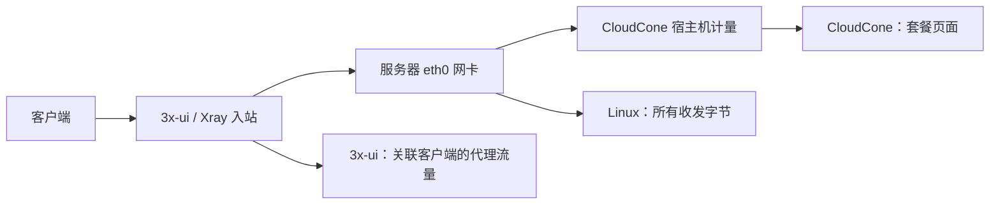

# CloudCone 流量与 3x-ui 流量为什么不同

同一台 VPS 会有至少两种“流量”数字。它们由不同系统记录，数字不相等是正常的；但如果 CloudCone 长期显示 `0 GB`，也不能据此认定服务器没有产生流量。先读 [[带宽流量延迟与丢包]]、[[入站出站与路由]]、[[3x-ui与Xray]]。

## 这次看到的实际情况

tyccc 的 CloudCone 管理页显示 `0 GB of 3072 GB/Mo Used`。同时在服务器上只读核对到：

| 记录位置 | 数值 | 它在数什么 |
| --- | --- | --- |
| Linux 网卡 `eth0` | 接收 7,147,358,893 B，发送 6,641,769,339 B；合计约 12.8 GiB | 从上次启动起，这张网卡收到和发出的全部网络数据。 |
| 3x-ui 客户端统计 | 合计 1,035,086,662 B，约 0.96 GiB | 已关联到 3x-ui 客户端的代理入站流量。 |
| CloudCone 页面 | `0 GB` | CloudCone 控制面显示的本月套餐计量值。 |

服务器服务处于 active，网卡字节数也持续存在，所以 CloudCone 的 `0 GB` 在这次不能表示“没有流量”。

## 为什么 3x-ui 与网卡本来就不会相等

- **3x-ui** 只统计它能归属到客户端和入站的代理流量。SSH、面板访问、系统更新、DNS、协议握手、未识别扫描等不会按同样方式显示。
- **Linux 网卡** 统计这台机器经接口进出的所有字节，因此通常高于 3x-ui。
- **CloudCone 页面** 来自服务商的宿主机或计费系统，不是直接读取 VPS 内 `eth0` 的计数器。它可能按月结算、异步汇总，或出现页面没有及时更新的情况。

本例中即使只看发送方向，服务器也已经发出约 6.2 GiB；因此 CloudCone 的 `0 GB` 不是由“只统计出站流量”造成的。

## 应该以哪个数字为准

| 目的 | 优先看哪里 |
| --- | --- |
| 判断代理节点是否真的被使用 | 3x-ui 的客户端流量与连接测试。 |
| 判断 VPS 实际是否有网络进出 | Linux 网卡计数，例如 `ip -s link show eth0`。 |
| 判断套餐剩余流量、限额或超额收费 | CloudCone 账单系统；若长期为 0，应提交工单确认。 |

不要把页面上的 `0 GB` 理解为无限流量、未计费或可以忽略套餐上限。若它在一个计费周期内始终不更新，保留管理页截图和服务器网卡计数，向 CloudCone 工单询问“该 VPS 的月流量是否正在计量、统计刷新频率和超额规则”。CloudCone 对 VPS 套餐的计费说明见其[官方帮助文档](https://help.cloudcone.com/en-us/article/how-billing-works-for-promotional-plans-and-virtual-private-servers-19bj5lr/)。
