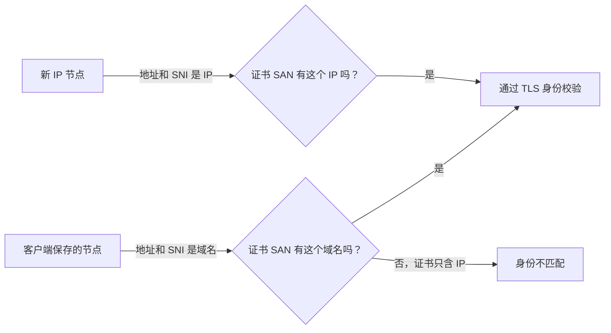

# MEU 域名节点为什么显示“运行 Core 失败”

本文记录一次真实排错：同一台电脑上，tyccc 的六条节点都能测试成功，MEU 的 VLESS WebSocket + TLS 与 Hysteria2 两条节点却显示“运行 Core 失败”。先读 [[连接失败的检查顺序]]、[[TLS证书与HTTPS]]、[[SNI]]。

## 结论先说

故障发生在 **本机 v2rayN 启动内核之前**，不是 MEU 服务端的端口、DNS 或证书已经失效。日志显示这两条 MEU 节点开启了“跳过证书验证（AllowInsecure）”，且没有设置证书固定值。v2rayN 搭配新版 Xray 因安全策略拒绝生成并启动此类配置。

切换前，服务端的域名证书、TLS 握手、WebSocket 路径和 Hysteria2 的 UDP 监听均已核对；用正确凭据建立的独立连接也成功。不能把“运行 Core 失败”直接理解成 VPS 宕机。

## 看到的现象与证据

| 项目 | MEU 的两条失败节点 | tyccc 的成功节点 |
| --- | --- | --- |
| 客户端表面结果 | `运行 Core 失败，请查看提示信息` | 延迟和测速结果正常 |
| 节点身份 | 域名 + TLS 证书 | IP + TLS 证书 |
| 本地安全选项 | `AllowInsecure=true`，未固定证书 | 没有触发该安全拦截 |
| 这次的判断 | 内核拒绝启动 | 可以启动并建立连接 |

v2rayN 日志中的关键信息是“检测到不安全配置：AllowInsecure 已启用，但未提供证书”和“为了安全，此类节点无法通过 26.2.6+ 版本的 Xray 核心连接”。这里的“未加密”是客户端给出的风险提示；更准确地说，TLS 虽可能仍在加密传输，但客户端被要求放弃校验证书身份，容易遭受中间人攻击。

原始客户端截图已留在本地私有留档，未放入公开 Git 仓库，避免公开长期有效的节点地址。公开教程只保留脱敏后的事实与操作方法，规则见 [[截图索引与脱敏说明]]。

## 为什么不能只把服务器证书换成 IP 证书

一张 IP 证书只证明“你连到的是这个 IP”；一张域名证书只证明“你连到的是这个域名”。客户端校验时，会把 **连接地址或 SNI** 与证书的 SAN（身份证明名单）比对。

因此，现有 MEU 节点仍保存域名和域名 SNI 时，把服务端正在使用的域名证书直接替换为 IP 证书会造成身份不匹配。它不能绕过 v2rayN 的本地安全检查，还会把原本有效的 TLS 链路改坏。

## 已执行：切换为 IP 证书节点

已为 MEU 的公网 IPv4 签发一张独立的 Let’s Encrypt 短期 IP 证书，并部署到仅 root 可读的路径。核对结果为：SAN 是该服务器的 IPv4、签发者为 Let’s Encrypt、私钥权限为 `600`。acme.sh 的定时任务会检查并续期；每次续期后会重启 x-ui，使 Xray 重新读取证书文件。

用户确认切换后，已把以下两个实际入站改为引用 IP 证书：

| 入站 | 端口和传输 | 现在的证书身份 |
| --- | --- | --- |
| VLESS WebSocket + TLS | TCP 8443、WebSocket | MEU 公网 IP |
| Hysteria2 | UDP 443、QUIC / Hysteria | MEU 公网 IP |

两个入站的 TLS `serverName` 已改为公网 IP；VLESS 的 WebSocket Host 也已改为公网 IP。原来的域名节点链接不再匹配新的证书，不能继续使用。IP 证书有效期约 160 小时，不能手工申请一次后置之不理；原理与续期命令见 [[03-签发IP证书与自动续期]]、[[ACME与证书续期]]。

## 你在 v2rayN 新增节点时应填写什么

请在 3x-ui 的“客户端”页面重新导出当前客户端链接或订阅，再导入 v2rayN。不要手抄旧的域名链接，也不要复用旧 Hysteria2 的认证字段。

| 项目 | VLESS WebSocket + TLS | Hysteria2 |
| --- | --- | --- |
| 地址 | MEU 的公网 IP | MEU 的公网 IP |
| 端口 | `8443` | `443`（UDP） |
| SNI | 同一个公网 IP | 同一个公网 IP |
| TLS 证书验证 | 关闭“跳过证书验证” | 关闭“跳过证书验证” |
| 额外字段 | 取面板当前导出的 WebSocket 路径和 Host | 取面板当前导出的认证信息；ALPN 为 `h3` |

本次使用“公网 IP + IP SNI + 不跳过证书验证”的临时配置做了真实测试：VLESS 与 Hysteria2 均能建立 TLS，且代理出口与 MEU 一致。排查过程中还发现旧 Hysteria2 测试配置里的认证值已经过期；当前面板客户端凭据才是有效来源。

## 订阅导入后还是旧域名，怎么办

这次迁移后还出现过一个容易忽略的问题：订阅接口虽然返回 `200`，也使用了可由系统验证的 IP 证书，但解码出来的 VLESS WebSocket 和 Hysteria2 仍是旧域名。原因是 3x-ui 生成订阅时优先使用入站的 **分享地址（share_addr）**，而不是只读取 TLS 表单里的 SNI。

已将这两个入站的分享地址同步为公网 IP，并重启 x-ui。再次验证订阅响应后，五条节点都可解码；其中 VLESS WebSocket 与 Hysteria2 的地址和 SNI 均为公网 IP。订阅 URL、UUID 和认证值只保留在私有记录中。

若 v2rayN 的日志出现 `Format_BadBase64Char`，不要只凭这一行判断订阅坏了。v2rayN 会尝试用多种格式解析条目，调试日志可在尝试失败时留下该信息。应同时检查 HTTP 状态、TLS 校验、Base64 解码结果和导出的节点字段。本例修复后的订阅满足这些条件。

在 v2rayN 中对原订阅执行“更新订阅”即可取得新内容；如果旧节点仍留在列表中，删除旧域名节点后再导入。订阅机制的基础说明见 [[UUID密码与订阅链接]]。

## 可选修复路线

| 路线 | 要改哪里 | 是否能保持现有 v2rayN 节点一字不动 | 适合什么情况 |
| --- | --- | --- | --- |
| 保留域名节点，启用证书校验 | v2rayN 的两条节点：关闭 AllowInsecure | 否 | 已有域名证书，最少改动且安全 |
| 使用固定证书指纹 | v2rayN 节点：填写 pinSHA256 | 否 | 需要明确固定某张证书时 |
| IP TLS 节点 | 3x-ui 入站引用 IP 证书；客户端导入新的 IP 节点 | 否 | 希望不依赖域名的直连 TLS 节点；本次已采用 |

三条路线都不能只靠服务端来消除当前的 v2rayN 拒绝启动：客户端必须知道它要校验的是域名、IP，还是固定指纹。本次已将服务器端切换到 IP 证书；客户端侧由用户新增并导入 IP 节点。

## 下次建立 IP TLS 节点时的检查单

1. 在 3x-ui 的客户端页面重新导出当前链接或订阅。
2. 导入后核对地址和 SNI 都是公网 IP。
3. 在客户端保持“跳过证书验证”为关闭。
4. 先测试新 IP 节点；确认成功后，再删除旧域名节点。

[[VLESS-WebSocket-TLS配置]]、[[Hysteria2配置]]、[[客户端软件与内核]]分别说明传输层、QUIC 与本地内核的差异。

来源：[Let’s Encrypt IP 证书已正式可用](https://letsencrypt.org/2026/01/15/6day-and-ip-general-availability)、[Let’s Encrypt 的 IP 证书说明](https://letsencrypt.org/2025/07/01/issuing-our-first-ip-address-certificate.html)、[Xray TLS 配置](https://xtls.github.io/config/transports/tls.html)。
