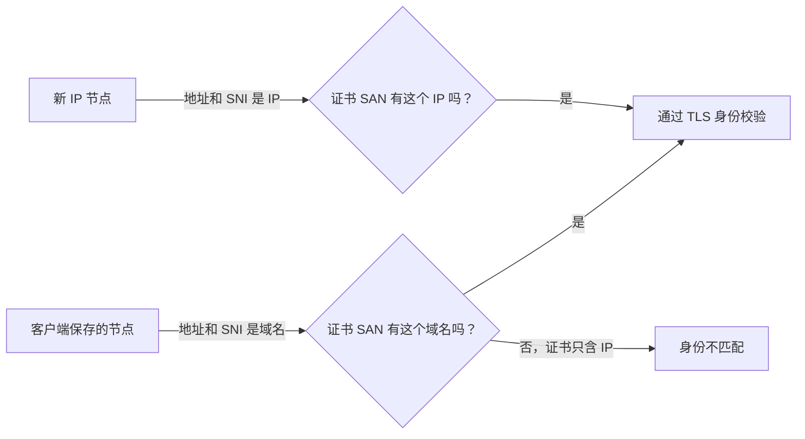

# MEU 域名节点为什么显示“运行 Core 失败”

本文记录一次真实排错：同一台电脑上，tyccc 的六条节点都能测试成功，MEU 的 VLESS WebSocket + TLS 与 Hysteria2 两条节点却显示“运行 Core 失败”。先读 [[连接失败的检查顺序]]、[[TLS证书与HTTPS]]、[[SNI]]。

## 结论先说

故障发生在 **本机 v2rayN 启动内核之前**，不是 MEU 服务端的端口、DNS 或证书已经失效。日志显示这两条 MEU 节点开启了“跳过证书验证（AllowInsecure）”，且没有设置证书固定值。v2rayN 搭配新版 Xray 因安全策略拒绝生成并启动此类配置。

服务端的域名证书、TLS 握手、WebSocket 路径和 Hysteria2 的 UDP 监听均已核对；用正确凭据建立的独立连接也成功。不能把“运行 Core 失败”直接理解成 VPS 宕机。

## 看到的现象与证据

| 项目 | MEU 的两条失败节点 | tyccc 的成功节点 |
| --- | --- | --- |
| 客户端表面结果 | `运行 Core 失败，请查看提示信息` | 延迟和测速结果正常 |
| 节点身份 | 域名 + TLS 证书 | IP + TLS 证书 |
| 本地安全选项 | `AllowInsecure=true`，未固定证书 | 没有触发该安全拦截 |
| 这次的判断 | 内核拒绝启动 | 可以启动并建立连接 |

v2rayN 日志中的关键信息是“检测到不安全配置：AllowInsecure 已启用，但未提供证书”和“为了安全，此类节点无法通过 26.2.6+ 版本的 Xray 核心连接”。这里的“未加密”是客户端给出的风险提示；更准确地说，TLS 虽可能仍在加密传输，但客户端被要求放弃校验证书身份，容易遭受中间人攻击。

原始客户端截图已留在本地私有留档，未放入公开 Git 仓库，避免公开长期有效的节点地址。公开教程只保留脱敏后的事实与操作方法，规则见 [[截图索引与脱敏说明]]。

## 为什么不能只把服务器证书换成 IP 证书

一张 IP 证书只证明“你连到的是这个 IP”；一张域名证书只证明“你连到的是这个域名”。客户端校验时，会把 **连接地址或 SNI** 与证书的 SAN（身份证明名单）比对。

因此，现有 MEU 节点仍保存域名和域名 SNI 时，把服务端正在使用的域名证书直接替换为 IP 证书会造成身份不匹配。它不能绕过 v2rayN 的本地安全检查，还会把原本有效的 TLS 链路改坏。

## 本次已做的服务器端准备

已为 MEU 的公网 IPv4 签发一张独立的 Let’s Encrypt 短期 IP 证书，并部署到仅 root 可读的路径。核对结果为：SAN 是该服务器的 IPv4、签发者为 Let’s Encrypt、私钥权限为 `600`。acme.sh 的定时任务会检查并续期。

这张证书**没有替换**当前两个域名节点正在使用的证书，也没有修改 v2rayN 的本地节点。这样能保留现状，同时为以后建立“地址就是 IP”的新 TLS 节点做好准备。IP 证书有效期约 160 小时，不能手工申请一次后置之不理；原理与续期命令见 [[03-签发IP证书与自动续期]]、[[ACME与证书续期]]。

## 可选修复路线

| 路线 | 要改哪里 | 是否能保持现有 v2rayN 节点一字不动 | 适合什么情况 |
| --- | --- | --- | --- |
| 保留域名节点，启用证书校验 | v2rayN 的两条节点：关闭 AllowInsecure | 否 | 已有域名证书，最少改动且安全 |
| 使用固定证书指纹 | v2rayN 节点：填写 pinSHA256 | 否 | 需要明确固定某张证书时 |
| 新建 IP TLS 节点 | 3x-ui 新入站引用 IP 证书；客户端导入新的 IP 节点 | 否 | 希望不依赖域名的直连 TLS 节点 |

三条路线都不能只靠服务端来消除当前的 v2rayN 拒绝启动：客户端必须知道它要校验的是域名、IP，还是固定指纹。当前用户选择是不改 v2rayN，所以本次只完成第三条路线的服务器证书准备，未擅自切换正在使用的节点。

## 下次建立 IP TLS 节点时的检查单

1. 在 3x-ui 新建独立入站，先不要覆盖已有域名入站。
2. TLS 证书链和私钥分别指向该 IP 证书的 `fullchain.pem` 与 `privkey.pem`。
3. 新节点的地址和 SNI 都填同一个公网 IP；WebSocket 还要让 Host 与服务端规则一致。
4. 在客户端保持“跳过证书验证”为关闭，再导入这条新节点。
5. 先测试新节点；成功后才决定是否保留或删除旧的域名节点。

[[VLESS-WebSocket-TLS配置]]、[[Hysteria2配置]]、[[客户端软件与内核]]分别说明传输层、QUIC 与本地内核的差异。

来源：[Let’s Encrypt IP 证书已正式可用](https://letsencrypt.org/2026/01/15/6day-and-ip-general-availability)、[Let’s Encrypt 的 IP 证书说明](https://letsencrypt.org/2025/07/01/issuing-our-first-ip-address-certificate.html)、[Xray TLS 配置](https://xtls.github.io/config/transports/tls.html)。
