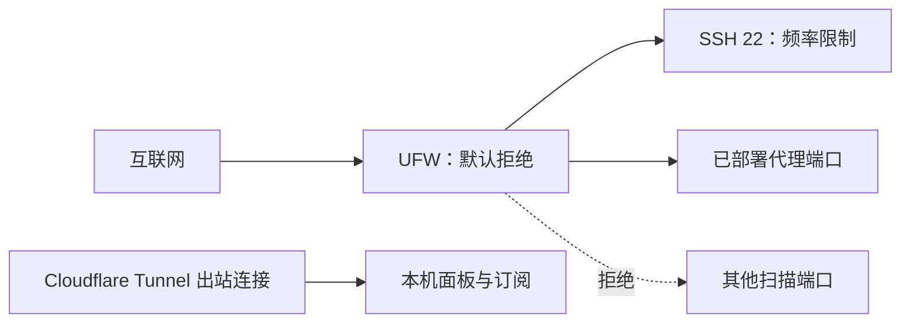

# tyccc：性能与暴露面审计

这是一份“现在这台服务器是否健康、外人能碰到什么、发生攻击时哪些措施会生效”的实测记录。它不把安全写成绝对结论：防护的目标是减少不必要的入口、降低撞库与扫描风险，并让问题可发现、可恢复。

## 审计结论

服务器当前没有看到 CPU、内存、磁盘或服务日志中的性能故障：负载接近空闲，磁盘已用约 23%，内存可用约 554MB，交换分区仅少量使用；`x-ui`、`cloudflared`、`fail2ban` 和 `ssh` 都处于运行状态。Xray 与 Cloudflare Tunnel 过去 24 小时日志中没有发现 panic、fatal 或内存耗尽。

已经实施的入口防护如下：

| 层次 | 当前状态 | 它解决什么 |
| --- | --- | --- |
| 面板监听 | 只监听 `127.0.0.1:46832`，通过 Cloudflare Tunnel 访问 | 公网扫描者不能直接连面板端口。 |
| 订阅监听 | 只监听 `127.0.0.1:2096`，通过 Cloudflare Tunnel 访问 | 订阅端口不直接暴露；随机订阅路径降低默认路径探测。 |
| Linux 防火墙 | UFW 默认拒绝入站，只放行 SSH 和正在使用的代理端口 | 关闭“服务没用、端口却开着”的暴露面。 |
| SSH | 保留现有 FinalShell 所需的 root/密码登录；限制每次尝试次数、缩短登录等待、启用闲置会话探测 | 减少口令猜测一次连接能消耗的资源。 |
| 防暴力破解 | Fail2ban 的 `sshd` 与 `3x-ipl` 监狱处于工作状态 | 连续失败的来源会被临时封禁。 |
| TCP 性能 | BBR + `fq_codel` 已启用 | 改善拥塞网络下的队列与吞吐表现；不保证跨境线路一定更快。 |

## 哪些端口仍须公开，为什么不能全部关掉

代理本身需要让客户端连接，所以相应入站端口必须公开。现在放行的端口与实际入站一一对应：

| 类型 | 放行端口 | 用途 |
| --- | --- | --- |
| SSH | TCP 22（带频率限制） | 服务器维护。 |
| TCP 代理入站 | 443、2443、8080、8388、8443、9443、18080、18388、18443、19443 | Reality、Shadowsocks、WS/TLS、VMess、Trojan 等已部署线路。 |
| UDP 代理入站 | 443、8388、4443 | Hysteria2、Shadowsocks UDP、TUIC。 |
| 面板与订阅 | **未放行公网端口** | 它们只接受本机 Cloudflare Tunnel 的转发。 |

防火墙不是“只要开了就自动保护一切”。它允许的代理端口仍会响应客户端，因为这是服务的功能；攻击者也能扫描到这些端口存在。

## 三类风险，要分开看

### 1. 撞密码、扫描和面板探测

面板和订阅服务已经不直接监听公网，面板管理员凭据也已轮换。订阅入口改为随机长路径，但它不是密码；实际 URL 仍须只保存在 `account.md` 和用户客户端中。

SSH 仍允许密码登录，是为了不中断现有 FinalShell 工作流。它是当前最需要持续关注的公网管理入口。后续若确认已在电脑保存并测试过 SSH 公钥，可以再把 SSH 改为“仅密钥登录”，并禁止 root 密码登录；这是更强的措施，但不能在没有回退通道时直接执行。

### 2. 非法连接和凭据泄漏

每位用户应有独立客户端记录、UUID/密码与订阅地址。发现订阅泄漏时，优先轮换该用户的 Sub ID 和节点认证信息，而不是只改节点备注名。流量上限、到期和设备限制也应按客户端设置。

REALITY 的错误握手会模拟访问目标站点。它减少代理特征，但不是防火墙，也不能阻止有人反复消耗握手资源。保持 Xray/3x-ui 更新、观察日志、为用户设独立额度，才是可操作的控制手段。

### 3. 大流量 DDoS

若攻击直接打向公开的代理 IP/端口，VPS 上的 UFW 只能丢弃不允许的包；它无法挽回已经被上游链路塞满的带宽。Cloudflare Tunnel 只能保护面板与订阅网站，不会代理 VLESS Reality、Hysteria2、TUIC 等任意 TCP/UDP 代理端口。

需要更强 DDoS 能力时，选择具备上游清洗/防护的服务商或网络架构，并准备换 IP、临时关闭受攻击入站、保留备用节点。不要相信“改端口”或“随机路径”能抵抗带宽型攻击。

## 日常检查顺序

每周或遇到变慢时，按下面顺序检查：

1. 看面板流量、在线人数和到期/超额用户；异常增长先停用可疑客户端。
2. 看服务器负载、可用内存、磁盘和 `x-ui` / `cloudflared` 服务状态。
3. 看 Fail2ban 的 SSH 与面板封禁计数是否快速增长。
4. 核对 UFW 规则只剩当前部署需要的端口；删除已废弃入站时同步删除放行规则。
5. 用真实客户端对同一节点重复测速；区分延迟、吞吐、丢包和 ISP 链式出口带来的额外一跳。
6. 升级前先做面板数据库备份，升级后先验证订阅和一条节点再恢复日常使用。

可用命令与含义见 [[防火墙与监听地址]]、[[systemd与日志]]、[[备份恢复与升级]]。避免在截图、日志粘贴或 Git 提交中泄漏订阅 URL、密码、私钥、UUID 或 Short ID。

## 本次验证边界

- 已验证：服务运行、面板新账号可登录、订阅可导出、UFW 已激活、SSH 更改后仍可重新登录、Fail2ban 在运行。
- 未验证：承受真实 DDoS 的能力、所有地区与运营商的长期吞吐、每一种客户端在弱网下的表现。
- 这意味着：当前可以判断“没有已观察到的资源瓶颈和不必要的面板/订阅公网端口”，不能承诺“不会被攻击”或“任何攻击都不会影响服务”。

## 参考

- [Ubuntu UFW 使用说明](https://help.ubuntu.com/community/UFW)
- [OpenSSH `sshd_config` 手册](https://man.openbsd.org/sshd_config)
- [Fail2ban 官方项目](https://github.com/fail2ban/fail2ban)
- [Linux TCP/IP sysctl 文档](https://docs.kernel.org/networking/ip-sysctl.html)
- [3x-ui 安全与订阅设置](https://github.com/MHSanaei/3x-ui)
