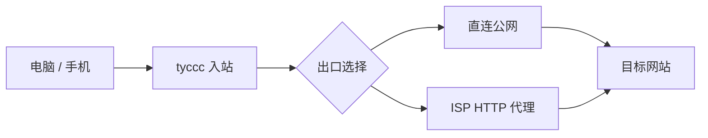

# tyccc：速度慢时怎样定位与选节点

一次测速低，不等于“VPS 被限速”或“100GB 套餐限速”。速度至少经过两段：**电脑到 tyccc**，以及 **tyccc 到目标网站**。ISP 出口还会多经过一台上游代理。

## 本次实际结果

用同一个 Cloudflare 下载目标在 tyccc 本机做了 10MB 对照测试：

| 流量路径 | 服务器端测得吞吐 | 说明 |
| --- | ---: | --- |
| tyccc 直连目标网站 | 约 29.4MB/s（约 235Mbps） | VPS CPU、磁盘、BBR 和直连出口没有显示出低速上限。 |
| tyccc → ISP HTTP 上游 → 目标网站 | 约 7.1MB/s（约 56Mbps） | 链式代理的上游速度就是这条路线的实际天花板之一。 |

同一时段的 v2rayN 测试中，直连 Hysteria2 约为 8.3MB/s，直连 VMess 约为 4.2MB/s，部分 WebSocket/TLS 节点不足 1MB/s；ISP Shadowsocks 约为 5.8MB/s。这与“电脑到美国 VPS 的线路约束 + ISP 上游约 7MB/s”的判断一致。

> [!important]
> 100GB/月是**总流量配额**，不是速度限制。本次账户还有大量未用额度，服务端也没有设置按用户限速规则。

## 为什么不同节点差很多

| 节点类型 | 这次表现 | 主要原因 | 适合什么 |
| --- | --- | --- | --- |
| 直连 Hysteria2 | 当前最快，约 8.3MB/s | UDP/QUIC 在当前网络下较顺，额外封装少。 | 视频、下载、对速度敏感的日常访问。 |
| 直连 VLESS Reality | 延迟正常；内置测速被取消 | RAW/TCP 路径短，但客户端测速任务可能超时或取消，不能仅凭 `TaskCancelledException` 断言不可用。 | 受限网络、隐私优先、Hysteria2 不可用时。 |
| 直连 VMess/Trojan | 中等 | TCP/TLS 或协议封装带来额外开销。 | 兼容性备用。 |
| WebSocket + TLS | 本次较慢 | HTTP/WebSocket 封装、TLS 与网络路径叠加；速度会随运营商波动。 | 兼容性或网页类网络环境。 |
| ISP 出口 | 通常慢于直连 | 多了一跳上游 HTTP 代理，上游本身吞吐约 7.1MB/s。 | 需要 ISP 出口属性，而非追求最高速度。 |

“协议 A 天生比协议 B 快”的说法不可靠。测速结果会随手机/电脑网络、运营商国际出口、目标网站、时段和丢包改变。

## 现在应怎样使用

1. **看视频或下载**：先用 `⚡ 直连出口｜视频/低延迟优先｜Hysteria2`。
2. **Hysteria2 连不上或网络限制 UDP**：改用 `🛡️ 直连出口｜受限网络｜VLESS Reality`，再用真实网页或视频测试。
3. **需要 ISP 出口**：接受它多一跳的速度成本；优先尝试 ISP Shadowsocks 或 ISP Reality，不要用 WS/TLS 作为速度首选。
4. **不要只看一次 v2rayN “测试速度”**：连续测 3 次，并使用同一个视频或下载文件作为真实体验对照。

## v2rayN 中的正确比较方法

1. 保持同一 Wi-Fi 或同一蜂窝网络；不要在测试中切换网络。
2. 在同一时间窗口内，每条节点测试三次，记下中位数而不是最高一次。
3. 先比较直连 Hysteria2、直连 Reality、ISP Shadowsocks、ISP Reality 四条；不要一次测 12 条后只记住最低值。
4. 用浏览器播放同一清晰度的视频 2 至 3 分钟，观察是否持续缓冲。
5. 如果某条显示 `TaskCancelledException` 或“跳过测试”，先实际选中它并访问网页；这类界面结果表示测试任务没有完成，不等于服务器已限速。

## 不建议做的“优化”

- 不要为了追求速度把所有节点都改成 ISP 出口：这会把直连的更快路径一起牺牲掉。
- 不要把 100GB 配额调成 0 来“解除限速”：0 只会变成无限流量，不会提高带宽。
- 不要仅因一条 WS/TLS 节点慢就修改所有协议表单；它们保留的价值是兼容性。
- 不要把随机订阅路径、Cloudflare Tunnel 或面板防火墙当成代理加速手段；它们保护面板与订阅，不参与代理入站的数据路径。

## 下一步的判断标准

如果直连 Hysteria2 在不同时间始终只有约 8MB/s，而电脑本身的国际网络明显更快，瓶颈更可能在“电脑到 tyccc 所在机房”的跨网线路。这时可测试另一地区 VPS、不同服务商或不同网络，而不是继续修改 Xray 参数。

如果直连 Hysteria2 也突然从 8MB/s 掉到很低，同时服务器本机直连下载仍保持约 29MB/s，则先检查本地网络、运营商国际出口和 UDP 是否被限制。若服务器本机下载也变慢，再检查 CloudCone 资源、服务端日志与链路告警。

关联阅读：[[带宽流量延迟与丢包]]、[[链式代理与中转落地]]、[[12-按使用场景组织ISP与直连订阅]]、[[tyccc-性能与暴露面审计]]。
