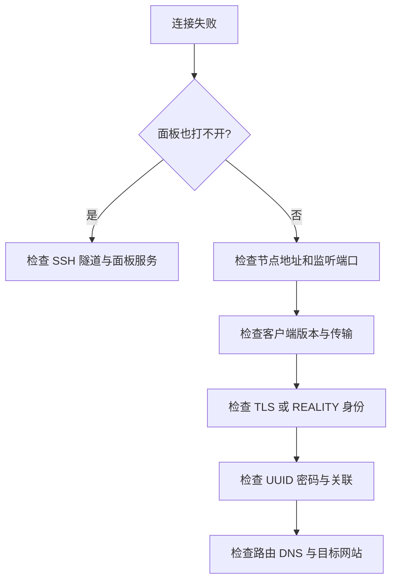

# 连接失败的检查顺序

先写清现象：哪个客户端、哪个版本、哪条节点、什么时候失败、错误文字是什么。不要只写“不能用”。真实秘密在截图前先遮挡。



## 常见现象

| 现象 | 优先检查 | 不应直接做的事 |
| --- | --- | --- |
| 127.0.0.1 面板拒绝连接 | 隧道窗口是否还在；本地端口是否占用 | 把面板改为公网开放来“解决” |
| SSH 警告身份变化 | 独立控制台核对指纹 | 无条件删除 known_hosts |
| 端口被占用 | `ss -lntup` 看进程、TCP/UDP | 随便 kill 陌生进程 |
| 面板开启但客户端数量 0 | 客户端是否关联入站 | 重装整个服务器 |
| certificate 错误 | IP SAN、有效期、证书链、时间 | 开 insecure 绕过验证 |
| WebSocket 升级失败 | 路径、ALPN、TLS、Host | 把所有传输选项都开启 |
| REALITY 验证失败 | 版本、目标、SNI、密钥、Short ID | 随机轮换全部参数 |
| Hysteria2 超时 | UDP 443 和网络对 QUIC 的支持 | 只检查 TCP 443 |
| 导入成功但启动失败 | 内核路径、执行权限、配置语法 | 只更新界面不看内核 |

## 服务器的三个基础命令

```bash
systemctl status x-ui --no-pager
ss -lntup
journalctl -u x-ui -n 80 --no-pager
```

先看服务，再看监听，最后对照时间读日志。`use of closed network connection` 如果恰好发生在修改或重启旧监听时，不必直接认定服务整体损坏；看新监听和实际请求是否成功。

本次面板 HTTP 警告来自只监听回环的管理入口，外层已有 SSH 隧道。节点 TLS 错误则是另一条链路的问题，见 [[SSH隧道]]。

完成一次修复就验证同一个请求，记录改动，避免多变量同时改变导致找不到原因。实际案例见 [[REALITY握手与客户端兼容性排错]]、[[主机密钥变化与noVNC输入问题]]。
