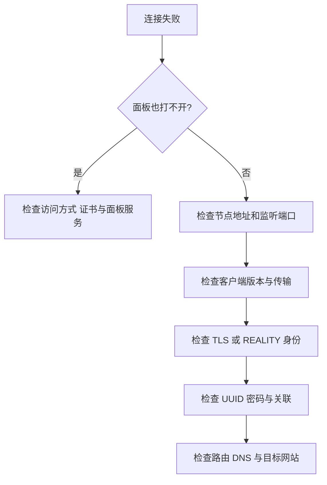

# 连接失败的检查顺序

先写清现象：哪个客户端、哪个版本、哪条节点、什么时候失败、错误文字是什么。不要只写“不能用”。真实秘密在截图前先遮挡。



## 常见现象

| 现象 | 优先检查 | 不应直接做的事 |
| --- | --- | --- |
| 127.0.0.1 面板拒绝连接 | 隧道窗口是否还在；本地端口是否占用 | 把面板改为公网开放来“解决” |
| 当前公网面板打不开 | 完整 HTTPS 地址、端口、路径、证书与服务监听 | 使用已经停用的本地 HTTP 地址 |
| SSH 警告身份变化 | 独立控制台核对指纹 | 无条件删除 known_hosts |
| 端口被占用 | `ss -lntup` 看进程、TCP/UDP | 随便 kill 陌生进程 |
| 面板开启但客户端数量 0 | 客户端是否关联入站 | 重装整个服务器 |
| certificate 错误 | IP SAN、有效期、证书链、时间 | 开 insecure 绕过验证 |
| `运行 Core 失败` 且日志提到 AllowInsecure | 本机内核的安全策略、证书校验或固定证书设置 | 直接更换服务器上的有效证书 |
| WebSocket 升级失败 | 路径、ALPN、TLS、Host | 把所有传输选项都开启 |
| REALITY 验证失败 | 版本、目标、SNI、密钥、Short ID | 随机轮换全部参数 |
| Hysteria2 超时 | UDP 443 和网络对 QUIC 的支持 | 只检查 TCP 443 |
| 导入成功但启动失败 | 内核路径、执行权限、配置语法 | 只更新界面不看内核 |

## 服务器的三个基础命令

```bash
systemctl status x-ui --no-pager
ss -lntup
journalctl -u x-ui -n 80 --no-pager
```

先看服务，再看监听，最后对照时间读日志。`use of closed network connection` 如果恰好发生在修改或重启旧监听时，不必直接认定服务整体损坏；看新监听和实际请求是否成功。

历史截图中的面板 HTTP 警告来自初始回环管理入口，外层已有 SSH 隧道；后来已按用户要求改为公网 HTTPS，见 [[08-开放公网HTTPS面板]]。节点 TLS 错误仍是另一条链路的问题。

## 不通、慢、网站拒绝，要分开描述

SSH 连不上可能来自服务未启动、端口或地址错误、防火墙、网络不可达或认证问题；仅凭一次失败不能判定 IP 被封。`ping` 有回应也不能证明 TCP 或 UDP 的应用端口可用。

连接成功但很慢，先记录目标、时段、吞吐与失败率，再看 [[带宽流量延迟与丢包]]；不要默认换 BBR 或换 IP。只有某个网站拒绝请求，则继续核对目标网站返回内容和请求条件，不能由此断定整条代理损坏或住宅 IP 一定能解决。

链式实验出口不符合预期，检查实际入站 tag、路由顺序、所选客户端节点和核心配置是否已应用。落地故障时是否允许切换其他出站，也要明确验证，见 [[09-链式代理实验设计]]。

更换 SSH 端口可以减少针对默认端口的部分扫描噪声，但不能替代认证、权限管理和软件更新。主机指纹变化仍按 [[SSH与主机指纹]] 核对。

完成一次修复就验证同一个请求，记录改动，避免多变量同时改变导致找不到原因。实际案例见 [[REALITY握手与客户端兼容性排错]]、[[主机密钥变化与noVNC输入问题]]。

域名节点与 IP 证书为什么不能只改服务器，见 [[MEU域名节点与IP证书兼容性]]。
