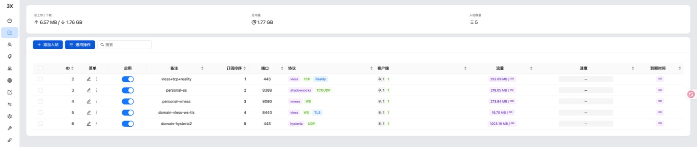
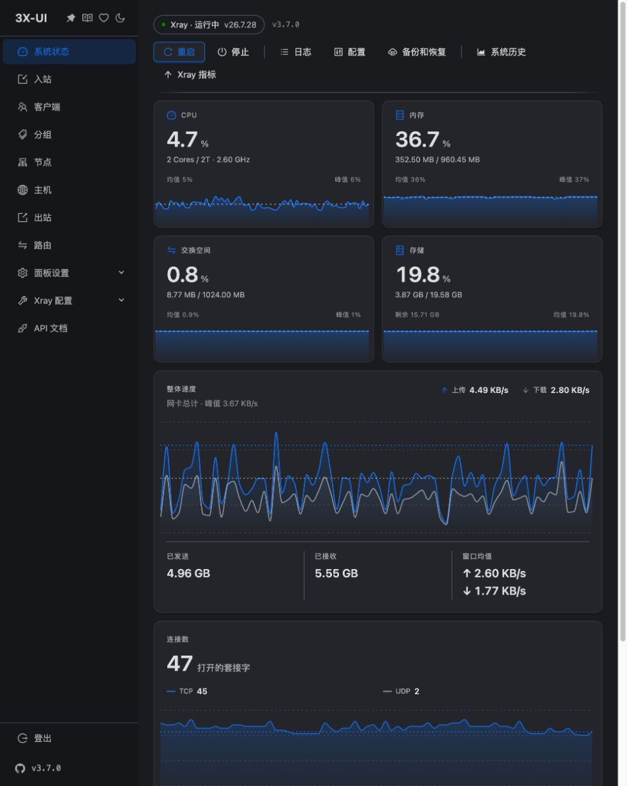

# 2026-09-07 实操日志

时间均为北京时间。只把实际观察到的结果写为事实；计划与推断单独说明。

## 起点

用户提供 meu 与 tyccc 两台 CloudCone VPS 的登录资料，要求在 tyccc 扩展服务，浏览器操作、保存截图，并形成零基础教材。`docx/` 是指定的 Obsidian 根目录，也是独立 Git 仓库。

## 16:42–16:46：工作区与浏览器核对

远程仓库可以通过 Git SSH 访问，未返回任何分支引用；克隆提示空仓库。浏览器仓库页面显示 Public，因此教程按可公开分享的标准脱敏。

浏览器标签页控制连续超时；改用同一个电脑控制工具的原生 Chrome 窗口接口，成功读取页面。这是工具连接问题，并不是 VPS 安装失败。

meu 面板显示 3x-ui v3.6.0，已有 5 条开启的入站：

| 备注 | 协议组合 | 端口 |
| --- | --- | --- |
| vless+tcp+reality | VLESS + TCP + REALITY | TCP 443 |
| personal-ss | Shadowsocks | TCP/UDP 8388 |
| personal-vmess | VMess + WebSocket | TCP 8080 |
| domain-vless-ws-tls | VLESS + WebSocket + TLS | TCP 8443 |
| domain-hysteria2 | Hysteria | UDP 443 |

这份表证明面板已有配置及累计流量，不代表本次已经重新验证其连通性。`domain-hysteria2` 是备注；准确协议版本还要核对底层配置。

## 16:46–16:53：服务器身份与环境

meu 为 Ubuntu 22.04.1；tyccc 为 Debian 12，x86_64、约 960 MB 内存、1 GB swap、20 GB 磁盘。tyccc 安装前只有 SSH TCP 22 监听，未发现旧 x-ui。系统时间已同步。

SSH 初次连接 tyccc 时发现主机密钥与旧 known_hosts 不一致。通过已登录的 CloudCone 网页进入 noVNC 取得 RSA 指纹；电脑控制工具向 noVNC 输入时会丢失下划线等字符，常规 ssh-keygen 路径被破坏。用 `find -regex` 与 `xargs -a` 分两步执行，成功取得控制台指纹，并与实际 SSH 提供的 RSA 密钥匹配。仅在仓库外建立本次专用 known_hosts，没有清空用户全局记录。见 [[主机密钥变化与noVNC输入问题]]。

用户补充允许 FinalShell 或本地终端。后续安装、证书和验证使用本地 SSH 通道；面板配置继续使用电脑控制工具操纵浏览器。

## 16:53–16:59：安装与管理入口

从官方固定版本取得 3x-ui v3.7.0 安装脚本，先检查 tyccc 不存在旧安装，再以新随机管理员信息执行。安装选择 SQLite、面板端口 46832、跳过面板自身 SSL、绑定 127.0.0.1。安装器退出码为 0，服务 active，内核为 Xray v26.7.28。

建立电脑 127.0.0.1:46832 到服务器回环面板的 SSH 本地转发。Chrome 扩展控制反复超时，改用电脑控制工具中的内置浏览器后稳定。浏览器登录成功。

发现安装默认开启公开订阅 2096。在“面板设置 → 订阅”关闭服务，保存并按提示重启面板；监听检查确认 2096 消失。完整截图与步骤见 [[02-安装面板与SSH隧道]]。

## 17:00–17:02：证书

从官方 acme.sh 3.1.4 固定版本安装工具，以 Let's Encrypt 为 CA，采用 standalone HTTP-01、IP 标识、shortlived 配置档、ec-256 密钥签发证书。没有要求另购域名。

证书链与私钥安装到 `/root/cert/tyccc-ip`，私钥权限 600，部署后执行 `systemctl restart x-ui`。证书 SAN 与 tyccc IP 匹配，有效期从 2026-09-07 08:02:34 UTC 到 2026-09-14 00:02:33 UTC，签发者 YE1。自动检查为每日四次，并记录后续 ARI 窗口。见 [[03-签发IP证书与自动续期]]。

## 17:02–17:15：浏览器创建入站与客户端

通过“添加入站”依次创建六个入口，分别保存基础配置、传输、安全字段截图。最终列表如下：

| ID | 备注 | 地址与端口 | 关键配置 |
| --- | --- | --- | --- |
| 1 | tyccc-vless-reality | tyccc IPv4，TCP 443 | VLESS，RAW/TCP，REALITY；目标后来调整为 Apple |
| 2 | tyccc-shadowsocks | tyccc IPv4，TCP/UDP 8388 | 2022-blake3-aes-256-gcm，多用户密钥 |
| 3 | tyccc-vless-ws-tls | tyccc IPv4，TCP 8443 | `/vless-ws`，TLS，禁用 Vision |
| 5 | tyccc-vmess-ws-tls | tyccc IPv4，TCP 8080 | `/vmess-ws`，TLS，auto 加密 |
| 6 | tyccc-trojan-tls | tyccc IPv4，TCP 9443 | RAW/TCP，TLS |
| 7 | tyccc-hysteria2 | tyccc IPv4，UDP 443 | Hysteria 版本 2，h3，无额外 Salamander |

ID 4 是为了探索克隆行为新建的临时入口，没有启用且没有客户端。发现协议不可改、部分字段被重置后，删除该临时克隆并新建正确协议。没有删除用户原有服务。

创建 `tyccc-tutorial` 客户端，关联全部六条。选择 Vision 后核对数据库：只有 REALITY 关联含 `xtls-rprx-vision`，其他关联为空。六条配置都启用。

侧栏未固定时挡住添加按钮，定位后用图钉固定解决。二维码弹窗可同时展开多项，截图会截断下方二维码，因此改为逐条展开。浏览器复制按钮未能稳定传到系统剪贴板，最后从真实二维码截图本地解码，得到六条完整分享链接；二维码边缘缺少空白时，解码前给裁切图补白边。原图与链接始终留在私人目录。

## 17:21–17:33：实际连接与修复

从本机 v2rayN 附带文件复制出 sing-box 1.12.22 与 Xray 26.2.6；因文件最初没有执行权限，只给私人测试副本设置可执行权限，没有修改原应用。另从官方发布下载 Xray 26.7.28。

sing-box 首轮通过 VLESS WS、Trojan、Hysteria2 的 HTTPS 测试；Shadowsocks 在修正测试程序对 SS 链接编码形式的假设后也通过。Hysteria2 与 Shadowsocks 的 UDP DNS 查询均通过。这里 SS 的修正发生在本地链接解析程序，服务端配置没有因此变化。

REALITY 初始目标 Microsoft 的普通 TLS 预检通过，但代理请求失败；公私钥推导、二维码公钥、SNI、Short ID 一致，换新版 Xray 和重启核心仍失败。临时启用诊断后记录到最低客户端版本默认 26.3.27 等提示。Apple 的 TLS 预检通过后，只调整目标/SNI，Xray 实际请求成功；随后关闭诊断并重新导出节点，再测正确 UUID 成功、错误 UUID 失败。详见 [[REALITY握手与客户端兼容性排错]]。

VMess 在 sing-box 1.12.22 上失败，Xray 26.7.28 上成功。所有六条最终都通过 HTTPS 出口验证和对应错误凭据对照。没有把失败核心列为兼容通过。完整结果见 [[06-连接验证与结果]]。

## 17:33–17:47：备份、交付和教材检查

通过 SQLite backup 接口生成副本，打包数据库、证书、ACME 状态、服务定义和核心配置，下载到本机私人目录。数据库 integrity_check 为 ok，核对 6 个入站、1 个客户端、6 个关联。服务 active 且 enabled，面板仅回环监听，预期代理端口存在，私钥 600、续期任务存在。

打开 v2rayN 核对到用户原有 tyccc 等分组，原生窗口接口随后不可用，没有声称完成 GUI 导入，也没有更改当前代理。私人交付包含面板地址和账号、六条真实链接、六个已验证 JSON、匹配内核、终端选择启动器及备份。

教材按七步实操、二十八个概念、六种协议、排错和维护拆分。公开截图裁掉浏览器账户区域，密钥字段和二维码用实色遮挡；本地 OCR、二维码扫描和人工查看共同检查。初次外链检查 72 条：大部分成功，部分官方站点拒绝自动请求（403/418），不把拒绝访问误判为页面不存在。参见 [[来源索引]] 和 [[截图索引与脱敏说明]]。

## 本次没有实测的部分

未来一次 ACME 自动续期、长时间稳定性、吞吐排名、所有网络环境、GUI 节点切换、恢复到另一台服务器，都没有写成已经验证。meu 保持原样，本次重新验证对象是 tyccc。

## 交付后追加：按用户要求开放公网 HTTPS 面板

用户明确要求“开放公网访问”。修改前保存数据库快照，随后通过原来的浏览器面板，将监听 IP 从 `127.0.0.1` 改为 `0.0.0.0`，保留端口和随机 URI 路径，在证书标签填写已部署的 IP 证书与私钥文件路径，保存并确认重启。

从电脑绕过测试程序的代理设置，直接验证公网 HTTPS 的证书身份与信任链，登录页返回 200；使用原账号密码登录接口成功，携带会话读取面板页返回 200。内置浏览器导航公网地址多次超时，未取得公网登录后的截图；保留两张保存重启前的配置截图，并明确区分接口验证与浏览器验证。

服务器面板服务 active，六条代理入站仍存在并监听预期端口；公开订阅保持关闭。保存变更后的数据库快照并核对 integrity_check 为 ok。已更新私人连接信息和教材导航，当前直接访问不再需要 SSH 隧道。详细图文见 [[08-开放公网HTTPS面板]]，结果见 [公网面板验证.json](公网面板验证.json)。

## 教材追加改编：用户提供的 NotebookLM 视频笔记

通过用户已登录的 Chrome 读取 NotebookLM 知识脉络与 Studio 报告，确认三个 YouTube 来源地址，并保存私人快照。针对报告里的安装项目路径错误、BBR 和住宅 IP 的绝对化说法，分别对照官方面板、内核、协议及 IP 数据库资料核对；具体出处见 [[NotebookLM笔记核对与改编依据]]。

新增 12 篇笔记，重排为看懂路径、完成一条节点、扩展协议与维护、理解链式代理的学习顺序；加入两篇视频教学材料。25 张原始实操脱敏截图继续使用，新增 Mermaid 图明确是原理示意。住宅落地、链式配置、BBR 变更、XHTTP 与 CDN 均未在本次改编中部署。

本轮对链接、图片引用、已知秘密和 Markdown 差异做静态检查；没有为了修改教材重新安装或修改服务器。当前教材共 67 篇 Markdown，既有实验的完成边界见 [[实验范围与验收]]。

## 2026-09-08 追加：MEU 改用 IP 证书

用户确认将 MEU 的 VLESS WebSocket + TLS 与 Hysteria2 改为 IP 证书节点，并自行在客户端新增配置。为避免公开长期有效的地址、UUID 和认证字段，这些值不写入公开日志。

已在 MEU 部署的 Let’s Encrypt IP 证书基础上，把两个入站的证书链、私钥、TLS SNI 改为公网 IP；VLESS 的 WebSocket Host 同步改为公网 IP。acme.sh 的部署动作改为在短期证书续期后重启 x-ui。变更前已保存 x-ui 数据库备份。

VLESS 以“公网 IP + IP SNI + 证书验证开启”从本机成功代理到公网。Hysteria2 首次外部测试返回认证 404；继续核对发现旧测试配置的认证字段已过期，而当前面板客户端记录仍有效。用当前记录进行服务器回环和本机外部测试均成功，TLS 和代理出口均符合预期。客户端应从面板重新导出当前链接或订阅，不能复用旧域名链接或旧 Hysteria2 认证字段。详见 [[MEU域名节点与IP证书兼容性]]。

随后用户报告订阅不能被 v2rayN 正确识别。接口、证书和标准 Base64 解码均通过，但解码后的两个迁移节点仍含旧域名。定位到 3x-ui 的入站 `share_addr` 仍保留旧值；同步为公网 IP 并重启 x-ui 后，订阅重新导出的 VLESS WebSocket、Hysteria2 地址与 SNI 均为 IP。订阅 URL 及所有节点秘密只保留在私有诊断文件。详见 [[MEU域名节点与IP证书兼容性]]。

## 2026-09-08 追加：MEU 订阅表单复核与兼容性修复

用户继续反馈 v2rayN 不能识别订阅。电脑控制工具两次读取已登录 3x-ui 浏览器标签都超时，因此改为核对同一面板实际读取的 SQLite 设置与已生成响应，并不把浏览器自动化故障误判为服务器故障。

复核确认订阅已启用、端口为 2096、私密路径已配置、订阅域名留空、订阅证书和私钥文件存在；五个入站均启用，分享地址均为公网 IP。两个 IP TLS 入站的 SNI 已为 IP，VLESS 的 WebSocket Host 也为 IP。一个启用的订阅客户端关联了全部五个入站。

发现 `subEncrypt=true` 仍使订阅输出整段 Base64。将它关闭、保存面板数据库快照并重启 x-ui。随后从公网对同一订阅进行 TLS 严格验证，返回 `200` 和 `text/plain`；正文是五条标准 URI（VLESS、Shadowsocks、VMess、VLESS、Hysteria2），而不是 Base64 文本。完整字段表、原理及验收步骤见 [[3x-ui订阅表单核对清单]]。

## 2026-09-08 追加：MEU 五条入站逐表单说明

用户要求以当前五条 MEU 入站为例，解释协议、传输、安全、嗅探和基础表单字段。只读核对确认：五条入站全部启用并使用自定义公网 IP 分享地址；VLESS REALITY 为 TCP 443 + Vision，Shadowsocks 为 TCP/UDP 8388 + `chacha20-ietf-poly1305`，VMess 为 WebSocket 8080 且无额外 TLS，VLESS WebSocket TLS 为 TCP 8443 + IP SNI + `http/1.1`，Hysteria2 为 UDP 443 + IP SNI + `h3`。详细填写原则、字段的作用和修改后的核对范围见 [[10-MEU五个入站逐表单配置]]。
