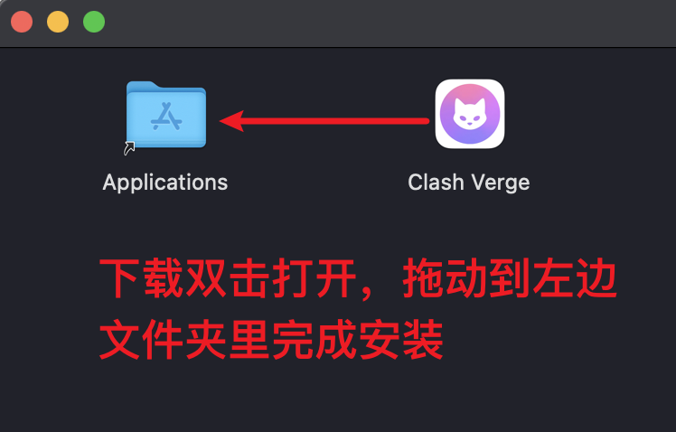
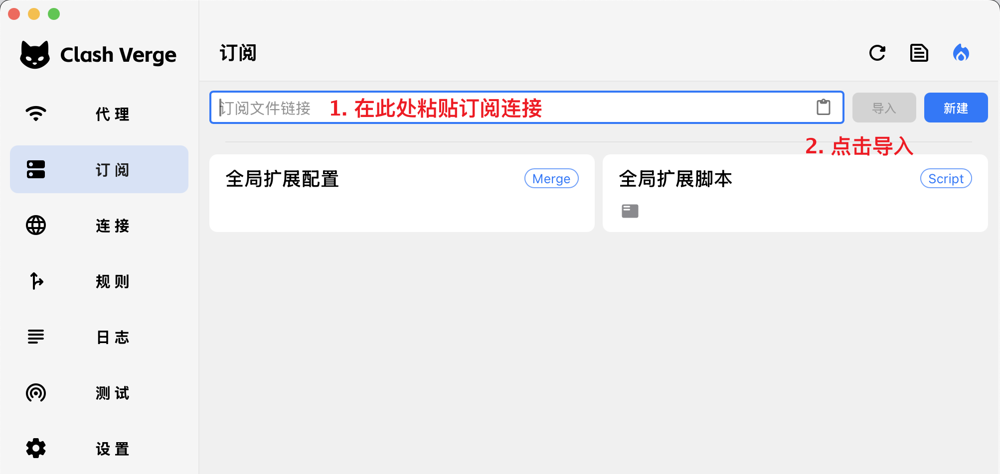
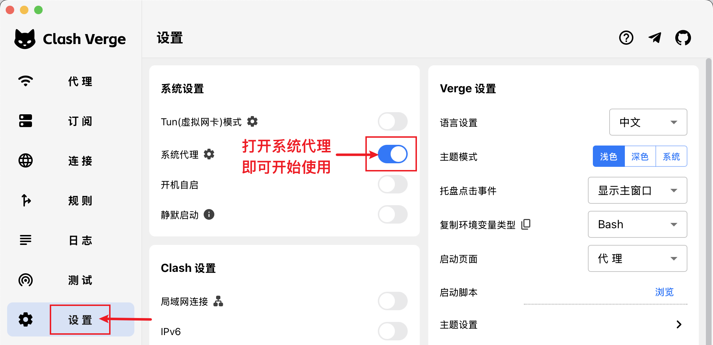

# Mac：安装 Clash Verge Rev 并导入 MEU

返回 [软件与订阅总览](MEU-员工使用说明.md)。本软件使用 **Mihomo 订阅**。

## 1. 下载并安装

点左上角苹果标志 → **关于本机**：

- Apple 芯片：从离线包取 `Clash-Verge-Rev/macOS/Clash.Verge_2.5.2_aarch64.dmg`，或点[官方 Apple 芯片版](https://github.com/clash-verge-rev/clash-verge-rev/releases/download/v2.5.2/Clash.Verge_2.5.2_aarch64.dmg)。
- Intel 芯片：取 `Clash-Verge-Rev/macOS/Clash.Verge_2.5.2_x64.dmg`，或点[官方 Intel 版](https://github.com/clash-verge-rev/clash-verge-rev/releases/download/v2.5.2/Clash.Verge_2.5.2_x64.dmg)。

双击 `.dmg`，将应用拖入“应用程序”并打开。若 macOS 阻止打开，先核对来源，再到 **系统设置 → 隐私与安全性**按提示处理；公司管理的 Mac 请联系管理员。

## 2. 导入并连接

1. 复制总览顶部的 **Mihomo 订阅**，在软件的 **订阅**页面粘贴并导入。
2. 点该订阅的**使用**；进入 **代理**页面选一个节点。
3. 开启**系统代理**，用浏览器测试网页。以后要获取新节点，在订阅页刷新。

截图取自[项目官方快速入门](https://www.clashverge.dev/guide/quickstart.html)。界面可能随软件版本变化；示例里的其他服务名称与 MEU 无关。

来源：[Clash Verge Rev 项目](https://github.com/clash-verge-rev/clash-verge-rev)、[官方订阅导入说明](https://www.clashverge.dev/guide/profile.html)。
