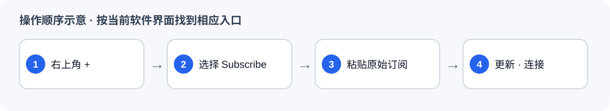

# iPhone／iPad：安装 Shadowrocket 并导入 MEU

返回 [软件与订阅总览](MEU-员工使用说明.md)。本软件使用总览顶部的 **原始订阅**。

## 1. 从 App Store 安装

打开 [Shadowrocket 的 App Store 页面](https://apps.apple.com/app/shadowrocket/id932747118)，核对应用名称后按商店提示购买或安装。iPhone／iPad 不安装 Android 的 `.apk`；本地离线包没有 iOS 安装文件。价格和上架地区以自己的 App Store 页面为准。

## 2. 添加订阅并连接

1. 从总览复制 **原始订阅**。
2. 打开 Shadowrocket，点右上角 `+`，在类型中选择 **Subscribe／订阅**。
3. 把链接粘贴进 URL 栏，保存并更新订阅。
4. 节点出现后选择一个，打开连接开关。首次弹出 VPN 配置请求时按系统提示允许；顶部出现 VPN 标志后，用浏览器测试网页。

如果订阅为空，先找“更新订阅”；如果商店里找不到应用，请联系管理员确认所在地区的可用安装途径。图为操作顺序示意，不是 App Store 截图。

来源：[开发者在 App Store 的应用页面](https://apps.apple.com/app/shadowrocket/id932747118)；“右上角 + → Subscribe → URL”的界面步骤另参看[社区 GitHub 图文说明](https://github.com/free-nodes/shadowrocket/blob/main/docs/shadowrocket_manual.md)，实际按钮以你的版本为准。
