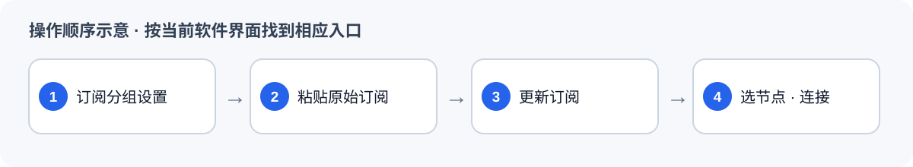

# Android：安装 v2rayNG 并导入 MEU 或 tyccc

返回 [软件与订阅总览](MEU-员工使用说明.md)。先选 **MEU（工作）**或 **tyccc（视频）**，再复制该线路对应格式的链接。本软件使用总览中所选线路的 **原始订阅**。

## 1. 安装

从管理员离线包取 `v2rayNG/Android/v2rayNG_2.2.6_arm64-v8a.apk`，或从[v2rayNG 官方发布文件](https://github.com/2dust/v2rayNG/releases/download/2.2.6/v2rayNG_2.2.6_arm64-v8a.apk)下载。大多数近年的 Android 手机使用这个 `arm64-v8a` 文件；如果安装时提示架构不兼容，让管理员提供离线包中的 `armeabi-v7a` 版本。

在手机“文件管理”里找到 `.apk`，点开安装。手机若询问是否允许当前文件管理器安装应用，确认文件来自管理员或上述官方地址后，再按系统提示允许。安装完成后打开 v2rayNG。

## 2. 添加订阅并连接

1. 从总览中所选线路复制 **原始订阅**，在 v2rayNG 侧边菜单打开 **订阅分组设置**。
2. 点 `+` 新建分组，名称填 `MEU-工作` 或 `tyccc-视频`，地址填刚复制的 HTTPS 链接，保存。
3. 返回节点列表，打开右上角菜单并执行 **更新订阅**。只保存分组不会自动出现节点。
4. 选择一个节点，点连接按钮；手机首次询问 VPN 权限时点允许。顶部出现 VPN 标志后，用浏览器试一个网页。

不要选择“从剪贴板导入分享链接”来导入整条订阅 URL。图为本手册的流程示意，不是软件截图；不同 Android 系统的安装弹窗可能不同。

来源：[v2rayNG 项目与官方发布页](https://github.com/2dust/v2rayNG)、[项目讨论中关于订阅更新的说明](https://github.com/2dust/v2rayNG/issues/4141)。
